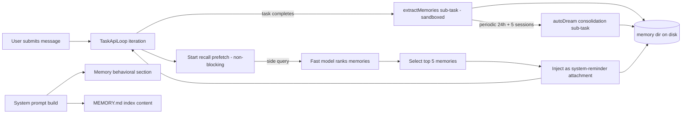

# Memory System Implementation Plan for Roo Code

**Status:** Planning phase — for implementation by Code mode
**Source analysis:** [`MEMORY_SYSTEM_ANALYSIS.md`](../MEMORY_SYSTEM_ANALYSIS.md)
**Date:** 2026-06-30

---

## 1. Summary of the Analyzed Mechanism

[`MEMORY_SYSTEM_ANALYSIS.md`](../MEMORY_SYSTEM_ANALYSIS.md) reverse-engineers Claude Code's **file-based, model-managed memory system**. The core mechanism is:

1. **No dedicated memory tool.** The model reads/writes memory using ordinary file tools (`read_file`, `write_to_file`, `edit_file`, `search_files`) against a special directory.
2. **`MEMORY.md` is an index, not a store.** Actual content lives in per-topic `.md` files with YAML frontmatter (`name`, `description`, `type`). The index is a one-line-per-topic pointer list, capped at 200 lines / 25 KB.
3. **Closed 4-type taxonomy:** `user`, `feedback`, `project`, `reference`. Anything derivable from code/git is explicitly excluded.
4. **Behavioral prompt.** A system-prompt section tells the model _what/when/how_ to save and _what NOT_ to save (drift caveats, "before recommending from memory" verification rules).
5. **Relevant-memory surfacing (recall engine).** A non-blocking prefetch runs a fast-model "side query" that ranks which memory files are relevant to the current user prompt, injecting the top ~5 as hidden `<system-reminder>` attachments. Cumulative cap 60 KB/session; per-file cap 4 KB.
6. **Two background writers** keep memory healthy:
    - `extractMemories` — runs at the end of each task via a sandboxed forked sub-agent (read-all turn 1 → write-all turn 2).
    - `autoDream` — periodic (≥24h + ≥5 sessions) consolidation that prunes, merges, re-indexes, and deletes contradicted facts.
7. **Storage layout.** `<memoryBase>/projects/<sanitizedGitRoot>/memory/` with a `.consolidate-lock` file whose mtime doubles as `lastConsolidatedAt`.
8. **Security.** Path-traversal validation, project-settings excluded from `autoMemoryDirectory` (trusted sources only), write carve-out for the memory dir, secret scanning on team memory writes.

The existing `.roo/rules/memory.md` in this repo references a **mem0 MCP** approach (`search_memories`, `add_memory`, `update_memory`, `delete_memory`). This plan supersedes that with a native, file-based mechanism modeled on Claude Code, because it requires no backend, no embeddings API, and no extra MCP server — fitting Roo Code's constraints (VS Code extension, webview config UI, no guaranteed backend).

---

## 2. Architecture Decision

### Recommendation: **Native built-in file-based memory (no MCP, no embeddings)**

### Rationale

| Option                                                          | Pros                                                                                                                                                                                                                               | Cons                                                                                                                                                                                | Verdict                                                                     |
| --------------------------------------------------------------- | ---------------------------------------------------------------------------------------------------------------------------------------------------------------------------------------------------------------------------------- | ----------------------------------------------------------------------------------------------------------------------------------------------------------------------------------- | --------------------------------------------------------------------------- |
| **A. mem0 MCP wrap** (existing `.roo/rules/memory.md`)          | Already referenced; semantic search via embeddings                                                                                                                                                                                 | Requires a running mem0 MCP server + embedding API; needs a backend or local service; opaque to the model; no offline support; defeats the "model manages its own files" philosophy | ❌ Rejected — violates "no guaranteed backend" constraint                   |
| **B. Native file-based + LLM-rank recall** (Claude Code port)   | No backend, no embeddings; transparent & auditable (plain `.md`); model-managed via existing file tools; works offline for read/write (recall needs one cheap LLM call); version-controllable; matches Roo's existing tool surface | Recall ranking needs an LLM call (degrade gracefully if unavailable); more prompt engineering; background writers add complexity                                                    | ✅ **Recommended**                                                          |
| **C. Hybrid** (file storage + optional mem0 MCP for embeddings) | Best recall quality when embeddings available                                                                                                                                                                                      | Two sources of truth; complex sync; embeddings add a hard dependency for the core feature                                                                                           | ⏸ Defer — can layer on top of B later as an optional recall-ranker backend |

**Chosen approach (B)** with these Roo-specific adaptations:

- **Storage root:** `context.globalStorageUri.fsPath` (via [`ContextProxy`](../../src/core/config/ContextProxy.ts:40)) rather than `~/.claude`. This survives extension updates and is the Roo-idiomatic persistence location, consistent with [`TaskHistoryStore`](../../src/core/task-persistence/TaskHistoryStore.ts:44) which uses `getStorageBasePath(globalStoragePath)`.
- **Per-workspace keying:** sanitized workspace folder URI, so multi-root workspaces get isolated memory (mirrors Claude Code's per-git-root keying).
- **No `runForkedAgent`:** Roo's [`Task`](../../src/core/task/Task.ts) class spawns sub-tasks but doesn't share a parent prompt cache. Background extract/dream run as fresh sub-`Task`s with a short system prompt (acceptable — these run in the background and aren't latency-critical; see MEMORY_SYSTEM_ANALYSIS.md §22.4 option (a)).
- **No compile-time `feature()` flags:** Roo's [`experiments`](../../src/shared/experiments.ts:3) map (`Record<ExperimentId, boolean>`) plus static settings keys replace Claude Code's GrowthBook/bun-bundle gating.
- **Recall replaces index switch** is **not** adopted initially — we keep the `MEMORY.md` index always injected AND run recall prefetch, because Roo doesn't have Claude Code's prompt-cache-sharing constraint that motivated the tradeoff. (See Risks §9.3.)
- **Team memory, KAIROS daily-log, agent-memory, SessionMemory:** all explicitly **excluded** from this plan (P3/deferred per the analysis doc).

### Conceptual data flow



---

## 3. File-by-File Change List

All paths relative to workspace root `/home/krzych/Projekty/QUB-IT/Roo-Code`.

### 3.1 New files — Memory core module (`src/core/memory/`)

| #   | Path                                   | Purpose                                                                                                                                                                                                                                                                                                                                                                                                                                                                                                                                              |
| --- | -------------------------------------- | ---------------------------------------------------------------------------------------------------------------------------------------------------------------------------------------------------------------------------------------------------------------------------------------------------------------------------------------------------------------------------------------------------------------------------------------------------------------------------------------------------------------------------------------------------- |
| N1  | `src/core/memory/paths.ts`             | Path resolution: `isAutoMemoryEnabled`, `getMemoryBaseDir`, `getAutoMemPath(cwd)`, `getAutoMemEntrypoint(cwd)`, `isAutoMemPath(absPath, cwd)`, `validateMemoryPath`. Adapted from `memdir/paths.ts`. Storage root = `context.globalStorageUri.fsPath`; per-workspace key = sanitized cwd. Memoized per-cwd. Env override `ROO_DISABLE_AUTO_MEMORY`.                                                                                                                                                                                                  |
| N2  | `src/core/memory/memoryTypes.ts`       | Pure data, no deps. Port `memdir/memoryTypes.ts` near-verbatim: `MEMORY_TYPES`, `parseMemoryType`, `TYPES_SECTION_INDIVIDUAL`, `WHAT_NOT_TO_SAVE_SECTION`, `MEMORY_DRIFT_CAVEAT`, `WHEN_TO_ACCESS_SECTION`, `TRUSTING_RECALL_SECTION`, `MEMORY_FRONTMATTER_EXAMPLE`. Drop `TYPES_SECTION_COMBINED` (team memory).                                                                                                                                                                                                                                    |
| N3  | `src/core/memory/memoryAge.ts`         | Pure functions, no deps. Port `memdir/memoryAge.ts` verbatim: `memoryAgeDays`, `memoryAge`, `memoryFreshnessText`, `memoryFreshnessNote`.                                                                                                                                                                                                                                                                                                                                                                                                            |
| N4  | `src/core/memory/frontmatter.ts`       | Minimal YAML frontmatter parser for memory files. Regex `^---\s*\n([\s\S]*?)---\s*\n?` + simple key:value extraction (only `description` and `type` needed). Avoid adding `gray-matter` dependency — memory frontmatter is simple key:value. Include the colon-space-aware quoting fallback (analysis §18.2).                                                                                                                                                                                                                                        |
| N5  | `src/core/memory/memoryPrompt.ts`      | The behavioral prompt builder. Port `buildMemoryLines()`, `truncateEntrypointContent()`, `ensureMemoryDirExists()`, `loadMemoryPrompt(cwd)`, `loadMemoryIndex(cwd)`. Replace tool names (`Write`→`write_to_file`, `Grep`→`search_files`, `Glob`→`list_files`, `Edit`→`edit_file`/`search_replace`). Constants: `ENTRYPOINT_NAME="MEMORY.md"`, `MAX_ENTRYPOINT_LINES=200`, `MAX_ENTRYPOINT_BYTES=25_000`. Always emit the `search_files` form of `buildSearchingPastContextSection` (drop the embedded-shell branch — Roo always has `search_files`). |
| N6  | `src/core/memory/memoryScan.ts`        | `scanMemoryFiles(memoryDir, signal)` → `MemoryHeader[]` (filename, filePath, mtimeMs, description, type). Port `memdir/memoryScan.ts`. Use `fs.readdir({recursive:true})` (Node 18.17+) + `fs.stat` for mtime + bounded `fs.readFile` (first 30 lines) for frontmatter. Cap `MAX_MEMORY_FILES=200`.                                                                                                                                                                                                                                                  |
| N7  | `src/core/memory/relevance.ts`         | `findRelevantMemories(query, memoryDir, signal, recentTools, alreadySurfaced)`. Port `memdir/findRelevantMemories.ts`. Replace `sideQuery` with a call through Roo's [`ApiHandler`](../../src/api/index.ts:39) (`completePrompt`-style or a structured JSON call) to a fast model. Use the JSON-schema-constrained output pattern (`{ selected_memories: string[] }`). Port `collectRecentSuccessfulTools()` scanning Roo's message format (assistant `tool_use` blocks + user `tool_result` blocks).                                                |
| N8  | `src/core/memory/surfacing.ts`         | `readMemoriesForSurfacing`, `memoryHeader`, `collectSurfacedMemories`, `filterDuplicateMemoryAttachments`. Port `utils/attachments.ts` memory pieces. Define a Roo-side attachment format (hidden user message wrapped in `<system-reminder>`). **Critical:** preserve the mark-after-filter ordering (analysis §23.4) — write to `readFileState` _after_ filtering, never during `readMemoriesForSurfacing`. Constants: `MAX_MEMORY_LINES=200`, `MAX_MEMORY_BYTES=4096`, `MAX_SESSION_BYTES=60*1024`, top-5 via `.slice(0,5)`.                      |
| N9  | `src/core/memory/prefetch.ts`          | `startRelevantMemoryPrefetch(messages, context)` → `MemoryPrefetch` handle. Port `startRelevantMemoryPrefetch` (analysis §23.3). Skip single-word prompts (`!/\s/.test(input.trim())`). Chain `AbortController` to the task's `currentRequestAbortController`. Roo has no `using`/Disposable — use explicit `try/finally` + `dispose()` method.                                                                                                                                                                                                      |
| N10 | `src/core/memory/extractMemories.ts`   | Background extraction. Runs at task completion (hooked in `TaskLifecycle`). Gate: `isAutoMemoryEnabled` + main-agent-only + `!hasMemoryWritesSince`. Spawn a sub-`Task` with sandboxed tool approval (port `createAutoMemCanUseTool`: allow `read_file`/`search_files`/`list_files` unrestricted; `execute_command` read-only; `write_to_file`/`edit_file` only inside `isAutoMemPath`). `maxTurns: 5`. Cursor-based (only consider messages since last extraction). Emit a "Saved N memories" system message on success.                            |
| N11 | `src/core/memory/autoDream.ts`         | Periodic consolidation. Gate cascade: time (≥24h since `lastConsolidatedAt`) + sessions (≥5 from `TaskHistoryStore` newer than `lastConsolidatedAt`) + lock. Lock file `.consolidate-lock` in memory dir; body = holder PID; mtime = `lastConsolidatedAt`; `HOLDER_STALE_MS=1h`. Port `buildConsolidationPrompt()` verbatim (self-contained). Run as sub-`Task` with same sandbox. Emit "Improved N memories" on success. Rollback lock mtime on failure.                                                                                            |
| N12 | `src/core/memory/consolidationLock.ts` | `readLastConsolidatedAt()`, `tryAcquireConsolidationLock()`, `rollbackConsolidationLock(priorMtime)`, `recordConsolidation()`. Port `services/autoDream/consolidationLock.ts` (analysis §26). PID-in-body + race-guard re-read + rollback-clears-PID pattern.                                                                                                                                                                                                                                                                                        |
| N13 | `src/core/memory/index.ts`             | Barrel export for the memory module.                                                                                                                                                                                                                                                                                                                                                                                                                                                                                                                 |

### 3.2 New files — Prompt section

| #   | Path                                  | Purpose                                                                                                                                           |
| --- | ------------------------------------- | ------------------------------------------------------------------------------------------------------------------------------------------------- |
| N14 | `src/core/prompts/sections/memory.ts` | `getMemorySection(cwd)` (behavioral prompt) + `getMemoryIndexSection(cwd)` (truncated `MEMORY.md` content). Thin wrappers over `memoryPrompt.ts`. |

### 3.3 New files — Config UI (webview)

| #   | Path                                                    | Purpose                                                                                                                                                                                                                                                                                                                                                                                                                                                                                                               |
| --- | ------------------------------------------------------- | --------------------------------------------------------------------------------------------------------------------------------------------------------------------------------------------------------------------------------------------------------------------------------------------------------------------------------------------------------------------------------------------------------------------------------------------------------------------------------------------------------------------- |
| N15 | `webview-ui/src/components/settings/MemorySettings.tsx` | New settings section component. Follows the [`CheckpointSettings.tsx`](../../webview-ui/src/components/settings/CheckpointSettings.tsx:24) pattern exactly: props typed with `SetCachedStateField`, binds to `cachedState` (NOT live `useExtensionState`), uses `VSCodeCheckbox`/`Section`/`SectionHeader`/`SearchableSetting`, Tailwind classes with VSCode CSS variables. Controls: enable/disable toggle, optional custom memory directory input, dream toggle, "Open memory folder" button, dream-status display. |

### 3.4 New files — Tests

See §6 Test Plan.

### 3.5 Modified files — Settings schema & state

| #   | Path                                                                                      | Change                                                                                                                                                                                                                                                                                                                                                                                                                                                                                                          |
| --- | ----------------------------------------------------------------------------------------- | --------------------------------------------------------------------------------------------------------------------------------------------------------------------------------------------------------------------------------------------------------------------------------------------------------------------------------------------------------------------------------------------------------------------------------------------------------------------------------------------------------------- |
| M1  | [`packages/types/src/global-settings.ts`](../../packages/types/src/global-settings.ts:99) | Add to `globalSettingsSchema`: `autoMemoryEnabled: z.boolean().optional()` (default true), `autoMemoryDirectory: z.string().optional()` (trusted sources only — NOT project settings), `autoDreamEnabled: z.boolean().optional()` (default true), `autoDreamMinHours: z.number().optional()` (default 24), `autoDreamMinSessions: z.number().optional()` (default 5), `memoryRecallEnabled: z.boolean().optional()` (default true). These auto-flow into `GLOBAL_STATE_KEYS` via the existing spread at `:339`. |
| M2  | [`src/core/config/ContextProxy.ts`](../../src/core/config/ContextProxy.ts:30)             | Add `autoMemoryEnabled`, `autoDreamEnabled`, `memoryRecallEnabled` to `PASS_THROUGH_STATE_KEYS` if they should round-trip through export/import (decision: add them — they're user preferences worth syncing). `autoMemoryDirectory` must be filtered from project-scoped imports (trusted-sources-only — mirror Claude Code's `memdir/paths.ts:179` exclusion). Add a migration `migrateAutoMemoryDefaults()` to set `autoMemoryEnabled=true` for existing users on first load after upgrade.                  |

### 3.6 Modified files — System prompt assembly

| #   | Path                                                                               | Change                                                                                                                                                                                                                                                                                                                                                                                                                                                                                              |
| --- | ---------------------------------------------------------------------------------- | --------------------------------------------------------------------------------------------------------------------------------------------------------------------------------------------------------------------------------------------------------------------------------------------------------------------------------------------------------------------------------------------------------------------------------------------------------------------------------------------------- |
| M3  | [`src/core/prompts/sections/index.ts`](../../src/core/prompts/sections/index.ts:1) | Add: `export { getMemorySection, getMemoryIndexSection } from "./memory"`                                                                                                                                                                                                                                                                                                                                                                                                                           |
| M4  | [`src/core/prompts/system.ts`](../../src/core/prompts/system.ts:42)                | Import `getMemorySection, getMemoryIndexSection` from `./sections` (`:15-27`). In `generatePrompt`, between `${getRulesSection(cwd, settings)}` (`:132`) and `${getSystemInfoSection(cwd)}` (`:134`), insert `${memorySection ? `\n${memorySection}` : ""}`. After the `addCustomInstructions(...)` call (`:138-142`), append `${memoryIndex}`. The `memorySection`is the behavioral instructions;`memoryIndex`is the truncated`MEMORY.md`content. Both are`await`ed (they do async `fs.readFile`). |

### 3.7 Modified files — Tool validation carve-out

| #   | Path                                                                               | Change                                                                                                                                                                                                                                                                                                                                                                                                                                                                                                                                                                                                                                                                           |
| --- | ---------------------------------------------------------------------------------- | -------------------------------------------------------------------------------------------------------------------------------------------------------------------------------------------------------------------------------------------------------------------------------------------------------------------------------------------------------------------------------------------------------------------------------------------------------------------------------------------------------------------------------------------------------------------------------------------------------------------------------------------------------------------------------- |
| M5  | [`src/core/tools/validateToolUse.ts`](../../src/core/tools/validateToolUse.ts:206) | In `isToolAllowedForMode`, inside the `groupName === "edit" && options.fileRegex` block (`:206`), before the `doesFileMatchRegex` check, add: `if (filePath && isAutoMemPath(filePath, cwd)) return true` (bypass mode `fileRegex` for memory paths). Import `isAutoMemPath` from `../../memory/paths`. The `cwd` must be threaded into `validateToolUse` (add a `cwd` param, sourced from the `Task`'s `access.cwd`). Also verify [`WriteToFileTool.ts`](../../src/core/tools/WriteToFileTool.ts) / [`EditFileTool.ts`](../../src/core/tools/EditFileTool.ts) don't have an additional workspace-containment check that needs the same carve-out (audit during implementation). |

### 3.8 Modified files — Task loop (recall prefetch + extract hook)

| #   | Path                                                                        | Change                                                                                                                                                                                                                                                                                                                                                                                                                                                                                 |
| --- | --------------------------------------------------------------------------- | -------------------------------------------------------------------------------------------------------------------------------------------------------------------------------------------------------------------------------------------------------------------------------------------------------------------------------------------------------------------------------------------------------------------------------------------------------------------------------------- |
| M6  | [`src/core/task/TaskApiLoop.ts`](../../src/core/task/TaskApiLoop.ts:206)    | At the **top of the `while (!this.access.abort)` loop** (`:206`), before `recursivelyMakeClineRequests`, add the recall-prefetch consume point: if a pending prefetch exists and `settledAt !== null` and not yet consumed, `await` the (already-settled) promise, run `filterDuplicateMemoryAttachments` against the task's `readFileState`, inject survivors as `<system-reminder>` user messages, mark consumed. This mirrors `query.ts:1599`.                                      |
| M7  | [`src/core/task/TaskApiLoop.ts`](../../src/core/task/TaskApiLoop.ts:114)    | When a user message is committed (`userMessageContent`/`userMessageContentReady` at `:114-115`), start the prefetch via `startRelevantMemoryPrefetch` chained to `currentRequestAbortController` (`:93`). Store the handle on the loop state for the consume point.                                                                                                                                                                                                                    |
| M8  | [`src/core/task/TaskLifecycle.ts`](../../src/core/task/TaskLifecycle.ts:40) | In the completion/dispose path (where `rooIgnoreController`, `fileContextTracker`, `messageQueueService` are disposed at `:49-53`), fire-and-forget `extractMemories` (main-agent-only gate inside). In the `abort === true` branch (`:60-62`), cancel any in-flight extraction and call `drainPendingExtraction()` with a 60s soft timeout before shutdown (mirrors `cli/print.ts:967`). The `autoDream` trigger also fires here (gated by time+sessions+lock inside `autoDream.ts`). |

### 3.9 Modified files — Settings UI wiring

| #   | Path                                                                                                                  | Change                                                                                                                                                                                                                                                                                                                                                                                                                                                                                                                                                                                 |
| --- | --------------------------------------------------------------------------------------------------------------------- | -------------------------------------------------------------------------------------------------------------------------------------------------------------------------------------------------------------------------------------------------------------------------------------------------------------------------------------------------------------------------------------------------------------------------------------------------------------------------------------------------------------------------------------------------------------------------------------- |
| M9  | [`webview-ui/src/components/settings/SettingsView.tsx`](../../webview-ui/src/components/settings/SettingsView.tsx:98) | Add `"memory"` to the `sectionNames` array (`:98-115`). Add a `memory` `TabTrigger` in the tab list (follow the pattern of existing tabs like checkpoints). Destructure `autoMemoryEnabled`, `autoMemoryDirectory`, `autoDreamEnabled`, `memoryRecallEnabled` from `cachedState` (`:149-205`). Render `<MemorySettings>` in the matching `TabContent`. In `handleSubmit`'s `updateSettings` message (`:360-424`), add the new keys to `updatedSettings`. **Critical (AGENTS.md rule):** all inputs bind to `cachedState` via `setCachedStateField`, NOT to live `useExtensionState()`. |
| M10 | [`webview-ui/src/context/ExtensionStateContext.tsx`](../../webview-ui/src/context/ExtensionStateContext.tsx)          | Add `autoMemoryEnabled`, `autoMemoryDirectory`, `autoDreamEnabled`, `autoDreamMinHours`, `autoDreamMinSessions`, `memoryRecallEnabled` to the `ExtensionStateContextType` and to the state initialization from the extension host payload (follow the existing pattern for `enableCheckpoints`, `checkpointTimeout`).                                                                                                                                                                                                                                                                  |
| M11 | [`src/core/webview/webviewMessageHandler.ts`](../../src/core/webview/webviewMessageHandler.ts:663)                    | In the `updateSettings` case (`:663`), the new keys flow through the generic `Object.entries(message.updatedSettings)` loop already (`:665`) and are persisted via `contextProxy.setValue(key, value)`. No special handling needed unless `autoMemoryDirectory` requires trusted-source filtering — add a guard there to reject project-scoped values for that key only.                                                                                                                                                                                                               |

### 3.10 Modified files — i18n

| #       | Path                                                                                                                                                                                               | Change                                                                                                                                                                                                                                                                                                                                                                                                 |
| ------- | -------------------------------------------------------------------------------------------------------------------------------------------------------------------------------------------------- | ------------------------------------------------------------------------------------------------------------------------------------------------------------------------------------------------------------------------------------------------------------------------------------------------------------------------------------------------------------------------------------------------------ |
| M12     | [`webview-ui/src/i18n/locales/en/settings.json`](../../webview-ui/src/i18n/locales/en/settings.json:28)                                                                                            | Add `"memory": "Memory"` to `sections` (`:28-45`). Add a new top-level `"memory"` key block with: `enable.label`, `enable.description`, `directory.label`, `directory.description`, `directory.placeholder`, `dream.enable.label`, `dream.enable.description`, `dream.status.never`, `dream.status.lastRan`, `dream.status.running`, `recall.enable.label`, `recall.enable.description`, `openFolder`. |
| M13     | [`src/i18n/locales/en/common.json`](../../src/i18n/locales/en/common.json)                                                                                                                         | Add keys for memory-related user-facing strings (e.g. `memory.saved`, `memory.improved`, `memory.openFolderFailed`) used by the "Saved N memories" system message rendering and the open-folder command.                                                                                                                                                                                               |
| M14–M28 | All other locale dirs under `src/i18n/locales/` and `webview-ui/src/i18n/locales/` (`ca`, `de`, `es`, `fr`, `hi`, `id`, `it`, `ja`, `ko`, `nl`, `pl`, `pt-BR`, `ru`, `tr`, `vi`, `zh-CN`, `zh-TW`) | Add the same new keys, translated. English first; other locales can ship English fallback initially and be translated later (i18next `fallbackLng: "en"` in [`setup.ts`](../../src/i18n/setup.ts:74) handles this). Run `scripts/find-missing-translations.js` to verify coverage.                                                                                                                     |

### 3.11 Modified files — VSCode CSS variables

| #   | Path                                                            | Change                                                                                                                                                                                                                                                                                                                                                                                                                                                                                                                 |
| --- | --------------------------------------------------------------- | ---------------------------------------------------------------------------------------------------------------------------------------------------------------------------------------------------------------------------------------------------------------------------------------------------------------------------------------------------------------------------------------------------------------------------------------------------------------------------------------------------------------------- |
| M29 | [`webview-ui/src/index.css`](../../webview-ui/src/index.css:25) | Audit the existing `--vscode-*` variables already mapped in the `@theme` block (`:25+`). The memory settings UI reuses existing classes (`text-vscode-descriptionForeground`, `bg-vscode-list-hoverBackground`, etc.) that are already available. **Only add new variables if** the memory section needs a distinctive accent (e.g. a `--vscode-memoryBadge-background` for the "Saved N memories" pill) — prefer reusing existing `--vscode-charts-*` or `--vscode-textLink-*` variables. Document any addition here. |

### 3.12 Modified files — package.json contributes (optional)

| #   | Path                                         | Change                                                                                                                                                                                                                                        |
| --- | -------------------------------------------- | --------------------------------------------------------------------------------------------------------------------------------------------------------------------------------------------------------------------------------------------- |
| M30 | [`src/package.json`](../../src/package.json) | (Optional) Add a `roo.memory.openFolder` command contribution + a keybinding, and a setting contribution for `autoMemoryEnabled` default. This lets users open the memory folder from the command palette as a complement to the settings UI. |

---

## 4. Public API Surface (Memory Service)

The memory module exposes these functions for use by the prompt builder, task loop, and config:

```typescript
// src/core/memory/index.ts
export { isAutoMemoryEnabled, getAutoMemPath, getAutoMemEntrypoint, isAutoMemPath, validateMemoryPath } from "./paths"
export { MEMORY_TYPES, parseMemoryType } from "./memoryTypes"
export { memoryAge, memoryFreshnessText, memoryFreshnessNote } from "./memoryAge"
export { parseFrontmatter } from "./frontmatter"
export { loadMemoryPrompt, loadMemoryIndex, buildMemoryLines, ensureMemoryDirExists } from "./memoryPrompt"
export { scanMemoryFiles, formatMemoryManifest, type MemoryHeader } from "./memoryScan"
export { findRelevantMemories } from "./relevance"
export {
	readMemoriesForSurfacing,
	filterDuplicateMemoryAttachments,
	collectSurfacedMemories,
	type RelevantMemory,
} from "./surfacing"
export { startRelevantMemoryPrefetch, type MemoryPrefetch } from "./prefetch"
export { executeExtractMemories, drainPendingExtraction } from "./extractMemories"
export { executeAutoDream } from "./autoDream"
export { readLastConsolidatedAt } from "./consolidationLock"
```

**No dedicated memory tool is exposed to the agent.** The model uses existing `read_file`/`write_to_file`/`edit_file`/`search_files`/`list_files` against the memory dir, gated by the behavioral prompt + the [`validateToolUse.ts`](../../src/core/tools/validateToolUse.ts:206) carve-out. This matches Claude Code's "no MemoryTool" design (analysis §9, §19.4) and avoids bloating the tool catalog.

---

## 5. Settings Schema Additions (Global State)

Added to [`globalSettingsSchema`](../../packages/types/src/global-settings.ts:99):

| Key                    | Type      | Default                 | Trusted-only?                              | Purpose                           |
| ---------------------- | --------- | ----------------------- | ------------------------------------------ | --------------------------------- |
| `autoMemoryEnabled`    | `boolean` | `true`                  | No (any source, supports per-repo opt-out) | Master switch                     |
| `autoMemoryDirectory`  | `string`  | (unset → globalStorage) | **Yes — project settings excluded**        | Full override of memory dir path  |
| `autoDreamEnabled`     | `boolean` | `true`                  | No                                         | Background consolidation switch   |
| `autoDreamMinHours`    | `number`  | `24`                    | No                                         | Hours since last consolidation    |
| `autoDreamMinSessions` | `number`  | `5`                     | No                                         | Sessions since last consolidation |
| `memoryRecallEnabled`  | `boolean` | `true`                  | No                                         | Recall prefetch switch            |

These keys automatically appear in `GLOBAL_STATE_KEYS` (`:339`) and are loaded/saved by [`ContextProxy.initialize()`](../../src/core/config/ContextProxy.ts:58) through the existing `GLOBAL_STATE_KEYS` loop (`:59-66`). No new load/save code needed.

### cachedState binding (AGENTS.md compliance)

Per AGENTS.md: _"When working on `SettingsView`, inputs must bind to the local `cachedState`, NOT the live `useExtensionState()`."_ The new [`MemorySettings.tsx`](../../webview-ui/src/components/settings/MemorySettings.tsx) follows the [`CheckpointSettings.tsx`](../../webview-ui/src/components/settings/CheckpointSettings.tsx:24) pattern:

```tsx
type MemorySettingsProps = HTMLAttributes<HTMLDivElement> & {
	autoMemoryEnabled?: boolean
	autoMemoryDirectory?: string
	autoDreamEnabled?: boolean
	memoryRecallEnabled?: boolean
	setCachedStateField: SetCachedStateField<
		"autoMemoryEnabled" | "autoMemoryDirectory" | "autoDreamEnabled" | "memoryRecallEnabled"
	>
	onOpenMemoryFolder: () => void
}
```

Inputs call `setCachedStateField("autoMemoryEnabled", e.target.checked)`; the parent [`SettingsView.tsx`](../../webview-ui/src/components/settings/SettingsView.tsx:229) `setCachedStateField` callback (`:229-238`) marks `setChangeDetected(true)` and buffers the edit. On Save, `handleSubmit` posts `updateSettings` (`:362`), which the extension host persists via [`webviewMessageHandler.ts`](../../src/core/webview/webviewMessageHandler.ts:663). No race conditions because edits never touch `ContextProxy` directly until Save.

---

## 6. Test Plan

Following AGENTS.md test-placement guidance: **prefer the narrowest test layer that proves the behavior.** Keep most coverage in fast, focused unit tests; add integration tests for cross-module contracts; webview-ui tests for the config component; reserve e2e for full-workflow smoke.

### 6.1 Package-local unit tests (pure logic — `src/`)

Run with: `cd src && npx vitest run <path>`

| #   | Test file                                             | What it covers                                                                                                                                                                                                                                                                                                                                                                                  |
| --- | ----------------------------------------------------- | ----------------------------------------------------------------------------------------------------------------------------------------------------------------------------------------------------------------------------------------------------------------------------------------------------------------------------------------------------------------------------------------------- |
| T1  | `src/core/memory/__tests__/paths.spec.ts`             | `getAutoMemPath` per-cwd sanitization & memoization; `isAutoMemPath` containment (including trailing-separator boundary, the `/foo/team-evil` vs `/foo/team` defense); `validateMemoryPath` rejects relative/root/UNC/null-byte/tilde-to-home; env override `ROO_DISABLE_AUTO_MEMORY`; project-settings exclusion for `autoMemoryDirectory`.                                                    |
| T2  | `src/core/memory/__tests__/memoryTypes.spec.ts`       | `parseMemoryType` accepts the 4 types, rejects others; `TYPES_SECTION_INDIVIDUAL` content sanity (each type has name/description/when_to_save); `WHAT_NOT_TO_SAVE_SECTION` lists the exclusions. Pure data — no FS.                                                                                                                                                                             |
| T3  | `src/core/memory/__tests__/memoryAge.spec.ts`         | `memoryAgeDays` (0 today, 1 yesterday, N days); `memoryAge` strings; `memoryFreshnessText` empty for ≤1 day, populated for older; `memoryFreshnessNote` wraps in `<system-reminder>`.                                                                                                                                                                                                           |
| T4  | `src/core/memory/__tests__/frontmatter.spec.ts`       | Parse valid frontmatter; missing frontmatter; malformed YAML fallback (colon-space quoting); `description`/`type` extraction.                                                                                                                                                                                                                                                                   |
| T5  | `src/core/memory/__tests__/memoryPrompt.spec.ts`      | `truncateEntrypointContent` line cap (200) and byte cap (25KB) and the warning suffix; `buildMemoryLines` includes tool names `write_to_file`/`search_files`/`list_files`/`edit_file` (NOT `Write`/`Grep`); `loadMemoryIndex` returns "" when file absent, returns truncated content when present; `buildSearchingPastContextSection` emits the `search_files` form (no embedded-shell branch). |
| T6  | `src/core/memory/__tests__/memoryScan.spec.ts`        | `scanMemoryFiles` with a temp dir: skips `MEMORY.md`, caps at `MAX_MEMORY_FILES=200`, sorts by mtime desc, parses frontmatter, swallows per-file errors (`Promise.allSettled` filter).                                                                                                                                                                                                          |
| T7  | `src/core/memory/__tests__/relevance.spec.ts`         | `findRelevantMemories`: empty dir → `[]`; selector filters by `validFilenames`; abort signal returns `[]`; `collectRecentSuccessfulTools` "any error → excluded" and "no result yet → excluded" rules (analysis §23.6) ported verbatim. Mock the API handler.                                                                                                                                   |
| T8  | `src/core/memory/__tests__/surfacing.spec.ts`         | `readMemoriesForSurfacing` truncation at `MAX_MEMORY_BYTES=4096`; `filterDuplicateMemoryAttachments` **mark-after-filter ordering** (the load-bearing bug-fix — write a regression test that fails if the write happens during `readMemoriesForSurfacing`); `collectSurfacedMemories` byte accounting; `.slice(0,5)` top-5 cap.                                                                 |
| T9  | `src/core/memory/__tests__/consolidationLock.spec.ts` | `tryAcquireConsolidationLock` race guard (two reclaimers → loser bails via re-read); dead PID reclaim; `HOLDER_STALE_MS` 1h reclaim even with live PID; `rollbackConsolidationLock` clears PID body and rewinds mtime; `priorMtime===0` → unlink. Use temp dir + fake PIDs.                                                                                                                     |
| T10 | `src/core/memory/__tests__/autoDream.spec.ts`         | Gate cascade: time-gate, session-gate (mock `TaskHistoryStore` returning N items with `lastModified > sinceMs`), scan throttle (10 min). Lock rollback on failure. Skip when `autoDreamEnabled=false`.                                                                                                                                                                                          |

### 6.2 Integration tests (cross-module — `src/`)

Run with: `cd src && npx vitest run <path>`

| #   | Test file                                                 | What it covers                                                                                                                                                                                                                                                                           |
| --- | --------------------------------------------------------- | ---------------------------------------------------------------------------------------------------------------------------------------------------------------------------------------------------------------------------------------------------------------------------------------- |
| T11 | `src/core/prompts/__tests__/system.memory.spec.ts`        | End-to-end prompt assembly: with `autoMemoryEnabled=true`, `generatePrompt` output contains the memory behavioral section AND the `MEMORY.md` index; with `autoMemoryEnabled=false`, neither appears. Mock `vscode.ExtensionContext.globalStorageUri` to a temp dir; seed a `MEMORY.md`. |
| T12 | `src/core/tools/__tests__/validateToolUse.memory.spec.ts` | The carve-out: a `write_to_file` call with `file_path` inside `isAutoMemPath` is allowed even when mode `fileRegex` would reject it; a path outside the memory dir is still rejected with `FileRestrictionError`.                                                                        |

### 6.3 Webview-ui tests (React component)

Run with: `cd webview-ui && npx vitest run src/path/to/test-file`

| #   | Test file                                                              | What it covers                                                                                                                                                                                                                                                                                                                                                                                       |
| --- | ---------------------------------------------------------------------- | ---------------------------------------------------------------------------------------------------------------------------------------------------------------------------------------------------------------------------------------------------------------------------------------------------------------------------------------------------------------------------------------------------- |
| T13 | `webview-ui/src/components/settings/__tests__/MemorySettings.spec.tsx` | Renders with `cachedState` props; toggling enable calls `setCachedStateField("autoMemoryEnabled", false)`; the directory input binds to `cachedState.autoMemoryDirectory` (NOT live state — assert no direct `useExtensionState` mutation); "Open memory folder" button calls `onOpenMemoryFolder`; i18n keys resolve (mock `useAppTranslation`). Follow existing `__tests__/` patterns in that dir. |

### 6.4 E2E (only if lower layers can't represent the behavior)

Per AGENTS.md: "Use `apps/vscode-e2e` only when the behavior depends on the real VS Code extension host." The memory system's core logic is covered by T1–T12. The only candidate for e2e is the full "user submits message → recall prefetch surfaces a memory → model uses it" round-trip, but that depends on a live LLM. **Defer e2e** unless a smoke test against a mock provider is explicitly requested.

### 6.5 Regression tests at the lowest failing layer

Per AGENTS.md: when fixing a regression, add the test at the lowest layer that would have failed. The `filterDuplicateMemoryAttachments` mark-after-filter ordering (T8) is the canonical example — it's a unit test, not an integration test, because the bug is in the ordering logic, not the cross-module wiring.

---

## 7. Phased Implementation Order

### Phase 0 — MVP: durable, model-managed memory (no recall, no background writers)

**Goal:** The model reads `MEMORY.md` each task, writes topic files with frontmatter, manages its own index.

1. **N1** `paths.ts` + **T1** `paths.spec.ts`
2. **N2** `memoryTypes.ts` + **T2** `memoryTypes.spec.ts`
3. **N3** `memoryAge.ts` + **T3** `memoryAge.spec.ts`
4. **N4** `frontmatter.ts` + **T4** `frontmatter.spec.ts`
5. **N5** `memoryPrompt.ts` + **T5** `memoryPrompt.spec.ts`
6. **N14** `sections/memory.ts`
7. **M3** `sections/index.ts` export
8. **M4** `system.ts` injection (behavioral section + index)
9. **M5** `validateToolUse.ts` carve-out + **T12** integration test
10. **M1** schema additions + **M2** `ContextProxy` (defaults + migration)
11. **T11** system prompt integration test
12. **N13** `index.ts` barrel (partial — export Phase 0 symbols)

**Exit criteria:** A task in a fresh workspace creates `<globalStorage>/memory/projects/<sanitized>/memory/`, the system prompt contains the memory behavioral section, and the model can write a topic file + `MEMORY.md` pointer using `write_to_file` even in a mode with a restrictive `fileRegex`. All Phase 0 tests green.

### Phase 1 — Recall surfacing (prefetch + inject)

**Goal:** Relevant memories surface as hidden attachments.

1. **N6** `memoryScan.ts` + **T6** `memoryScan.spec.ts`
2. **N7** `relevance.ts` + **T7** `relevance.spec.ts` (mock API handler)
3. **N8** `surfacing.ts` + **T8** `surfacing.spec.ts` (mark-after-filter regression test)
4. **N9** `prefetch.ts`
5. **M6** `TaskApiLoop.ts` consume point (top of loop)
6. **M7** `TaskApiLoop.ts` start point (user message commit)

**Exit criteria:** With a seeded memory dir, submitting a relevant user prompt causes the top-5 memories to be injected as `<system-reminder>` attachments within the first 1-2 loop iterations; single-word prompts skip prefetch; abort cancels the prefetch. `memoryRecallEnabled=false` disables it.

### Phase 2 — Background writers (extract + dream)

**Goal:** Memory stays healthy without manual curation.

1. **N10** `extractMemories.ts` (sandboxed sub-`Task`)
2. **N12** `consolidationLock.ts` + **T9** `consolidationLock.spec.ts`
3. **N11** `autoDream.ts` + **T10** `autoDream.spec.ts`
4. **M8** `TaskLifecycle.ts` fire-and-forget + drain hooks

**Exit criteria:** After a task completes, `extractMemories` runs (main-agent-only) and emits "Saved N memories" when it writes topic files; `autoDream` runs after ≥24h + ≥5 sessions, prunes/merges, emits "Improved N memories"; killing a dream rolls back the lock; `autoDreamEnabled=false` disables it.

### Phase 3 — Config UI + i18n

**Goal:** Users can toggle/configure via Settings; strings localized.

1. **N15** `MemorySettings.tsx` + **T13** `MemorySettings.spec.tsx`
2. **M9** `SettingsView.tsx` tab + destructure + handleSubmit
3. **M10** `ExtensionStateContext.tsx` state additions
4. **M11** `webviewMessageHandler.ts` trusted-source guard for `autoMemoryDirectory`
5. **M12** `webview-ui/.../en/settings.json` keys
6. **M13** `src/i18n/.../en/common.json` keys
7. **M14–M28** other locale dirs (English fallback acceptable initially)
8. **M29** `index.css` audit (add vars only if needed)
9. **M30** `package.json` command contribution (optional)

**Exit criteria:** Settings has a "Memory" tab; toggles persist via `cachedState` → Save → `updateSettings`; "Open memory folder" opens the dir in the OS file manager; `scripts/find-missing-translations.js` reports no missing keys for `en`.

---

## 8. Config the User Must Set

| Setting                           | Default | Where                             | Notes                                                                                                                                                                                                     |
| --------------------------------- | ------- | --------------------------------- | --------------------------------------------------------------------------------------------------------------------------------------------------------------------------------------------------------- |
| `autoMemoryEnabled`               | `true`  | Settings → Memory tab             | Master switch. Per-repo opt-out supported (project settings allowed for this key).                                                                                                                        |
| `autoMemoryDirectory`             | (unset) | Settings → Memory tab             | Optional full-path override. **Project settings excluded** — only user/global/policy sources honored, to prevent a malicious repo from redirecting memory writes (analysis §13.3, `memdir/paths.ts:179`). |
| `autoDreamEnabled`                | `true`  | Settings → Memory tab             | Background consolidation.                                                                                                                                                                                 |
| `autoDreamMinHours`               | `24`    | (advanced — env or settings.json) | Hours between dreams.                                                                                                                                                                                     |
| `autoDreamMinSessions`            | `5`     | (advanced)                        | Sessions between dreams.                                                                                                                                                                                  |
| `memoryRecallEnabled`             | `true`  | Settings → Memory tab             | Recall prefetch. Disable to save the side-query LLM cost.                                                                                                                                                 |
| `ROO_DISABLE_AUTO_MEMORY` env var | (unset) | Environment                       | `1`/`true` → memory OFF; overrides everything. Mirrors `CLAUDE_CODE_DISABLE_AUTO_MEMORY`.                                                                                                                 |

**No API key is required** for the core feature (file read/write). Recall prefetch needs a configured LLM provider (any of Roo's existing providers — uses the same `ApiHandler` as the main task, with a fast/cheap model preference). If no provider is configured, recall degrades gracefully to no-op (logged at debug level), and the `MEMORY.md` index still loads — so memory remains functional.

---

## 9. Risks, Edge Cases, and Mitigations

### 9.1 Embedding/LLM API availability

- **Risk:** Recall prefetch and background writers need an LLM call. Offline or no-provider users lose recall + background writing.
- **Mitigation:** All LLM-dependent paths are gated and degrade to no-op (never throw to the user). The `MEMORY.md` index is always injected regardless, so the model still has manual access. Document this in the settings UI description.

### 9.2 Privacy

- **Risk:** Memory files may contain sensitive facts the user didn't intend to persist across sessions.
- **Mitigation:** Storage under `globalStorageUri` (extension-private, not in the workspace). The "What NOT to save" prompt section explicitly excludes secrets-adjacent content. Add a note in the settings UI that memory persists across sessions and is stored locally. Future: add a "Clear all memory" button (P2).

### 9.3 Double-injection (index + recall)

- **Risk:** Claude Code's `tengu_moth_copse` flag removes the `MEMORY.md` index when recall is active to avoid double-injection (analysis §32.4). We chose to keep both.
- **Mitigation:** This is acceptable because Roo doesn't share Claude Code's prompt-cache constraint. The index is a short pointer list (≤200 lines); recall surfaces full topic-file content. They're complementary (index = always-on overview, recall = on-demand detail). Monitor token budget; if it becomes a problem, add a `memoryRecallReplacesIndex` setting that mirrors `tengu_moth_copse`.

### 9.4 Path traversal / malicious repo

- **Risk:** A malicious `.roo/rules` or project setting could redirect `autoMemoryDirectory` to `~/.ssh` and gain silent write access via the carve-out.
- **Mitigation:** `autoMemoryDirectory` is **trusted-sources-only** (project settings excluded) — enforced in [`ContextProxy`](../../src/core/config/ContextProxy.ts) and [`webviewMessageHandler.ts`](../../src/core/webview/webviewMessageHandler.ts:663). `validateMemoryPath` rejects root/near-root/UNC/null-byte paths (analysis §2). The carve-out in `validateToolUse` checks `isAutoMemPath` which only matches the resolved, sanitized memory dir.

### 9.5 Concurrent processes / worktrees

- **Risk:** Multiple VS Code windows over the same workspace could race on `autoDream`.
- **Mitigation:** The `.consolidate-lock` file with PID-in-body + race-guard re-read + 1h stale reclaim (analysis §26) handles cross-process mutual exclusion. Worktrees under different cwds get different memory dirs (per-cwd keying), so they don't collide.

### 9.6 Background writer crashes / hangs

- **Risk:** `extractMemories`/`autoDream` sub-tasks could hang or crash.
- **Mitigation:** `maxTurns: 5` caps extraction. `drainPendingExtraction()` has a 60s soft timeout (`.unref()`'d). `autoDream` rolls back the lock mtime on failure so the time-gate re-passes. All background writers are fire-and-forget (`void`) — they never block the main response.

### 9.7 Large memory dirs

- **Risk:** A user accumulates hundreds of memory files; `scanMemoryFiles` gets slow.
- **Mitigation:** `MAX_MEMORY_FILES=200` cap on scanned files (sorted by mtime, most recent first). Frontmatter-only bounded read (30 lines). `autoDream` prunes stale entries.

### 9.8 Existing mem0 MCP rule conflict

- **Risk:** `.roo/rules/memory.md` still instructs the agent to use `search_memories`/`add_memory` MCP tools, conflicting with the new file-based mechanism.
- **Mitigation:** The implementing mode should update `.roo/rules/memory.md` to describe the new file-based mechanism (or remove the mem0 instructions) as part of Phase 0. This is a docs change, not code. Flag for user approval.

### 9.9 Node version for `readdir({recursive:true})`

- **Risk:** Requires Node 18.17+.
- **Mitigation:** Roo's [`.nvmrc`](../../.nvmirc) / [`.tool-versions`](../../.tool-versions) should be checked; if older Node is supported, replace with a manual recursive walk in `memoryScan.ts`.

---

## 10. Open Questions for the User

These don't block planning but should be confirmed before/during implementation:

1. **Should the memory dir be workspace-scoped or global?** Plan assumes per-workspace (sanitized cwd) keying under `globalStorage`. Alternative: a single global memory dir shared across all workspaces. Per-workspace is recommended (matches Claude Code's per-git-root keying and avoids cross-project memory pollution).
2. **Should `autoMemoryEnabled` default to `true` for existing users on upgrade?** Plan assumes yes (with a migration). If no, existing users keep memory off until they opt in.
3. **Fast model for recall ranking:** which provider/model? Plan uses the user's configured provider with a preference for a cheap/fast model. Confirm or specify a dedicated "memory-ranker" model setting.
4. **Should the existing `.roo/rules/memory.md` (mem0-based) be replaced or kept as an alternative?** Plan recommends replacing it to avoid conflict (§9.8).

---

## 11. Quick Reference — Verified Integration Points

All paths below were verified against the live checkout during this planning phase.

| Concern                      | File:Line                                                                                                                            | Status                                                                                   |
| ---------------------------- | ------------------------------------------------------------------------------------------------------------------------------------ | ---------------------------------------------------------------------------------------- |
| System prompt assembly       | [`src/core/prompts/system.ts:115`](../../src/core/prompts/system.ts:115)                                                             | Verified — inject between `getRulesSection` (:132) and `getSystemInfoSection` (:134)     |
| Sections registry            | [`src/core/prompts/sections/index.ts:1`](../../src/core/prompts/sections/index.ts:1)                                                 | Verified — add export                                                                    |
| Config proxy                 | [`src/core/config/ContextProxy.ts:40`](../../src/core/config/ContextProxy.ts:40)                                                     | Verified — `PASS_THROUGH_STATE_KEYS` at :30, `initialize` loop at :59                    |
| Tool validation              | [`src/core/tools/validateToolUse.ts:206`](../../src/core/tools/validateToolUse.ts:206)                                               | Verified — carve-out in `edit` group `fileRegex` block                                   |
| Task loop                    | [`src/core/task/TaskApiLoop.ts:206`](../../src/core/task/TaskApiLoop.ts:206)                                                         | Verified — `while (!abort)` loop; abort controller at :93; user msg at :114              |
| Task lifecycle               | [`src/core/task/TaskLifecycle.ts:49`](../../src/core/task/TaskLifecycle.ts:49)                                                       | Verified — dispose points at :49-53; abort at :60-62                                     |
| Settings schema              | [`packages/types/src/global-settings.ts:99`](../../packages/types/src/global-settings.ts:99)                                         | Verified — add to `globalSettingsSchema`; flows into `GLOBAL_STATE_KEYS` at :339         |
| Settings view cachedState    | [`webview-ui/src/components/settings/SettingsView.tsx:147`](../../webview-ui/src/components/settings/SettingsView.tsx:147)           | Verified — `cachedState` at :147, `setCachedStateField` at :229, `handleSubmit` at :360  |
| Settings component pattern   | [`webview-ui/src/components/settings/CheckpointSettings.tsx:24`](../../webview-ui/src/components/settings/CheckpointSettings.tsx:24) | Verified — `SetCachedStateField` props, `VSCodeCheckbox`, `Section`/`SectionHeader`      |
| Webview message handler      | [`src/core/webview/webviewMessageHandler.ts:663`](../../src/core/webview/webviewMessageHandler.ts:663)                               | Verified — generic `Object.entries` loop persists new keys automatically                 |
| i18n setup                   | [`src/i18n/setup.ts:72`](../../src/i18n/setup.ts:72)                                                                                 | Verified — auto-loads all `*.json` in locale dirs as namespaces; `fallbackLng: "en"`     |
| Task history (dream counter) | [`src/core/task-persistence/TaskHistoryStore.ts:44`](../../src/core/task-persistence/TaskHistoryStore.ts:44)                         | Verified — use `taskHistory.filter(t => t.lastModified > sinceMs).length`                |
| Storage base path            | [`src/utils/storage.ts:14`](../../src/utils/storage.ts:14)                                                                           | Verified — `getStorageBasePath(globalStoragePath)` respects custom storage path config   |
| API handler                  | [`src/api/index.ts:39`](../../src/api/index.ts:39)                                                                                   | Verified — `SingleCompletionHandler.completePrompt` available for the recall side-query  |
| Experiments                  | [`src/shared/experiments.ts:3`](../../src/shared/experiments.ts:3)                                                                   | Verified — `EXPERIMENT_IDS` + `experimentConfigsMap` pattern for any future feature flag |

---

## 12. What Is Explicitly Out of Scope

- **Team memory** (HTTP sync, shared `MEMORY.md`, secret scanning on team writes) — needs a backend; P3.
- **KAIROS daily-log mode** — niche (perpetual assistant sessions); deferred.
- **Agent-memory** (per-sub-agent memory with `user`/`project`/`local` scopes) — P2; can layer on top of this plan.
- **SessionMemory** — a _different_ system (single-conversation compaction aid); explicitly excluded (analysis §20.2).
- **Embeddings-based recall** — optional future enhancement layered on the recall ranker; not needed for MVP.
- **`/context`-style memory visualization** — Roo-extra; the "Saved N memories" system message + settings UI is the minimum viable surface.
