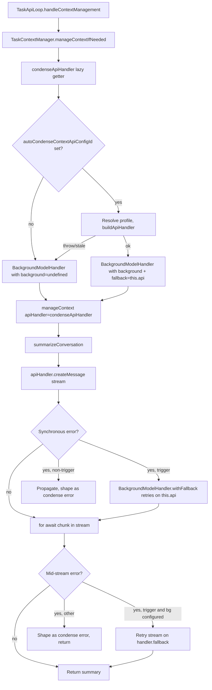

# Background Model for Context Compaction & Memory — Implementation Plan

**Date:** 2026-07-13
**Scope:** Allow users to configure a dedicated "background model" (any provider/profile) used for context compaction and memory save/dream. Add a fallback system so that if the chosen background model fails (offline, provider error), the system immediately switches back to the main task model to finish the operation.

**Delivery constraint:** Implement on a stacked branch. Do **not** commit or push — leave staged/unstaged changes for review.

---

## 1. Summary

Today the Roo Code VS Code extension uses the **main task model** for context compaction (condense) and a **separate, already-configurable profile** for memory writers (extraction + dream). However:

- **Compaction** ([`summarizeConversation`](src/core/condense/index.ts:274), called from [`manageContext`](src/core/context-management/index.ts:270)) always uses `this.access.api` — the main task's ApiHandler. There is **no** setting to route the condense LLM call to a cheaper/different model.
- **Memory writers** ([`extractMemories`](src/core/memory/extractMemories.ts:228) + [`autoDream`](src/core/memory/autoDream.ts:149)) already support a custom profile via the global setting [`memoryWriterApiConfigId`](packages/types/src/global-settings.ts:253) (resolved in [`ClineProvider.resolveMemoryWriterApiConfiguration`](src/core/webview/ClineProvider.ts:3418)). But this only falls back to the foreground profile **at config-load time** (stale/missing id) — there is **no runtime fallback** if the chosen provider returns errors mid-call.

This plan delivers:

1. A new global setting `autoCondenseContextApiConfigId` that routes compaction to a chosen profile (mirrors the existing `memoryWriterApiConfigId` pattern).
2. A reusable **`BackgroundModelHandler`** wrapper around `ApiHandler` that tries a configured background handler first and, on a triggering error, immediately retries the same call with the main (fallback) handler. This is the core "fallback system".
3. Integration of the wrapper into the **compaction** call site (`summarizeConversation`) and a hardening of the **memory writer** path so a failing background profile falls back to the foreground model mid-run (currently it just aborts/rolls back the dream lock).
4. Settings UI: a "Compaction API profile" selector in the Context Management tab (mirroring the existing Memory writer profile selector), and an optional unified "Background model" affordance. Respect the `cachedState` binding rule from AGENTS.md.
5. Tests at the unit + integration layer per the AGENTS.md test-placement guidance.

**Non-goals (explicitly out of scope):** Changing the memory writer's full-sub-Task architecture, adding a new provider, altering the circuit breaker's latch semantics, or persisting fallback events to telemetry beyond a log line.

---

## 2. Current Architecture (grounded findings)

### 2.1 Context compaction path

| Concern                         | Location                                                                                                                                                                                                                                                                                             |
| ------------------------------- | ---------------------------------------------------------------------------------------------------------------------------------------------------------------------------------------------------------------------------------------------------------------------------------------------------- |
| Top-level orchestrator          | [`manageContext()`](src/core/context-management/index.ts:270) — decides microcompaction → condense → truncation                                                                                                                                                                                      |
| Condense-gate + circuit breaker | [`TaskContextManager.manageContextIfNeeded()`](src/core/task/TaskContextManager.ts:438) computes `condenseCircuitOpen` from `consecutiveAutoCompactFailures` ([line 457](src/core/task/TaskContextManager.ts:457)), then calls `manageContext` ([line 505](src/core/task/TaskContextManager.ts:505)) |
| Forced truncation path          | [`TaskContextManager.handleContextWindowExceededError()`](src/core/task/TaskContextManager.ts:338) calls `manageContext` directly at [line 369](src/core/task/TaskContextManager.ts:369)                                                                                                             |
| **The actual LLM call**         | [`summarizeConversation()`](src/core/condense/index.ts:274) — streams `apiHandler.createMessage(promptToUse, requestMessages, metadata)` at [line 353](src/core/condense/index.ts:353)                                                                                                               |
| Error capture                   | The `try/catch` around the stream at [lines 352–404](src/core/condense/index.ts:352) builds a detailed `error`/`errorDetails` string and returns a `SummarizeResponse` with `error` set (does **not** throw)                                                                                         |
| ApiHandler passed in            | `this.access.api` (the main task handler) — see [`TaskContextManager` line 374](src/core/task/TaskContextManager.ts:374) and [line 510](src/core/task/TaskContextManager.ts:510)                                                                                                                     |
| Circuit breaker counter         | `consecutiveAutoCompactFailures` on [`TaskContextManagerAccess`](src/core/task/TaskContextManager.ts:90), advanced via [`nextAutoCompactFailureCount()`](src/core/task/TaskContextManager.ts:64); `MAX_CONSECUTIVE_AUTOCOMPACT_FAILURES = 3` ([line 36](src/core/task/TaskContextManager.ts:36))     |
| Caller in the API loop          | [`TaskApiLoop.handleContextManagement()`](src/core/task/TaskApiLoop.ts:1185) → `contextManager.manageContextIfNeeded` ([line 1223](src/core/task/TaskApiLoop.ts:1223))                                                                                                                               |

**Key observation:** `summarizeConversation` takes `apiHandler` as a parameter and never references the task directly — it is already a pure function of the handler. **Swapping the handler is trivial**; the work is in _constructing_ the background handler and _falling back_.

### 2.2 Memory save / dream path

| Concern                       | Location                                                                                                                                                                                                                                                                                                                 |
| ----------------------------- | ------------------------------------------------------------------------------------------------------------------------------------------------------------------------------------------------------------------------------------------------------------------------------------------------------------------------ |
| Trigger                       | [`TaskLifecycle.triggerMemoryBackgroundWriters()`](src/core/task/TaskLifecycle.ts:675) — fire-and-forget, called on `TaskCompleted` ([Task.ts:766](src/core/task/Task.ts:766)) and non-cancelled abort                                                                                                                   |
| Extraction runner             | [`executeExtractMemories()`](src/core/memory/extractMemories.ts:228) calls `context.subTaskRunner(...)` ([line 256](src/core/memory/extractMemories.ts:256))                                                                                                                                                             |
| Dream runner                  | [`executeAutoDream()`](src/core/memory/autoDream.ts:149) calls `context.subTaskRunner(...)` ([line 199](src/core/memory/autoDream.ts:199))                                                                                                                                                                               |
| Sub-task spawner              | [`ClineProvider.memorySubTaskRunner`](src/core/webview/ClineProvider.ts:3388) — spawns a **full headless `Task`** via `createBackgroundTask` ([line 3397](src/core/webview/ClineProvider.ts:3397)) with `apiConfiguration = resolveMemoryWriterApiConfiguration()` ([line 3394](src/core/webview/ClineProvider.ts:3394)) |
| Profile resolution            | [`ClineProvider.resolveMemoryWriterApiConfiguration()`](src/core/webview/ClineProvider.ts:3418) — reads `memoryWriterApiConfigId`, loads the profile via `providerSettingsManager.getProfile({id})`, returns `undefined` on stale/missing (caller falls back to foreground)                                              |
| Existing setting              | [`memoryWriterApiConfigId`](packages/types/src/global-settings.ts:253) — `z.string().optional()`                                                                                                                                                                                                                         |
| Failure handling (dream)      | [`autoDream` catch block](src/core/memory/autoDream.ts:210) — on non-abort failure, logs and **rolls back the consolidation lock** so the time-gate re-passes; no retry, no fallback                                                                                                                                     |
| Failure handling (extraction) | [`extractMemories` catch block](src/core/memory/extractMemories.ts:263) (read in earlier exploration) — logs and advances cursor; no retry                                                                                                                                                                               |

**Key observation:** Memory writers are **full sub-Tasks**, not direct LLM calls. The chosen profile becomes the sub-task's `apiConfiguration`, and the sub-task builds its own `ApiHandler` via [`buildApiHandler`](src/api/index.ts:119). A sub-task that fails because the background provider is down currently just aborts the sub-task (emitting `TaskAborted`); the parent's `awaitTaskCompletion` resolves `{ completed: false, writtenPaths: [] }` ([backgroundTask.spec.ts:66](src/core/webview/__tests__/backgroundTask.spec.ts:66)) and the memory is simply not saved. **There is no automatic retry on the foreground model.**

### 2.3 Model configuration & profile system

| Concern                   | Location                                                                                                                                                                                                                                            |
| ------------------------- | --------------------------------------------------------------------------------------------------------------------------------------------------------------------------------------------------------------------------------------------------- |
| `ProviderSettings` schema | [`providerSettingsSchema`](packages/types/src/provider-settings.ts:419) — union of all provider schemas; `apiProvider` discriminator + `apiModelId`/`openRouterModelId`/… model keys ([`modelIdKeys`](packages/types/src/provider-settings.ts:477)) |
| `ApiHandlerOptions`       | [`src/shared/api.ts:13`](src/shared/api.ts:13) — `Omit<ProviderSettings, "apiProvider"> & { enableResponsesReasoningSummary?; ollamaNumCtx? }`                                                                                                      |
| ApiHandler factory        | [`buildApiHandler(configuration: ProviderSettings)`](src/api/index.ts:119) — `switch (apiProvider)` returning the concrete handler                                                                                                                  |
| Profile storage           | `ProviderSettingsManager` ([`src/core/config/ProviderSettingsManager.ts`](src/core/config/ProviderSettingsManager.ts:626)) — profiles stored under `apiConfigs: Record<id, ProviderSettingsWithId>`                                                 |
| Global settings schema    | [`globalSettingsSchema`](packages/types/src/global-settings.ts) — includes `memoryWriterApiConfigId` at [line 253](packages/types/src/global-settings.ts:253)                                                                                       |
| GlobalState keys list     | [`GLOBAL_STATE_KEYS`](packages/types/src/global-settings.ts:417) = `[...GLOBAL_SETTINGS_KEYS, ...PROVIDER_SETTINGS_KEYS]` minus secrets                                                                                                             |
| ContextProxy defaults     | [`ContextProxy.initialize()`](src/core/config/ContextProxy.ts:59) writes defaults for memory keys ([lines 128–129](src/core/config/ContextProxy.ts:128))                                                                                            |
| Extension → webview state | [`src/extension.ts:202`](src/extension.ts:202) pushes `autoDreamMinHours` etc. to the webview — new keys must be added here                                                                                                                         |

**Key observation:** Adding a new "background model" setting is a **one-line schema addition** to `globalSettingsSchema`, and it automatically flows through `GLOBAL_STATE_KEYS`, `ContextProxy`, and the webview state. The existing `memoryWriterApiConfigId` is the exact template.

### 2.4 Settings UI (webview)

| Concern                                     | Location                                                                                                                                                                                                                                                                                                                                                                                                                                             |
| ------------------------------------------- | ---------------------------------------------------------------------------------------------------------------------------------------------------------------------------------------------------------------------------------------------------------------------------------------------------------------------------------------------------------------------------------------------------------------------------------------------------- |
| `SettingsView` root                         | [`webview-ui/src/components/settings/SettingsView.tsx`](webview-ui/src/components/settings/SettingsView.tsx) — pulls values from `useExtensionState()` into local `cachedState`, passes down                                                                                                                                                                                                                                                         |
| `cachedState` binding (AGENTS.md rule)      | All inputs bind to `setCachedStateField` (type in [`webview-ui/src/components/settings/types.ts:5`](webview-ui/src/components/settings/types.ts:5)); Save flushes `cachedState` to the extension                                                                                                                                                                                                                                                     |
| Memory settings section                     | [`MemorySettings.tsx`](webview-ui/src/components/settings/MemorySettings.tsx) — the **writer profile `<Select>`** lives at [lines 130–152](webview-ui/src/components/settings/MemorySettings.tsx:130), uses `UNSET_PROFILE = "-"` sentinel, calls `setCachedStateField("memoryWriterApiConfigId", …)`                                                                                                                                                |
| Context-management section                  | [`ContextManagementSettings.tsx`](webview-ui/src/components/settings/ContextManagementSettings.tsx) — props type at [line 28](webview-ui/src/components/settings/ContextManagementSettings.tsx:28); already receives `listApiConfigMeta` ([line 69](webview-ui/src/components/settings/ContextManagementSettings.tsx:69)). The `autoCondenseContext` checkbox is at [line 480](webview-ui/src/components/settings/ContextManagementSettings.tsx:480) |
| `SettingsView` wiring for ContextManagement | [`SettingsView.tsx:866–886`](webview-ui/src/components/settings/SettingsView.tsx:866) — passes `listApiConfigMeta` already ([line 870](webview-ui/src/components/settings/SettingsView.tsx:870))                                                                                                                                                                                                                                                     |
| `ExtensionStateContextType`                 | [`webview-ui/src/context/ExtensionStateContext.tsx`](webview-ui/src/context/ExtensionStateContext.tsx) — new fields must be declared on the type and given defaults ([lines 252–254](webview-ui/src/context/ExtensionStateContext.tsx:252))                                                                                                                                                                                                          |
| i18n keys                                   | [`webview-ui/src/i18n/locales/en/settings.json`](webview-ui/src/i18n/locales/en/settings.json) — existing `memory.writerProfile.*` at [lines 646–650](webview-ui/src/i18n/locales/en/settings.json:646)                                                                                                                                                                                                                                              |

### 2.5 ApiHandler construction & error classification

| Concern                             | Location                                                                                                                                                                                                                        |
| ----------------------------------- | ------------------------------------------------------------------------------------------------------------------------------------------------------------------------------------------------------------------------------- | ------- | --------------------- |
| `ApiHandler` interface              | [`src/api/index.ts:90`](src/api/index.ts:90) — `createMessage` returns an `ApiStream` (async iterable of `{type:"text"                                                                                                          | "usage" | "reasoning"}` chunks) |
| Error wrapper used by providers     | [`handleProviderError()`](src/api/providers/utils/error-handler.ts:37) — preserves `status`, `errorDetails`, `code` on the wrapped Error                                                                                        |
| Retry classification (reuse target) | [`RetryHandler.shouldRetry()`](src/core/task/RetryHandler.ts:119) — returns `true` for `ECONNRESET`/`ETIMEDOUT`/`ENOTFOUND`, HTTP `429`, `503`, any `5xx`. **This is the exact classification we want for "trigger fallback".** |
| 429 RetryInfo parsing               | [`RetryHandler.calculateBackoffDelay()`](src/core/task/RetryHandler.ts:84) reads `error.errorDetails[].@type === "...RetryInfo"`                                                                                                |

---

## 3. Proposed Design

### 3.1 Storage: new global setting `autoCondenseContextApiConfigId`

Mirror `memoryWriterApiConfigId` exactly. **Type addition** in [`packages/types/src/global-settings.ts`](packages/types/src/global-settings.ts) (insert after [line 253](packages/types/src/global-settings.ts:253)):

```ts
/**
 * API profile id to use for automatic context compaction (condense) LLM calls.
 * When unset or stale, compaction uses the foreground task model. A runtime
 * failure of the chosen profile falls back to the foreground model via the
 * BackgroundModelHandler wrapper.
 */
autoCondenseContextApiConfigId: z.string().optional(),
```

This single addition propagates the key into `GLOBAL_STATE_KEYS` ([line 417](packages/types/src/global-settings.ts:417)), the `GlobalState` union in [`vscode-extension-host.ts:338`](packages/types/src/vscode-extension-host.ts:338), and the webview's `ExtensionStateContextType` (must be mirrored there — see §3.4).

**Why a profile id and not inline provider/model fields?** The profile system already persists a full `ProviderSettings` (provider + modelId + apiKey + baseUrl + …) per profile, the UI already lists profiles via `listApiConfigMeta`, and `memoryWriterApiConfigId` proves the pattern works. Reusing profiles avoids duplicating the entire provider-config UI surface for "background model".

**No sub-profile / nested object** — a flat optional string keeps the schema additive and migration-free (absent ⇒ foreground, identical to today).

### 3.2 `BackgroundModelHandler` — the fallback wrapper

**New file:** [`src/api/BackgroundModelHandler.ts`](src/api/BackgroundModelHandler.ts)

This is the core of the fallback system. It implements `ApiHandler` and wraps a _primary_ (background) handler with a _fallback_ (main) handler. On a triggering error from the primary, it transparently retries the identical call on the fallback.

#### Interface

```ts
import { Anthropic } from "@anthropic-ai/sdk"
import { ApiHandler, ApiHandlerCreateMessageMetadata, ApiStream } from "./index"
import { ModelInfo } from "@roo-code/types"

/**
 * Error classification for fallback decisions. Extracted from
 * RetryHandler.shouldRetry (src/core/task/RetryHandler.ts:119) so the
 * background handler stays decoupled from the task retry loop.
 */
export function isFallbackTriggerError(error: unknown): boolean {
	if (error == null) return false
	const e = error as any
	// Network / connectivity (provider offline, DNS, timeout)
	if (e.code === "ECONNRESET" || e.code === "ETIMEDOUT" || e.code === "ENOTFOUND" || e.code === "EAI_AGAIN") {
		return true
	}
	// Auth / invalid credentials — the background profile is misconfigured;
	// fall back rather than surface a 401 to the user inside a condense.
	if (e.status === 401 || e.status === 403) return true
	// Rate limit / unavailable / 5xx — provider-side outage.
	if (e.status === 429 || e.status === 503) return true
	if (typeof e.status === "number" && e.status >= 500 && e.status < 600) return true
	// Provider construction threw (e.g. "API key is required") — wrapped Errors
	// from buildApiHandler propagate as plain Errors with .message; treat a
	// handler that was never usable as a trigger.
	if (e instanceof Error && /API key is required|no such provider|invalid/i.test(e.message)) return true
	return false
}

export interface BackgroundModelHandlerOptions {
	/** The preferred background handler. If undefined, the wrapper is a passthrough to fallback. */
	background?: ApiHandler
	/** The main task handler — always present. Used when background is absent or fails. */
	fallback: ApiHandler
	/** Sink for fallback events (telemetry/log). Optional. */
	onFallback?: (reason: { stage: "createMessage" | "countTokens" | "getModel"; error: unknown }) => void
}

export class BackgroundModelHandler implements ApiHandler {
	private readonly bg?: ApiHandler
	private readonly fb: ApiHandler
	private readonly onFallback?: BackgroundModelHandlerOptions["onFallback"]

	constructor(opts: BackgroundModelHandlerOptions) {
		this.bg = opts.background
		this.fb = opts.fallback
		this.onFallback = opts.onFallback
	}

	getModel(): { id: string; info: ModelInfo } {
		// Always report the handler that will actually serve the call. We prefer
		// background for display purposes, but the model info is only consumed for
		// token math / context-window decisions, where the fallback's numbers are
		// the safe ones to use (the call may end up there). Use fallback.
		return this.fb.getModel()
	}

	async countTokens(content: Array<Anthropic.Messages.ContentBlockParam>): Promise<number> {
		// Token counting is cheap and must be consistent with the model that ends
		// up serving the call. Always use the fallback (main) handler's counter —
		// the context window / token budget belongs to the main task. This avoids
		// a background model with a different tokenizer under-counting and blowing
		// the main model's window.
		return this.fb.countTokens(content)
	}

	createMessage(
		systemPrompt: string,
		messages: Anthropic.Messages.MessageParam[],
		metadata?: ApiHandlerCreateMessageMetadata,
	): ApiStream {
		// Stream-first-then-retry: we must be able to retry the *entire* stream
		// because a failure mid-stream has already yielded partial output that the
		// caller (summarizeConversation) accumulates into `summary`. The caller
		// must discard the partial summary on fallback — see §3.3 integration.
		return this.withFallback((handler) => handler.createMessage(systemPrompt, messages, metadata))
	}

	/**
	 * Run a producer through the background handler; on a triggering error,
	 * emit a fallback event and re-run it through the fallback handler.
	 * The producer must be a pure function of `handler` (no captured state)
	 * so re-running on fallback produces a fresh, complete stream.
	 */
	private withFallback<T>(producer: (handler: ApiHandler) => T): T {
		// If no background handler is configured, skip straight to fallback.
		if (!this.bg) return producer(this.fb)
		try {
			return producer(this.bg)
		} catch (error) {
			if (isFallbackTriggerError(error)) {
				this.onFallback?.({ stage: "createMessage", error })
				return producer(this.fb)
			}
			throw error
		}
	}

	cancelRequest?(destroyClient?: boolean): void {
		this.bg?.cancelRequest?.(destroyClient)
		this.fb.cancelRequest?.(destroyClient)
	}
}
```

#### Critical design decisions

1. **`getModel()` / `countTokens()` always use the fallback (main) handler.** The context window, max-token math, and budget checks in `manageContext` ([index.ts:294–308](src/core/context-management/index.ts:294)) and `summarizeConversation` ([index.ts:521–543](src/core/condense/index.ts:521)) must be consistent with the model that ultimately serves the call. Using the background model's (possibly smaller) token math would under-count and risk overflow on the main model after a fallback. This is also cheaper (no double counting).

2. **`createMessage` returns a stream, but fallback is decided at _stream creation_ time, not mid-stream.** The `ApiStream` is an async iterable; an error during iteration surfaces inside the `for await` loop in `summarizeConversation` ([line 355](src/core/condense/index.ts:355)), _after_ partial text has been accumulated. The wrapper's `withFallback` only catches errors thrown **synchronously by `createMessage`** (e.g. handler construction failure, immediate connection refusal on first `next()`). **Mid-stream errors are handled by the integration layer** (§3.3) which is the only place that can discard the partial summary and restart cleanly. This avoids a fragile "buffer-and-replay" stream wrapper.

3. **Error classification reuses `RetryHandler.shouldRetry`'s logic** ([line 119](src/core/task/RetryHandler.ts:119)) plus 401/403 (a background profile with bad credentials should not block compaction). Network errors (`ECONNRESET`/`ETIMEDOUT`/`ENOTFOUND`/`EAI_AGAIN`) cover "model not online"; `429`/`503`/`5xx` cover "provider returns errors". 4xx other than 401/403/429 (e.g. `400 Bad Request` from a context-window mismatch, `404 model not found`) are **also** treated as triggers via the message regex, because a misconfigured background model should not block the task.

4. **Non-trigger errors propagate.** Aborts (`AbortError`), `SIGINT`, and programmer errors are not classified as triggers and bubble up unchanged — so cancelling a task still cancels condense.

5. **`onFallback` callback** lets the integration layer emit a log line / telemetry event without coupling the wrapper to `TelemetryService`.

#### Why a wrapper and not per-call-site `try/catch`?

- `summarizeConversation` and the memory sub-task both already have their own error handling; duplicating the "try background → catch → retry on main" logic in each is error-prone and diverges.
- A wrapper that satisfies `ApiHandler` is a drop-in replacement at the call site — no signature changes to `summarizeConversation` or `manageContext`.
- The wrapper is unit-testable in isolation (§5).

### 3.3 Integration points

#### A. Compaction (`summarizeConversation` + `TaskContextManager`)

**Before** (current flow):

```
TaskContextManager.manageContextIfNeeded()
  → manageContext({ apiHandler: this.access.api, … })          // TaskContextManager.ts:510
      → summarizeConversation({ apiHandler, … })               // context-management/index.ts:403
          → stream = apiHandler.createMessage(…)               // condense/index.ts:353
          → for await (chunk of stream) { summary += chunk.text }  // line 355
          → on error: return { error, errorDetails }           // line 398
```

**After** (with background model + fallback):

1. **Construct the background handler once per task** alongside `this.api`. Add a lazy getter on `TaskContextManagerAccess` (or `Task`):

    ```ts
    // On Task / TaskContextManagerAccess:
    private _condenseApiHandler?: ApiHandler
    /** The handler used for condense LLM calls: background model with fallback to this.api. */
    get condenseApiHandler(): ApiHandler {
      if (this._condenseApiHandler) return this._condenseApiHandler
      const background = this.resolveBackgroundCondenseHandler()
      this._condenseApiHandler = new BackgroundModelHandler({
        background,
        fallback: this.api,
        onFallback: ({ error }) => logger.warn(`[condense] background model failed, falling back to main: ${
          error instanceof Error ? error.message : String(error)}`),
      })
      return this._condenseApiHandler
    }
    ```

    `resolveBackgroundCondenseHandler()` reads `autoCondenseContextApiConfigId` from the provider, loads the profile via `providerSettingsManager.getProfile({id})`, and calls `buildApiHandler(profile)`. Returns `undefined` if no id, stale id, or `buildApiHandler` throws (caught → `undefined` → wrapper becomes a passthrough). This mirrors [`ClineProvider.resolveMemoryWriterApiConfiguration`](src/core/webview/ClineProvider.ts:3418) exactly, but returns a _handler_ rather than raw `ProviderSettings` (because condense is a direct LLM call, not a sub-task).

2. **Invalidate the cached handler on `updateApiConfiguration`** — same pattern as [`Task.memoryCoordinator` invalidation](src/core/task/__tests__/Task.memory-coordinator-invalidation.spec.ts:248): set `this._condenseApiHandler = undefined` when the main api config changes.

3. **Pass `condenseApiHandler` into `manageContext`** instead of `this.access.api` at the two call sites:

    - [`TaskContextManager.manageContextIfNeeded` line 510](src/core/task/TaskContextManager.ts:510): `apiHandler: this.access.condenseApiHandler`
    - [`TaskContextManager.handleContextWindowExceededError` line 374](src/core/task/TaskContextManager.ts:374): `apiHandler: this.access.condenseApiHandler`

    No change to `manageContext`'s signature — it already takes `apiHandler` as a param ([index.ts:215](src/core/context-management/index.ts:215)).

4. **Harden `summarizeConversation` against mid-stream fallback.** The wrapper only catches synchronous `createMessage` failures. A mid-stream error (provider drops connection after emitting 200 of 500 tokens) surfaces inside the `for await` loop at [`condense/index.ts:355`](src/core/condense/index.ts:355). To support a clean retry on the fallback handler, refactor the streaming loop into a helper that can be re-invoked:

    ```ts
    // condense/index.ts — sketch (shape only, not final code)
    async function streamSummary(
    	handler: ApiHandler,
    	promptToUse: string,
    	requestMessages: Anthropic.Messages.MessageParam[],
    	metadata?: ApiHandlerCreateMessageMetadata,
    ): Promise<{ summary: string; cost: number; outputTokens: number }> {
    	let summary = "",
    		cost = 0,
    		outputTokens = 0
    	const stream = handler.createMessage(promptToUse, requestMessages, metadata)
    	for await (const chunk of stream) {
    		if (chunk.type === "text") summary += chunk.text
    		else if (chunk.type === "usage") {
    			cost = chunk.totalCost ?? 0
    			outputTokens = chunk.outputTokens ?? 0
    		}
    	}
    	return { summary: summary.trim(), cost, outputTokens }
    }
    ```

    Then in `summarizeConversation`, replace the inline `try { stream = …; for await … } catch { return {…, error} }` ([lines 352–404](src/core/condense/index.ts:352)) with:

    ```ts
    try {
      const { summary: bgSummary, cost: bgCost, outputTokens: bgOut } = await streamSummary(
        apiHandler, promptToUse, requestMessages, metadata)
      summary = bgSummary; cost = bgCost; outputTokens = bgOut
    } catch (error) {
      // If the handler is a BackgroundModelHandler and the error is a trigger,
      // it already retried internally for synchronous failures. Mid-stream
      // failures reach here: classify and retry once on the fallback directly.
      if (apiHandler instanceof BackgroundModelHandler && isFallbackTriggerError(error)) {
        logger.warn(`[condense] background stream failed mid-flight, retrying on main model`)
        const { summary: fbSummary, cost: fbCost, outputTokens: fbOut } = await streamSummary(
          apiHandler.fallback, promptToUse, requestMessages, metadata)   // expose `fallback` getter
        summary = fbSummary; cost = fbCost; outputTokens = fbOut
      } else {
        // existing error-shaping path (lines 364–404) unchanged
        return { ...response, cost, error: t("common:errors.condense_api_failed", { message: … }), errorDetails }
      }
    }
    ```

    This keeps the public `summarizeConversation` signature unchanged (still takes a single `apiHandler`), and the fallback is opt-in: a plain `ApiHandler` (no background configured) takes the existing error path verbatim.

    **Expose `BackgroundModelHandler.fallback` as a readonly getter** so the integration can do a direct mid-stream retry without re-implementing classification.

#### B. Memory writers (extraction + dream)

Memory writers run as full sub-Tasks via [`ClineProvider.memorySubTaskRunner`](src/core/webview/ClineProvider.ts:3388). The chosen profile is the sub-task's `apiConfiguration`. When the background provider fails, the sub-task aborts and `awaitTaskCompletion` resolves `{ completed: false, writtenPaths: [] }` — the memory is silently not saved.

**Design choice: fallback at the sub-task level, not inside the sub-task.** Re-running the sub-task on the foreground profile is the cleanest fallback because:

- The sub-task has its own conversation history, tool approvals, and turn cap — injecting a new handler mid-run is fragile.
- The sub-task's failure already produces a clean `completed: false` result that the runner can detect.

**Change** [`memorySubTaskRunner`](src/core/webview/ClineProvider.ts:3388):

```ts
public get memorySubTaskRunner(): SubTaskRunner {
  return async ({ cwd, systemPrompt, userPrompt, maxTurns, signal }) => {
    const text = systemPrompt ? `${systemPrompt}\n\n---\n\n${userPrompt}` : userPrompt
    const backgroundConfig = await this.resolveMemoryWriterApiConfiguration()
    this.setMemoryActivity("write", true)
    try {
      const outcome = await this.runMemorySubTask(text, cwd, maxTurns, signal, backgroundConfig)
      if (outcome.completed && outcome.writtenPaths.length >= 0) {
        return { writtenPaths: filterMemoryWrittenPaths(outcome.writtenPaths, cwd) }
      }
      // Sub-task did not complete (aborted). If we were using a background
      // profile, retry once on the foreground profile — the background model
      // may be offline. Do NOT retry if we were already on the foreground
      // profile (would just loop on a real failure).
      if (backgroundConfig) {
        this.log(`[memorySubTaskRunner] background profile did not complete, retrying on foreground`)
        const retry = await this.runMemorySubTask(text, cwd, maxTurns, signal, undefined /* foreground */)
        return { writtenPaths: filterMemoryWrittenPaths(retry.writtenPaths, cwd) }
      }
      return { writtenPaths: [] }
    } finally {
      this.setMemoryActivity("write", false)
    }
  }
}

/** Helper extracted from the inline body for retry support. */
private async runMemorySubTask(text, cwd, maxTurns, signal, apiConfiguration): Promise<{ completed: boolean; writtenPaths: string[] }> {
  const task = await this.createBackgroundTask(text, {
    taskMode: "code", workspacePath: cwd, maxAgentTurns: maxTurns,
    autoApprovalOverride: memoryWriteSandbox(cwd), silentWrites: true, apiConfiguration,
  })
  const { completed, writtenPaths } = await this.awaitTaskCompletion(task, { signal })
  return { completed, writtenPaths }
}
```

**Important distinction from compaction:** Memory writer fallback triggers on **sub-task non-completion** (a coarse signal), not on a classified error, because the sub-task swallows its own API errors internally (the dream's catch block [rolls back the lock](src/core/memory/autoDream.ts:210); extraction's catch advances the cursor). This is acceptable for memory (best-effort by design — see the comments at [`extractMemories.ts:18`](src/core/memory/extractMemories.ts:18) "Fire-and-forget"). A full memory-save is still not guaranteed, but a transient background-provider outage will no longer silently skip memory extraction.

**The signal:** `awaitTaskCompletion` already respects the abort signal ([backgroundTask.spec.ts:88](src/core/webview/__tests__/backgroundTask.spec.ts:88)). The retry must check `signal.aborted` before re-running, so a user-initiated abort does not trigger a fallback retry.

### 3.4 Settings UI

#### New state field

In [`webview-ui/src/context/ExtensionStateContext.tsx`](webview-ui/src/context/ExtensionStateContext.tsx):

- Add `autoCondenseContextApiConfigId: string | undefined` to `ExtensionStateContextType` (near [line 131](webview-ui/src/context/ExtensionStateContext.tsx:131), next to `autoCondenseContext`).
- Add a default `autoCondenseContextApiConfigId: undefined` to the initial state ([line 252 area](webview-ui/src/context/ExtensionStateContext.tsx:252)).
- No setter needed beyond the generic `setState` path — it flows through `setCachedStateField` like the other settings.

In [`src/extension.ts`](src/extension.ts) (the state-push near [line 202](src/extension.ts:202)):

```ts
autoCondenseContextApiConfigId: contextProxy.getValue("autoCondenseContextApiConfigId"),
```

#### `ContextManagementSettings.tsx` — add the profile selector

Add `autoCondenseContextApiConfigId?: string` to the props type ([line 28](webview-ui/src/components/settings/ContextManagementSettings.tsx:28)) and to the `SetCachedStateField` union ([line 47](webview-ui/src/components/settings/ContextManagementSettings.tsx:47)). Then, inside the `{autoCondenseContext && ( … )}` block ([line 487](webview-ui/src/components/settings/ContextManagementSettings.tsx:487)), after the threshold slider, add a `<SearchableSetting>` mirroring [`MemorySettings.tsx:122–156`](webview-ui/src/components/settings/MemorySettings.tsx:122):

```tsx
<SearchableSetting
	settingId="context-condense-profile"
	section="contextManagement"
	label={t("settings:contextManagement.condenseProfile.label")}
	className="mt-4">
	<label className="block text-sm font-medium mb-2">{t("settings:contextManagement.condenseProfile.label")}</label>
	<Select
		value={autoCondenseContextApiConfigId ?? UNSET_PROFILE}
		onValueChange={(value) =>
			setCachedStateField("autoCondenseContextApiConfigId", value === UNSET_PROFILE ? undefined : value)
		}
		data-testid="condense-profile-select">
		<SelectTrigger className="w-full">
			<SelectValue placeholder={t("settings:contextManagement.condenseProfile.useCurrent")} />
		</SelectTrigger>
		<SelectContent>
			<SelectItem value={UNSET_PROFILE}>{t("settings:contextManagement.condenseProfile.useCurrent")}</SelectItem>
			{listApiConfigMeta.map((config) => (
				<SelectItem key={config.id} value={config.id}>
					{config.name}
				</SelectItem>
			))}
		</SelectContent>
	</Select>
	<div className="text-vscode-descriptionForeground text-sm mt-1">
		{t("settings:contextManagement.condenseProfile.description")}
	</div>
</SearchableSetting>
```

`UNSET_PROFILE = "-"` is defined locally (same as `MemorySettings.tsx:36`). `listApiConfigMeta` is already a prop ([line 69](webview-ui/src/components/settings/ContextManagementSettings.tsx:69)) and already passed from `SettingsView` ([line 870](webview-ui/src/components/settings/SettingsView.tsx:870)).

#### `SettingsView.tsx` wiring

In [`SettingsView.tsx`](webview-ui/src/components/settings/SettingsView.tsx):

- Pull `autoCondenseContextApiConfigId` from `useExtensionState()` near [line 170](webview-ui/src/components/settings/SettingsView.tsx:170) (next to `autoCondenseContext`).
- Include it in the `cachedState` initial object near [line 396](webview-ui/src/components/settings/SettingsView.tsx:396): `autoCondenseContextApiConfigId: autoCondenseContextApiConfigId || undefined,`
- Pass it to `<ContextManagementSettings … autoCondenseContextApiConfigId={autoCondenseContextApiConfigId} />` at [line 867](webview-ui/src/components/settings/SettingsView.tsx:867).

**Respect the `cachedState` rule (AGENTS.md):** the `<Select>` binds to `setCachedStateField("autoCondenseContextApiConfigId", …)` — never to `useExtensionState()` directly. This matches the existing `memoryWriterApiConfigId` wiring ([MemorySettings.tsx:132](webview-ui/src/components/settings/MemorySettings.tsx:132)).

#### i18n keys

Add to [`webview-ui/src/i18n/locales/en/settings.json`](webview-ui/src/i18n/locales/en/settings.json) under `contextManagement`:

```json
"condenseProfile": {
  "label": "Compaction API profile",
  "description": "Routes context compaction (condense) LLM calls to a cheaper or different API profile instead of the foreground model. If the chosen profile is offline or returns an error, compaction automatically falls back to the current model. A stale or deleted profile also falls back to the current model.",
  "useCurrent": "Use current profile"
}
```

The other 17 locale directories under [`webview-ui/src/i18n/locales/`](webview-ui/src/i18n/locales/) must get the same key (English fallback is acceptable per existing translation workflow; the `roo-translation` skill documents the process). **At minimum** add the English key to every locale's `settings.json` to avoid missing-key warnings; the translations can follow.

### 3.5 Fallback flow diagram



---

## 4. Implementation Task Breakdown

Ordered so each step's dependencies are already present. Each step lists the files it touches. **Branch creation first; no commits/push.**

### Step 0 — Stacked branch

- Create a stacked branch off the current working branch (e.g. `git checkout -b feat/background-model-compaction-memory` from the user's current branch). The user said "stacked branch" — confirm the base with the user before branching if the current branch is not `main`/the integration branch. **Do not commit or push.**

### Step 1 — Schema: add `autoCondenseContextApiConfigId`

Files:

- [`packages/types/src/global-settings.ts`](packages/types/src/global-settings.ts) — add the `z.string().optional()` field after [line 253](packages/types/src/global-settings.ts:253). (Auto-propagates into `GLOBAL_STATE_KEYS`, `GlobalState` union.)
- [`packages/types/src/vscode-extension-host.ts`](packages/types/src/vscode-extension-host.ts:338) — add `"autoCondenseContextApiConfigId"` to the `GlobalState` intersection (next to `memoryWriterApiConfigId` at [line 342](packages/types/src/vscode-extension-host.ts:342)).

**Test:** `cd packages/types && npx vitest run src/__tests__/index.test.ts` — verify `GLOBAL_STATE_KEYS` includes the new key (extend the test file with an assertion).

### Step 2 — `BackgroundModelHandler` + error classification

Files:

- **New** [`src/api/BackgroundModelHandler.ts`](src/api/BackgroundModelHandler.ts) — `isFallbackTriggerError`, `BackgroundModelHandlerOptions`, `BackgroundModelHandler` class (§3.2).
- **New** [`src/api/__tests__/BackgroundModelHandler.spec.ts`](src/api/__tests__/BackgroundModelHandler.spec.ts) — unit tests (§5).

No integration yet; the class is self-contained and implements `ApiHandler`.

**Test:** `cd src && npx vitest run api/__tests__/BackgroundModelHandler.spec.ts`

### Step 3 — Plumb the new setting through extension state

Files:

- [`src/extension.ts`](src/extension.ts) — push `autoCondenseContextApiConfigId` to webview near [line 202](src/extension.ts:202).
- [`webview-ui/src/context/ExtensionStateContext.tsx`](webview-ui/src/context/ExtensionStateContext.tsx) — add the type field ([line ~131](webview-ui/src/context/ExtensionStateContext.tsx:131)) and default ([line ~252](webview-ui/src/context/ExtensionStateContext.tsx:252)).
- [`webview-ui/src/context/__tests__/ExtensionStateContext.spec.tsx`](webview-ui/src/context/__tests__/ExtensionStateContext.spec.tsx) — add the field to test fixtures ([line ~208](webview-ui/src/context/__tests__/ExtensionStateContext.spec.tsx:208) and [line ~277](webview-ui/src/context/__tests__/ExtensionStateContext.spec.tsx:277)).

**Test:** `cd webview-ui && npx vitest run src/context/__tests__/ExtensionStateContext.spec.tsx`

### Step 4 — Resolve + construct the background condense handler on `Task`

Files:

- [`src/core/task/Task.ts`](src/core/task/Task.ts) — add the `_condenseApiHandler` cache, the `condenseApiHandler` lazy getter, `resolveBackgroundCondenseHandler()` (reads `autoCondenseContextApiConfigId` from the provider, calls `buildApiHandler`), and invalidation in `updateApiConfiguration` (next to the `_memoryCoordinator` invalidation — see [Task.memory-coordinator-invalidation.spec.ts:248](src/core/task/__tests__/Task.memory-coordinator-invalidation.spec.ts:248)).
- [`src/core/task/TaskContextManager.ts`](src/core/task/TaskContextManager.ts) — add `condenseApiHandler: ApiHandler` to `TaskContextManagerAccess` ([line 78](src/core/task/TaskContextManager.ts:78)); replace `apiHandler: this.access.api` with `apiHandler: this.access.condenseApiHandler` at [line 374](src/core/task/TaskContextManager.ts:374) and [line 510](src/core/task/TaskContextManager.ts:510).

**Test (integration):** extend [`src/core/task/__tests__/Task.memory-coordinator-invalidation.spec.ts`](src/core/task/__tests__/Task.memory-coordinator-invalidation.spec.ts) pattern into a new `Task.condense-handler-invalidation.spec.ts` verifying (a) the getter constructs a `BackgroundModelHandler` wrapping the resolved background handler + `this.api`, (b) `updateApiConfiguration` invalidates the cache, (c) a stale/missing profile id yields a passthrough wrapper.

**Test:** `cd src && npx vitest run core/task/__tests__/Task.condense-handler-invalidation.spec.ts`

### Step 5 — Integrate the wrapper into `summarizeConversation` (mid-stream retry)

Files:

- [`src/core/condense/index.ts`](src/core/condense/index.ts) — extract `streamSummary` helper; replace the inline try/catch at [lines 352–404](src/core/condense/index.ts:352) with the fallback-aware version (§3.3-A). Import `BackgroundModelHandler` and `isFallbackTriggerError` from `../../api/BackgroundModelHandler`. Expose `BackgroundModelHandler.fallback` as a readonly getter in step 2.

**Test (integration):** extend [`src/core/condense/__tests__/index.spec.ts`](src/core/condense/__tests__/index.spec.ts) (the `summarizeConversation with custom settings` block at [line 1132](src/core/condense/__tests__/index.spec.ts:1132)) with cases: (a) background handler succeeds, (b) background handler throws synchronously → fallback handler's stream is used, (c) background stream errors mid-flight → fallback stream's output is the final summary, (d) non-trigger error → existing error path.

**Test:** `cd src && npx vitest run core/condense/__tests__/index.spec.ts`

### Step 6 — Harden memory writer sub-task with foreground retry

Files:

- [`src/core/webview/ClineProvider.ts`](src/core/webview/ClineProvider.ts) — refactor `memorySubTaskRunner` ([line 3388](src/core/webview/ClineProvider.ts:3388)) to extract `runMemorySubTask` and add the non-completion → foreground retry (§3.3-B). Check `signal.aborted` before retrying.

**Test:** extend [`src/core/webview/__tests__/backgroundTask.spec.ts`](src/core/webview/__tests__/backgroundTask.spec.ts) (the `resolveMemoryWriterApiConfiguration` block at [line 151](src/core/webview/__tests__/backgroundTask.spec.ts:151)) with cases: (a) background profile completes → no retry, (b) background profile does not complete + `backgroundConfig` set → retry on foreground, (c) foreground-only run does not complete → no retry, (d) signal already aborted → no retry.

**Test:** `cd src && npx vitest run core/webview/__tests__/backgroundTask.spec.ts`

### Step 7 — Settings UI: Context Management profile selector

Files:

- [`webview-ui/src/components/settings/ContextManagementSettings.tsx`](webview-ui/src/components/settings/ContextManagementSettings.tsx) — add prop + `UNSET_PROFILE` + the `<SearchableSetting>`/`<Select>` block (§3.4).
- [`webview-ui/src/components/settings/SettingsView.tsx`](webview-ui/src/components/settings/SettingsView.tsx) — pull from state, add to `cachedState` initial object, pass prop ([line 867](webview-ui/src/components/settings/SettingsView.tsx:867)).
- [`webview-ui/src/components/settings/__tests__/ContextManagementSettings.spec.tsx`](webview-ui/src/components/settings/__tests__/ContextManagementSettings.spec.tsx) — add `autoCondenseContextApiConfigId` to `defaultProps` ([line 88](webview-ui/src/components/settings/__tests__/ContextManagementSettings.spec.tsx:88)); add a test that selecting a profile calls `setCachedStateField("autoCondenseContextApiConfigId", "profile-1")` (mirror [`MemorySettings.spec.tsx:176`](webview-ui/src/components/settings/__tests__/MemorySettings.spec.tsx:176)).
- [`webview-ui/src/components/settings/__tests__/SettingsView.change-detection.spec.tsx`](webview-ui/src/components/settings/__tests__/SettingsView.change-detection.spec.tsx) and `SettingsView.unsaved-changes.spec.tsx` — add the field to fixtures ([line 266](webview-ui/src/components/settings/__tests__/SettingsView.change-detection.spec.tsx:266) etc.).

**Test:** `cd webview-ui && npx vitest run src/components/settings/__tests__/ContextManagementSettings.spec.tsx src/components/settings/__tests__/SettingsView.change-detection.spec.tsx src/components/settings/__tests__/SettingsView.unsaved-changes.spec.tsx`

### Step 8 — i18n keys

Files:

- [`webview-ui/src/i18n/locales/en/settings.json`](webview-ui/src/i18n/locales/en/settings.json) — add `contextManagement.condenseProfile.{label,description,useCurrent}` (§3.4).
- All 17 locale dirs under [`webview-ui/src/i18n/locales/`](webview-ui/src/i18n/locales/) — add the same English key as a placeholder (or use the `roo-translation` skill workflow).

**Test:** `cd webview-ui && npx vitest run` (existing i18n key-presence tests, if any) + `node scripts/find-missing-i18n-key.js` if present.

### Step 9 — End-to-end sanity (no e2e needed)

Per AGENTS.md, e2e is reserved for behavior that depends on the real VS Code extension host. The fallback logic is fully covered by unit + integration tests in steps 2, 4, 5, 6. **Do not add an e2e test** — the lower layers represent the failure modes (mocked handler throwing, sub-task not completing).

### Step 10 — Lint + full test sweep

- `cd src && npx vitest run` (full backend suite)
- `cd webview-ui && npx vitest run` (full UI suite)
- `pnpm lint` (repo root) — fix any issues; **never disable lint rules** (AGENTS.md).

---

## 5. Test Strategy

Per AGENTS.md test-placement guidance: prefer the narrowest layer that proves the behavior.

### 5.1 Unit — `BackgroundModelHandler` (Step 2)

**File:** [`src/api/__tests__/BackgroundModelHandler.spec.ts`](src/api/__tests__/BackgroundModelHandler.spec.ts) (new)

Pure-logic tests (no VS Code, no network):

- `isFallbackTriggerError` returns `true` for: `ECONNRESET`, `ETIMEDOUT`, `ENOTFOUND`, `EAI_AGAIN`; status 401/403/429/503/500/502; `Error("API key is required")`. Returns `false` for: `AbortError`, status 400 (without matching message), `null`, plain `Error("boom")`.
- `BackgroundModelHandler` with no `background`: `createMessage` returns the fallback's stream verbatim; `countTokens` calls fallback; `getModel` returns fallback's model.
- With a `background` that throws synchronously in `createMessage` (e.g. `() => { throw Object.assign(new Error("connect ECONNREFUSED"), { code: "ECONNRESET" }) }`): the wrapper calls `onFallback` and returns the fallback's stream. Verify the fallback handler's `createMessage` was called with the **same** `(systemPrompt, messages, metadata)`.
- With a `background` that throws a non-trigger error (`new Error("programmer error")`): the wrapper re-throws and does **not** call the fallback.
- `getModel` / `countTokens` always use fallback even when background is present (asserts the §3.2 decision).
- `cancelRequest` calls both handlers' `cancelRequest` when present.

**Run:** `cd src && npx vitest run api/__tests__/BackgroundModelHandler.spec.ts`

### 5.2 Unit — circuit breaker still classifies fallback-recovered condense as success

**File:** [`src/core/task/__tests__/autocompact-circuit-breaker.spec.ts`](src/core/task/__tests__/autocompact-circuit-breaker.spec.ts) (extend)

The existing [`nextAutoCompactFailureCount`](src/core/task/TaskContextManager.ts:64) tests cover the counter logic. Add one case verifying that a `SummarizeResponse` produced by a successful fallback (no `error` field, `summary` set, `newContextTokens < prevContextTokens`) **resets** the counter to 0 — i.e. the breaker does not trip just because the background model failed but the fallback saved the condense. (This is automatically true because the breaker reads the `result`, not the handler — but the test locks the contract.)

**Run:** `cd src && npx vitest run core/task/__tests__/autocompact-circuit-breaker.spec.ts`

### 5.3 Integration — `summarizeConversation` with background handler (Step 5)

**File:** [`src/core/condense/__tests__/index.spec.ts`](src/core/condense/__tests__/index.spec.ts) (extend the `summarizeConversation with custom settings` block at [line 1132](src/core/condense/__tests__/index.spec.ts:1132))

Use two mock handlers (`mockBackgroundHandler`, `mockFallbackHandler`) like the existing `mockMainApiHandler` fixture ([line 1157](src/core/condense/__tests__/index.spec.ts:1157)). Wrap them in a real `BackgroundModelHandler`. Cases:

- Background yields "Summary from background" → result summary is that text; fallback's `createMessage` not called.
- Background's `createMessage` throws `{ code: "ECONNRESET" }` → fallback's stream is consumed; result summary is "Summary from fallback"; `onFallback` called once.
- Background's stream yields one text chunk then throws `{ status: 503 }` mid-iteration → final summary is "Summary from fallback" (the partial chunk is discarded); `onFallback` called once.
- Background's `createMessage` throws `new Error("bad request")` (non-trigger) → result has `error` set (existing path), fallback not called.

**Run:** `cd src && npx vitest run core/condense/__tests__/index.spec.ts`

### 5.4 Integration — `Task.condenseApiHandler` invalidation (Step 4)

**File:** [`src/core/task/__tests__/Task.condense-handler-invalidation.spec.ts`](src/core/task/__tests__/Task.condense-handler-invalidation.spec.ts) (new, modeled on `Task.memory-coordinator-invalidation.spec.ts`)

- Constructor with no `autoCondenseContextApiConfigId` → `condenseApiHandler` is a `BackgroundModelHandler` with `background === undefined` (passthrough).
- Set the id to a valid profile → getter builds a `BackgroundModelHandler` with `background` set to the profile's handler and `fallback === this.api`.
- `updateApiConfiguration` → cached `_condenseApiHandler` is invalidated; next access rebuilds.
- Stale id (profile deleted) → `resolveBackgroundCondenseHandler` returns `undefined`; wrapper is passthrough (no throw).

**Run:** `cd src && npx vitest run core/task/__tests__/Task.condense-handler-invalidation.spec.ts`

### 5.5 Integration — memory writer foreground retry (Step 6)

**File:** [`src/core/webview/__tests__/backgroundTask.spec.ts`](src/core/webview/__tests__/backgroundTask.spec.ts) (extend the `resolveMemoryWriterApiConfiguration` block at [line 151](src/core/webview/__tests__/backgroundTask.spec.ts:151))

The existing tests stub `getProfile`. Add tests for the retry path by stubbing `createBackgroundTask` / `awaitTaskCompletion` to return `{ completed: false }` on the first call and `{ completed: true, writtenPaths: […] }` on the second:

- Background config set + first run `completed: false` → `createBackgroundTask` called twice, second time with `apiConfiguration === undefined` (foreground).
- No background config + first run `completed: false` → `createBackgroundTask` called once (no retry).
- Signal aborted before retry → no second call.

**Run:** `cd src && npx vitest run core/webview/__tests__/backgroundTask.spec.ts`

### 5.6 UI — `ContextManagementSettings` profile selector (Step 7)

**File:** [`webview-ui/src/components/settings/__tests__/ContextManagementSettings.spec.tsx`](webview-ui/src/components/settings/__tests__/ContextManagementSettings.spec.tsx) (extend)

Mirror the `MemorySettings.spec.tsx` profile-selector test ([line 176](webview-ui/src/components/settings/__tests__/MemorySettings.spec.tsx:176)):

- Render with `autoCondenseContext=true`, `listApiConfigMeta=[{id:"profile-1",name:"P1"}]`, `autoCondenseContextApiConfigId=undefined`.
- Open the select, pick "P1" → `setCachedStateField` called with `("autoCondenseContextApiConfigId", "profile-1")`.
- Render with `autoCondenseContextApiConfigId="profile-1"`, pick "Use current profile" → `setCachedStateField` called with `("autoCondenseContextApiConfigId", undefined)`.
- Selector not rendered when `autoCondenseContext=false` (it's inside the `{autoCondenseContext && (…)}` block).

**Run:** `cd webview-ui && npx vitest run src/components/settings/__tests__/ContextManagementSettings.spec.tsx`

### 5.7 Full sweeps (Step 10)

```
cd src && npx vitest run
cd webview-ui && npx vitest run
pnpm lint
```

---

## 6. Risks / Edge Cases

| Risk                                                         | Mitigation                                                                                                                                                                                                                                                                                                                                                                                                                                                                                                                                         |
| ------------------------------------------------------------ | -------------------------------------------------------------------------------------------------------------------------------------------------------------------------------------------------------------------------------------------------------------------------------------------------------------------------------------------------------------------------------------------------------------------------------------------------------------------------------------------------------------------------------------------------- |
| **Background model not configured**                          | `autoCondenseContextApiConfigId` unset ⇒ `BackgroundModelHandler` constructed with `background=undefined` ⇒ passthrough to `this.api`. Identical to today's behavior. Same for memory writer (`memoryWriterApiConfigId` unset).                                                                                                                                                                                                                                                                                                                    |
| **Background model configured but invalid credentials**      | `buildApiHandler` may throw on construction (e.g. OpenAI-compatible "API key is required" — [`base-openai-compatible-provider.ts:62`](src/api/providers/base-openai-compatible-provider.ts:62)). `resolveBackgroundCondenseHandler` catches and returns `undefined` → passthrough. If credentials are present but wrong, the first call returns 401/403 → `isFallbackTriggerError` → fallback.                                                                                                                                                     |
| **Stale profile id** (user deleted the profile)              | `providerSettingsManager.getProfile({id})` throws → caught in `resolveBackgroundCondenseHandler` (mirrors [`resolveMemoryWriterApiConfiguration` try/catch at ClineProvider.ts:3421](src/core/webview/ClineProvider.ts:3421)) → returns `undefined` → passthrough. UI selector still shows the stale id as selected until the user changes it; acceptable (same as memory writer today).                                                                                                                                                           |
| **Streaming vs non-streaming**                               | `summarizeConversation` uses the streaming `createMessage` API. The wrapper handles synchronous `createMessage` failures; mid-stream failures are retried in `summarizeConversation` via the extracted `streamSummary` helper (§3.3-A). `completePrompt` (used by some single-shot paths) is **not** wrapped — it's not used for condense. Memory writers use the sub-task's own streaming, covered by the sub-task retry.                                                                                                                         |
| **Token limits differ between background and main model**    | `getModel()` and `countTokens()` always use the **fallback (main) handler** (§3.2 decision). The context-window and max-token math in `manageContext` ([index.ts:294–308](src/core/context-management/index.ts:294)) and `summarizeConversation` ([index.ts:521](src/core/condense/index.ts:521)) therefore always reflect the main model, even when the background model serves the call. A background model with a smaller context window could reject a large condense request → 400/413 → `isFallbackTriggerError` (message regex) → fallback. |
| **Circuit breaker interaction**                              | The breaker counts _condense outcomes_, not handler failures ([`nextAutoCompactFailureCount`](src/core/task/TaskContextManager.ts:64)). A background-model failure that is recovered by the fallback yields a **successful** `SummarizeResponse` (no `error`, tokens reduced) → counter resets to 0. The breaker will **not** trip due to background outages as long as the fallback succeeds. If the fallback _also_ fails, the existing error path runs and the counter increments normally.                                                     |
| **Background model returns an empty summary**                | `summarizeConversation` already handles `summary.length === 0` ([line 408](src/core/condense/index.ts:408)) → returns `error: condense_failed`. This is a non-trigger error (no throw) → no fallback. Acceptable: an empty-but-200 response is a model-quality issue, not an outage. (Could be revisited: treat empty summary as a trigger. **Decision: no** — keep the existing semantics to avoid masking genuinely broken prompts.)                                                                                                             |
| **Memory writer retry doubles cost/time on transient abort** | The retry only fires when `backgroundConfig` was set and the sub-task did not complete. If the abort was user-initiated, `signal.aborted` is true and we skip the retry. If the abort was a real background outage, the retry on foreground is the desired behavior. The turn cap (`maxTurns`) applies to each attempt independently.                                                                                                                                                                                                              |
| **Fallback recursion**                                       | `BackgroundModelHandler.fallback` is the main `this.api`, which is a plain provider handler — never another `BackgroundModelHandler`. No recursion risk.                                                                                                                                                                                                                                                                                                                                                                                           |
| **`countTokens` consistency after fallback**                 | Since `countTokens` always uses the fallback handler, the post-condense token math ([`summarizeConversation` lines 521–543](src/core/condense/index.ts:521)) is correct regardless of which handler served the summary.                                                                                                                                                                                                                                                                                                                            |
| **Telemetry**                                                | `TelemetryService.instance.captureContextCondensed` ([condense/index.ts:288](src/core/condense/index.ts:288)) fires before the call and is unaffected. The `onFallback` callback should emit a `logger.warn` (and optionally a telemetry event `background_model_fallback` with `{ stage, provider }`) — keep it lightweight; no PII.                                                                                                                                                                                                              |
| **Profile switching mid-task**                               | `updateApiConfiguration` invalidates `_condenseApiHandler` (Step 4), so the next condense uses the new config. An in-flight condense keeps the old handler (acceptable — condense is short-lived).                                                                                                                                                                                                                                                                                                                                                 |

---

## 7. Out-of-scope / Future work

- A unified "Background model" UI section combining `memoryWriterApiConfigId` + `autoCondenseContextApiConfigId` (and potentially the recall side-query model) into one place. Deferred to keep this change additive and the diff reviewable.
- Using the background model for the memory **recall** side-query ([`MemoryCoordinator`](src/core/task/Task.ts:417) → `SideQuery`). The coordinator already binds to `this.api`; the same `BackgroundModelHandler` could wrap it, but recall is latency-sensitive (prefetch) and out of scope for this request.
- Per-mode background model overrides. The profile system already supports per-mode profiles via `profileThresholds` for condense thresholds; a per-mode background model would need a map. Not requested.

---

## 8. Key decisions summary

1. **Storage:** A single new optional string `autoCondenseContextApiConfigId` in `globalSettingsSchema`, mirroring the proven `memoryWriterApiConfigId`. No nested sub-profile, no migration.
2. **Fallback mechanism:** A reusable `BackgroundModelHandler implements ApiHandler` that wraps `background` + `fallback` and retries on classified trigger errors. Error classification reuses `RetryHandler.shouldRetry`'s categories plus 401/403 and a message regex for construction-time failures.
3. **`getModel`/`countTokens` always use the fallback (main) handler** — keeps token/context-window math consistent with the model that may ultimately serve the call, and avoids double counting.
4. **Compaction integration:** Lazy `condenseApiHandler` getter on `Task`, invalidated on `updateApiConfiguration`. `summarizeConversation` gets the wrapper as its `apiHandler` (no signature change) plus a mid-stream retry via an extracted `streamSummary` helper.
5. **Memory writer integration:** Sub-task-level retry on non-completion (coarse signal) rather than per-LLM-call fallback, because memory writers are full sub-Tasks. Retry only when a background profile was configured and the signal is not aborted.
6. **UI:** A `<Select>` in `ContextManagementSettings` mirroring the existing `MemorySettings` writer-profile selector, bound to `cachedState` per the AGENTS.md rule.
7. **Circuit breaker:** Unchanged. A fallback-recovered condense counts as success; the breaker only trips on genuine repeated failures of _both_ handlers.

---

## 9. Post-review fixes (2026-07-13, review rounds 1–2)

A high-effort multi-agent review of the working tree surfaced 10 findings; two fix
rounds followed. Round 1 (the "Claim N" comments in code) superseded several
§8 decisions:

- **§8.2/§8.4 superseded — fallback lives inside the wrapper.** `createMessageWithFallback`
  buffers the background stream and, on a mid-stream trigger error, discards the
  partial output and replays against the fallback. The bespoke retry
  (`streamSummary` + `instanceof` sniffing) in `summarizeConversation` was removed;
  the wrapper is the single source of fallback policy.
- **§8.3 inverted — `getModel()`/`countTokens()` report the BACKGROUND model** when
  one is configured, so image stripping and payload sizing match the model that
  serves the call. 400 is now a fallback trigger (covers context_length_exceeded /
  unsupported-images from a smaller background model); `resolveBackgroundCondenseHandler`
  warns when the background window is < 25% of the foreground's.
- **Shared error classifier** — `src/api/apiErrors.ts:isRetryableApiError` is consumed
  by both `RetryHandler.shouldRetry` and `isFallbackTriggerError`; the `/invalid/i`
  message regex was dropped.
- **Memory sub-task retry classified** — `TaskApiLoop` aborts turn-capped background
  tasks with a distinct `abortReason: "max_turns_reached"`; the foreground retry in
  `memorySubTaskRunner` fires only on `"streaming_failed"`, and `writtenPaths` are
  reported for incomplete runs and unioned across attempts.
- **Failed-condense spend accounted** — `streamSummary` attaches `error.partialCost`;
  the error-shaping path in `summarizeConversation` returns it. The condense circuit
  breaker also increments when `summarizeConversation` throws.

Round 2 (this round) closed the gaps the re-review found:

- **Stop now severs a background condense stream.** `TaskLifecycle.cancelCurrentRequest`
  additionally calls the new `Task.cancelCondenseRequest`, which cancels the cached
  condense handler's _background_ handler (the fallback IS `this.api`, already
  cancelled by the caller). Without this, Stop during a background-model condense
  left the stream running to completion (post-cancel spend, delayed abort) — the
  same class as the previously-fixed stop-button regression.
- **Background spend survives an internal fallback.** The wrapper captures the last
  usage chunk's `totalCost` from the discarded buffer and folds it into the fallback
  stream's usage chunks (or emits a synthetic usage chunk if the fallback emits
  none), so the consumer's last-usage-wins accounting covers both attempts.
- **Condense-handler cache re-keyed by config id.** `getCondenseApiHandler` compares
  the live `autoCondenseContextApiConfigId` against the id the cached wrapper was
  built for and rebuilds on mismatch — tasks that never receive
  `updateApiConfiguration` (paused parents, background subagents) now pick up
  setting changes on their next condense.
- **Eager resolve gated.** `manageContextIfNeeded` resolves the condense handler only
  when its condense gate (`contextManagementWillRun && autoCondenseContext &&
!condenseCircuitOpen`) holds; otherwise it passes `access.api` (correct for
  truncation-only token math).
- **i18n:** the `condenseProfile` block is translated in all 16 non-English locales
  (was English-in-disguise). The dead upstream `condensingApiConfiguration` key is
  left untouched (pre-existing at HEAD; removing it belongs to a separate cleanup).

Known accepted leftovers: the private sync `condenseApiHandler` getter +
`_condensePassthrough` are reachable only from tests (kept as a type-level guard
against future sync callers); `newContextTokens` after a condense is counted with
the background tokenizer even when the fallback served the summary (approximation,
consumers treat token counts as estimates).
