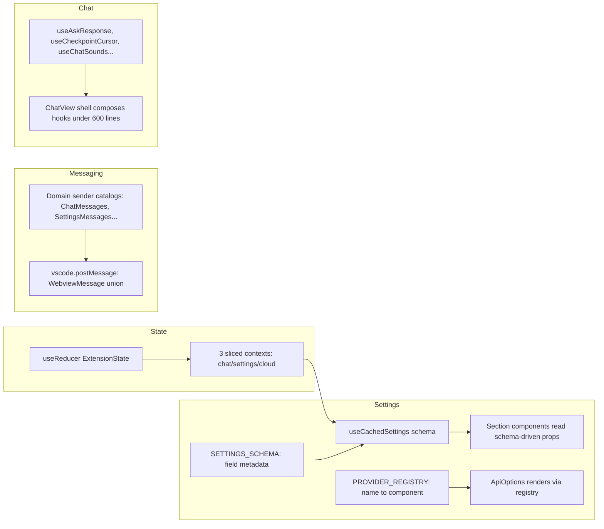

# Webview UI Refactor Analysis

**Scope:** `webview-ui/src/` only. No backend, no `apps/cli`, no `self-hosted-cloudapi`.
**Goal:** Reduce cognitive complexity, shrink the number of change-points per feature, improve seams.

---

## File-size heatmap (confirmed)

| File                                                                                | Lines | Concern                                                             |
| ----------------------------------------------------------------------------------- | ----- | ------------------------------------------------------------------- |
| [`ChatView.tsx`](webview-ui/src/components/chat/ChatView.tsx:1830)                  | 1830  | chat orchestrator god-component                                     |
| [`ModesView.tsx`](webview-ui/src/components/modes/ModesView.tsx:1790)               | ~1790 | modes editor + prompt editor + MCP restrictions + API config wiring |
| [`SettingsView.tsx`](webview-ui/src/components/settings/SettingsView.tsx:1009)      | 1009  | settings shell + 70-field submit + section registry                 |
| [`ExtensionStateContext.tsx`](webview-ui/src/context/ExtensionStateContext.tsx:642) | 642   | single context, ~70 setters, message dispatch                       |
| [`ApiOptions.tsx`](webview-ui/src/components/settings/ApiOptions.tsx:850)           | 850   | 27-branch provider conditional render                               |
| [`ChatRow.tsx`](webview-ui/src/components/chat/ChatRow.tsx:1300)                    | ~1300 | every message-type renderer in one file                             |

---

## Findings (ranked by value / effort)

### #1 — SettingsView `handleSubmit` is a 70-field shotgun-surgery point ★ HIGHEST LEVERAGE

**Location:** [`SettingsView.tsx:375-458`](webview-ui/src/components/settings/SettingsView.tsx:375) — the `handleSubmit` payload (lines 378-447) plus the destructure at lines 155-220.

**Symptom:** Adding one setting requires touching **5 places**: (1) `ExtensionStateContextType` interface, (2) the destructure at L155-220, (3) the `handleSubmit` payload at L378-447, (4) the child component that renders the input, (5) the child's prop type. The submit payload alone is a 70-line object literal hand-mirroring the state shape with per-field `?? defaultValue` coercion (L380-446). Forgetting one field in the payload = silently lost setting.

**Root cause:** No declarative field metadata. Each setting's key, default, coercion, and serialization are spread across imperative code. The `Section`/`SearchableSetting` primitives exist for _layout_, but nothing describes a setting's _data contract_.

**Proposed refactor — declarative settings schema:**

```ts
type SettingField = {
	key: keyof ExtensionStateContextType
	default?: unknown
	serialize?: (v: unknown) => unknown // replaces the `?? null` / `?? 0.5` coercion
	section: SectionName
}
const SETTINGS_SCHEMA: SettingField[] = [
	/* one entry per field */
]
```

`handleSubmit` becomes `vscode.postMessage({ type:"updateSettings", updatedSettings: pickAndSerialize(cachedState, SETTINGS_SCHEMA) })`. The destructure becomes a generic `useCachedSettings(SETTINGS_SCHEMA)` hook. Adding a setting = one schema row + one input component.

**Impact:** **M** effort (schema extraction is mechanical). **Low** risk (payload is data, testable by snapshot). Future setting additions drop from 5 touch-points to 2. This is the single highest-leverage refactor.

---

### #2 — Children of SettingsView dual-bind to cachedState AND live `useExtensionState()` — AGENTS.md violation ★ HIGH LEVERAGE

**Location:**

- [`AutoApproveSettings.tsx:75-93`](webview-ui/src/components/settings/AutoApproveSettings.tsx:75) — receives `setCachedStateField` (cached buffer) AND calls `useExtensionState()` (live, L79-84) AND fires `vscode.postMessage({type:"updateSettings"})` inline (L88) in a single `handleModeChange`.
- [`NotificationSettings.tsx:127-146`](webview-ui/src/components/settings/NotificationSettings.tsx:127) — same dual-read; documented as intentional (L134-137) but architecturally inconsistent with the pattern.
- [`PromptsSettings.tsx:42-43`](webview-ui/src/components/settings/PromptsSettings.tsx:42) — reads live `setIncludeTaskHistoryInEnhance` from context while sibling fields use cached prop.

**Symptom:** One user interaction in `AutoApproveSettings.handleModeChange` writes to **three** state locations: the cached buffer (`setCachedStateField`), the live global state (`setAutoApprovalMode`), and the extension host (`vscode.postMessage`). This is the exact race the AGENTS.md / repo-root rule exists to prevent. The cache becomes meaningless for these fields. Inconsistent across children: some honor the buffer, some bypass it.

**Root cause:** The cached-state contract is enforced _only_ at the `SettingsView` top level. Children are free to grab live setters from the context, and several "immediate-effect" settings (auto-approval mode, custom sounds) were wired to bypass the save buffer because the schema in #1 doesn't express "this field applies immediately vs. on-save."

**Proposed refactor:**

1. Resolve #1 first — the schema carries an `applyMode: "onSave" | "immediate"` flag per field. Immediate fields route to a dedicated `postImmediateSetting(key, value)` helper; save-buffered fields route to `setCachedStateField`. No child ever calls both.
2. Make `useExtensionState()` inside settings children a lint error (custom ESLint rule scoped to `settings/**`) so the dual-bind cannot regress.
3. For genuinely-immediate fields (custom sounds), pass an explicit `onImmediateChange` prop instead of reaching into context.

**Impact:** **S** effort after #1. **Medium** risk (behavioral — must verify each immediate field still fires). Eliminates an entire class of race-condition bugs and makes the cache contract enforceable.

---

### #3 — `ExtensionStateContext` is a 70-setter monolith with type-erased hydration ★ HIGH LEVERAGE

**Location:** [`ExtensionStateContext.tsx`](webview-ui/src/context/ExtensionStateContext.tsx:642) — context type L35-148 (~70 setters), `handleMessage` switch L312-487, `contextValue` object literal L506-628 (~70 inline arrow closures), `(newState as any)` casts L322-340.

**Symptom:**

- ~70 setter methods in one context value → every consumer re-renders on any state change (no selector slicing). The contextValue object (L506-628) rebuilds 70 fresh arrow closures every render.
- State is duplicated: `alwaysAllowFollowupQuestions`, `followupAutoApproveTimeoutMs`, `includeTaskHistoryInEnhance`, `includeCurrentTime`, `includeCurrentCost` exist in BOTH the main `state` object (L194) AND separate `useState` calls (L285-295), hydrated via `(newState as any)` casts (L322-340) because the `ExtensionState` type doesn't declare them.
- Adding a new top-level state field = touch the interface, the initial-state object, the contextValue wiring, and possibly the `handleMessage` switch.

**Root cause:** One `useState<ExtensionState>` + one mega-context for everything. No reducer, no selector, no slicing. The "extra" `useState` fields (L285-295) are a workaround for fields that should be in `ExtensionState` but aren't typed there.

**Proposed refactor:**

- Split into a `useReducer` with a typed `Action` union (each setter becomes a `SET_FIELD` action). The contextValue becomes `{ state, dispatch }` — one stable value, no 70-closure rebuild.
- Promote the `(newState as any)` fields into `ExtensionState` so hydration is type-safe.
- Optionally slice the context into 2-3 providers (chat state, settings state, cloud state) so consumers subscribe only to their slice. Even without slicing, the reducer alone removes the closure-rebuild cost and centralizes field addition to one place.

**Impact:** **L** effort (mechanical but wide). **Medium** risk (re-render behavior changes — verify with existing tests). Pays for every future state-field addition and fixes a latent performance issue.

---

### #4 — `postMessage` is scattered across 55 files / 234 call sites with no centralized catalog

**Location:** 234 `vscode.postMessage({...})` call sites across ~55 files (search `vscode\.postMessage\(` in `webview-ui/src/**/*.tsx`). Largest concentrations: `ChatView.tsx` (~30), `ModesView.tsx` (~20), `SettingsView.tsx` (~8), `McpView.tsx` (~6).

**Symptom:** To answer "what messages does the webview send?" you must grep 55 files. No central registry. Message `type` strings are stringly-typed literals at each call site. The boundary IS typed — [`vscode.ts:33`](webview-ui/src/utils/vscode.ts:33) accepts `WebviewMessage` (imported from `@roo/WebviewMessage`) — so this is an **ergonomics/discoverability** problem, not a type-safety hole. But the type lives in `src/` (outside this scope) and is a large union; call sites don't get per-variant autocomplete guidance, and there's no guarantee every union variant is actually sent.

**Root cause:** No sender abstraction. Each component imports `vscode` and calls `.postMessage` directly with a literal. There's no `sendMessage()` helper that narrows to a specific variant, no command-pattern catalog, and no static assertion that union variants are covered.

**Proposed refactor:**

- Introduce a typed `postMessage(msg: WebviewMessage)` re-export (already typed) **plus** a catalog of typed sender functions grouped by domain: `ChatMessages.send(text, images)`, `SettingsMessages.updateSettings(partial)`, `McpMessages.toggleServer(name)`, etc. Each is a one-liner wrapping `vscode.postMessage` with the correct variant shape.
- Components import the domain sender instead of `vscode` + literal. This makes the call sites self-documenting and gives a single grep target per domain.
- Add a `satisfies WebviewMessage[]` exhaustiveness test over the catalog to detect dead union variants.

**Impact:** **M** effort (234 sites, but mechanical rename). **Low** risk (type-checker catches shape errors). Future message additions become discoverable; dead-variant detection is a bonus. Lower priority than #1-#3 because type-safety already exists at the boundary.

---

### #5 — `ApiOptions` is an 850-line 27-branch provider conditional ★ MEDIUM LEVERAGE

**Location:** [`ApiOptions.tsx:474-700`](webview-ui/src/components/settings/ApiOptions.tsx:474) — 27 consecutive `{selectedProvider === "x" && <X .../>}` blocks, each passing the same `apiConfiguration` + `setApiConfigurationField` props with slight per-provider variation (`routerModels`, `organizationAllowList`, `simplifySettings`, `selectedModelInfo`, `modelValidationError`).

**Symptom:** Adding a provider = add one `{selectedProvider === "new" && <NewProvider .../>}` block here (L482-679) plus one export in [`providers/index.ts`](webview-ui/src/components/settings/providers/index.ts:1). The prop-differencing across 27 blocks is hand-maintained and error-prone (some providers get `simplifySettings`, some don't, with no schema).

**Root cause:** No provider registry. The mapping from `ProviderName` → component + required-props is imperative JSX, not data.

**Proposed refactor:** A `PROVIDER_REGISTRY: Record<ProviderName, { component, needsRouterModels?, needsOrgAllowList?, needsSelectedModelInfo? }>` and a single render loop: `{PROVIDER_REGISTRY[selectedProvider] && renderProvider(PROVIDER_REGISTRY[selectedProvider], sharedProps)}`. The `needs*` flags express prop requirements declaratively. Adding a provider = one registry entry.

**Impact:** **S** effort (mechanical extraction). **Low** risk. Drops provider-addition from 2 touch-points to 1 and removes 200 lines of duplicated prop-passing.

---

### #6 — 26 provider components duplicate an identical `handleFieldChange` hook + identical props interface

**Location:** Every file in [`webview-ui/src/components/settings/providers/`](webview-ui/src/components/settings/providers/) — `Anthropic.tsx`, `DeepSeek.tsx`, `Gemini.tsx`, `Moonshot.tsx`, `SambaNova.tsx`, `XAI.tsx`, `ZAi.tsx`, `Baseten.tsx`, `Fireworks.tsx`, `MiniMax.tsx`, `Mistral.tsx`, `Ollama.tsx`, `OpenAI.tsx`, `OpenAICodex.tsx`, `OpenRouter.tsx`, `QwenCode.tsx`, `Requesty.tsx`, `Unbound.tsx`, `VercelAiGateway.tsx`, `Vertex.tsx`, `VSCodeLM.tsx`, `LiteLLM.tsx`, `Poe.tsx`, `Bedrock.tsx`, `BedrockCustomArn.tsx`, `OpenAICompatible.tsx`.

**Symptom:** Each provider declares:

```ts
apiConfiguration: ProviderSettings
setApiConfigurationField: (field: keyof ProviderSettings, value: ProviderSettings[keyof ProviderSettings]) => void
```

and an identical `handleFieldChange` `useCallback` (seen in `Anthropic.tsx:37`, `Gemini.tsx:29`, `Ollama.tsx:30`, `XAI.tsx:24`, `ZAi.tsx:25`, `SambaNova.tsx:24`, `MiniMax.tsx:25`, `Moonshot.tsx:26`, `DeepSeek.tsx:25`, `Baseten.tsx:25`, `Fireworks.tsx:24`, `Mistral.tsx:26`, `Unbound.tsx:43`, `VercelAiGateway.tsx:41`, `Requesty.tsx:55`, `OpenRouter.tsx:50`, `Vertex.tsx:33`, `LiteLLM.tsx:75`, `Poe.tsx:80`, `Bedrock.tsx:54`, `OpenAICompatible.tsx:106`). That's **21 copies** of the same 6-line hook + **26 copies** of the same 2-line prop type.

**Root cause:** No shared base. The `transforms.ts` file ([`transforms.ts:1`](webview-ui/src/components/settings/transforms.ts:1)) exists with `inputEventTransform` but the hook itself was never extracted.

**Proposed refactor:** Extract `useProviderFieldHandlers(apiConfiguration, setApiConfigurationField)` into `settings/utils/` returning `{ handleFieldChange, handleCheckboxChange, handleSelectChange }`. Export a shared `ProviderComponentProps` type. Each provider file drops ~10 lines.

**Impact:** **S** effort (pure extraction, mechanical). **Low** risk (behavior identical). Removes ~250 lines of duplication across 26 files.

---

### #7 — `ChatView.tsx` is a 1830-line god component with ~59 hooks and 6+ concern axes

**Location:** [`ChatView.tsx:73-1830`](webview-ui/src/components/chat/ChatView.tsx:73) — single `ChatViewComponent` from L73 to L1827.

**Symptom:** One component handles: message rendering orchestration, send/queue logic (L610-695), ask-response state machine (L751-870), scroll lifecycle (L1291-1423), checkpoint cursor management (L1248-1407), keyboard shortcuts (L1507-1520), sound playback (L245-), follow-up auto-approval timers (L210-221, L1397), mode switching (L1340-1498), image selection, retired-provider warnings, announcement modal, aggregated costs. ~59 `useEffect`/`useCallback`/`useMemo`/`useState`/`useRef` calls. The destructure at L84-103 pulls 18+ fields from global state.

**Root cause:** ChatView accumulated every chat-related behavior without extraction. Hooks like `useScrollLifecycle` and `usePromptHistory` exist in `chat/hooks/` — the extraction pattern is known but under-applied.

**Proposed refactor — extract concern hooks (incremental, no big-bang):**

1. `useAskResponseMachine(clineAsk, messages)` — owns the ask-state + primary/secondary button handlers (L156-870).
2. `useCheckpointCursor(messages, checkpointIndices)` — owns checkpoint jump/restore cursor (L1248-1423).
3. `useChatSounds(messages, soundEnabled, ...)` — owns playback (L245-).
4. `useFollowUpAutoApproval(inputValue, clineAsk, ...)` — owns the timer + cancel (L210-221, L1397).
5. `useChatKeyboard(customModes, mode, ...)` — owns shortcuts (L1507-1520).
   Each hook returns `{ state, handlers }`; ChatView composes them. Target: <600 lines.

**Impact:** **L** effort (must preserve the exact effect-ordering semantics — `useScrollLifecycle` already shows this is delicate). **High** risk if done carelessly (scroll/ask timing bugs). High value (the file is the #1 maintenance cost). Do incrementally, one hook at a time, with the existing per-behavior tests as guardrails.

---

### #8 — `ModesView.tsx` is a ~1790-line modes editor with prompt editing, MCP restrictions, and API-config wiring in one file

**Location:** [`ModesView.tsx`](webview-ui/src/components/modes/ModesView.tsx:1790) — `vscode.postMessage` at L145, L157, L176, L293, L591, L634, L647, L874, L897, L922, L1329, L1362, L1378, L1413, L1430, L1765, L1786.

**Symptom:** One component owns: mode CRUD (create/edit/delete/import/export), per-mode prompt editing (system prompt get/copy), per-mode MCP server restrictions, per-mode API config assignment, custom-instructions editing, rules-directory checking. ~20 postMessage call sites for 8 distinct message types.

**Root cause:** Same as ChatView — accumulated concerns without extraction. `McpServerChecklist.tsx` and `McpServerRestriction.tsx` exist as partial extractions but the orchestrator remains monolithic.

**Proposed refactor:** Split into `ModesListView` (CRUD + list), `ModeEditorPanel` (single-mode editing: prompt, instructions, API config, MCP restrictions). Extract `useModeCrud()` and `useModePromptEditor()` hooks. Target: <600 lines for the shell.

**Impact:** **L** effort, **Medium** risk. Lower priority than ChatView (less frequently changed) but same structural debt.

---

### #9 — `TabButton.tsx` uses inline styles, violating the repo Tailwind rule

**Location:** [`TabButton.tsx:22`](webview-ui/src/components/common/TabButton.tsx:22) — `style={isActive ? { color: "var(--vscode-focusBorder)" } : undefined}`.

**Symptom:** Single violation, but it's the shared tab primitive. The `--vscode-focusBorder` variable must be registered in `webview-ui/src/index.css` before it can be a Tailwind class (`text-vscode-focusBorder`).

**Root cause:** Variable not yet in the CSS variable registry; inline style was the path of least resistance.

**Proposed refactor:** Add `--vscode-focusBorder` to `index.css` Tailwind theme, replace inline style with `text-vscode-focusBorder`.

**Impact:** **S** effort, **trivial** risk. Compliance fix, not a leverage point.

---

### #10 — i18n `t()` is stringly-typed with no compile-time key validation

**Location:** [`TranslationContext.tsx:7-8`](webview-ui/src/i18n/TranslationContext.tsx:7) — `t: (key: string, options?: Record<string, any>) => string`. Setup at [`i18n/setup.ts`](webview-ui/src/i18n/setup.ts:1) auto-globs `./locales/**/*.json` into namespaces (clean, no duplication in wiring).

**Symptom:** Typos in translation keys fail silently at runtime (return the key string). No autocomplete on valid keys. The namespace split (`chat`, `settings`, `common`, etc.) is good, but `t("settings:foo.bar")` is unvalidated.

**Root cause:** `i18next`'s default typing is `string`. No augmented type declaration generated from the JSON.

**Proposed refactor:** Generate a `d.ts` from `en/*.json` (the canonical namespace) and augment `i18next`'s `TFunction` with `KeyPrefix` typing. Many `i18next` integrations do this via `i18next-typescript` tooling. This is the `roo-translation` skill's adjacent concern.

**Impact:** **S-M** effort (codegen). **Low** risk. Catches key typos at compile time. Lowest priority of the set — wiring is already clean.

---

## Top 5 highest-leverage refactors (do in this order)

| #   | Refactor                                                   | Effort       | Why first                                                                    |
| --- | ---------------------------------------------------------- | ------------ | ---------------------------------------------------------------------------- |
| 1   | **Declarative settings schema** (#1)                       | M            | Unblocks #2; drops 5→2 touch-points per setting; mechanical                  |
| 2   | **Enforce cached-state contract in children** (#2)         | S (after #1) | Fixes AGENTS.md violation; prevents race bugs; cheap once schema exists      |
| 3   | **`ExtensionStateContext` reducer + typed hydration** (#3) | L            | Foundational; every other state consumer benefits; fixes perf + type-erasure |
| 4   | **Provider registry in `ApiOptions`** (#5)                 | S            | Quick win; removes 200 lines; 27→1 render path                               |
| 5   | **Extract `ChatView` concern hooks** (#7)                  | L            | Highest maintenance-cost file; do incrementally with test guardrails         |

#4 (provider `handleFieldChange` extraction, #6) and #8 (`ModesView` split) are good follow-ups. #9 and #10 are compliance/quality fixes, not leverage.

---

## Architecture target



## Boundary compliance note

- No `src/` backend files were analyzed.
- `WebviewMessage` type was _referenced_ (lives in `src/`, imported via `@roo/WebviewMessage`) only to characterize the messaging boundary — not analyzed for refactor.
- i18n locale JSON duplication across 10 languages is the `roo-translation` skill's domain and was not audited for translation completeness; only the _wiring_ (`setup.ts`, `TranslationContext.tsx`) was assessed.
