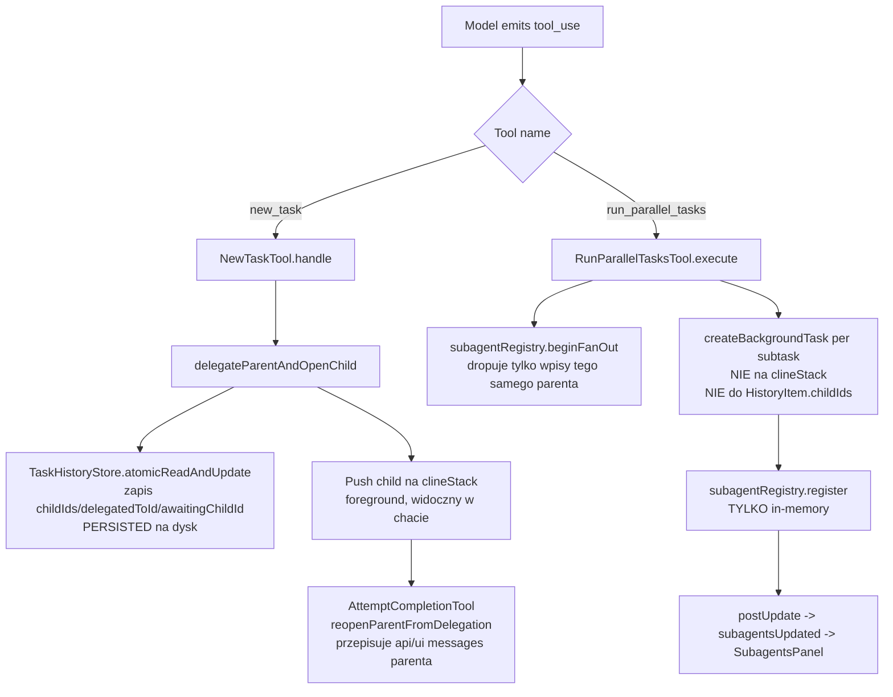

# Analiza cyklu życia subagentów / subtasków

Zgłoszony błąd: _Gdy subagenci zostaną użyci, nie znikają w nowym zadaniu. Subagenci są zawsze przypisani do konkretnego zadania. Należy zadbać, by po zakończeniu głównego zadania wykonane subagenci nie pojawiali się w nowym zadaniu. Należy też zadbać, by rehydracja zadania z historii pokazywała historię subagentów._

Zakres: wyłącznie analiza (tryb architect). Bez zmian w kodzie.

---

## 1. Mapa cyklu życia subtasków/subagentów

W bazie kodu istnieją **dwa odrębne mechanizmy subtasków**, a zgłoszony błąd miesza je ze sobą. Mają różny storage, różny stan i różne powierzchnie webview.

### 1a. Delegacja `new_task` (sekwencyjny, foreground child)

- Spawn przez [`newTaskTool`](src/core/tools/NewTaskTool.ts:133), który woła [`ClineProvider.delegateParentAndOpenChild`](src/core/webview/ClineProvider.ts:4033).
- Child jest pushowany na [`clineStack`](src/core/webview/ClineProvider.ts:1297) przez `addClineToStack` i staje się zadaniem foreground. Parent zostaje na stosie w statusie `"delegated"`.
- [`HistoryItem`](packages/types/src/history.ts:7) parenta jest atomowo modyfikowany przez [`taskHistoryStore.atomicReadAndUpdate`](src/core/webview/ClineProvider.ts:4144), który ustawia `status: "delegated"`, `delegatedToId`, `awaitingChildId` i appenduje id childa do `childIds` ([`ClineProvider.ts:4147`](src/core/webview/ClineProvider.ts:4147)). To jest **zapisywane na dysk** przez współdzielony `TaskHistoryStore`.
- Przy zakończeniu childa [`AttemptCompletionTool`](src/core/tools/AttemptCompletionTool.ts:203) woła [`reopenParentFromDelegation`](src/core/webview/ClineProvider.ts:4328), który przepisuje `api_conversation_history.json` i `ui_messages.json` parenta ([`ClineProvider.ts:4404`](src/core/webview/ClineProvider.ts:4404) i [`:4488`](src/core/webview/ClineProvider.ts:4488)), czyści `awaitingChildId`, aktualizuje `completedByChildId` / `completionResultSummary` ([`ClineProvider.ts:4525`](src/core/webview/ClineProvider.ts:4525)).
- Dzieci `new_task` **NIE SĄ** rejestrowane w `SubagentRegistry` i nigdy nie pojawiają się w `SubagentsPanel`. Ich historia żyje we własnych plikach childa `api_conversation_history.json` / `ui_messages.json` pod `globalStorage/tasks/<id>/`.

### 1b. Fan-out `run_parallel_tasks` (równoległe, headless background children)

- Spawn przez [`RunParallelTasksTool.execute`](src/core/tools/RunParallelTasksTool.ts:367).
- [`RunParallelTasksTool.ts:448`](src/core/tools/RunParallelTasksTool.ts:448) woła [`provider.subagentRegistry.beginFanOut(task.taskId)`](src/core/webview/SubagentRegistry.ts:41), co dropuje poprzedni fan-out dla tego samego parenta, a następnie `registerQueued` per subtask ([`:450`](src/core/tools/RunParallelTasksTool.ts:450)).
- Każdy subtask startuje przez [`provider.createBackgroundTask`](src/core/tools/RunParallelTasksTool.ts:303), co routuje do [`ClineProvider.createBackgroundTask`](src/core/webview/ClineProvider.ts:3384). Tam [`subagentRegistry.register(...)`](src/core/webview/ClineProvider.ts:3388) z `parentTaskId`, `index`, `description` itd.
- Background children **NIE SĄ** pushowane na `clineStack` (komentarz [`ClineProvider.ts:3317`](src/core/webview/ClineProvider.ts:3317)) i **NIE SĄ** zapisywane do `HistoryItem.childIds` parenta. Z `RunParallelTasksTool` nie woła się `atomicReadAndUpdate` — potwierdzone grepem: jedynym writrem `childIds` jest [`delegateParentAndOpenChild`](src/core/webview/ClineProvider.ts:4144).
- Przejścia terminalne prowadzą listenery w [`ClineProvider.ts:319`](src/core/webview/ClineProvider.ts:319) (`onTaskCompleted` → `markTerminal("completed")`), [`:326`](src/core/webview/ClineProvider.ts:326) (`onTaskAborted` → `markTerminal("failed")`) i aktualizacje tokenów w [`:374`](src/core/webview/ClineProvider.ts:374).
- Registry jest wyłącznie in-memory: [`SubagentRegistry`](src/core/webview/SubagentRegistry.ts:30) trzyma `private summaries = new Map<string, SubagentSummary>()` ([`:31`](src/core/webview/SubagentRegistry.ts:31)). Nic nie serializuje go na dysk.

### Struktury danych trzymające drzewo zadań

- [`ClineProvider.clineStack`](src/core/webview/ClineProvider.ts:128) — in-memory stack instancji `Task` foreground. Top stosa to bieżące zadanie.
- [`ClineProvider.subagentRegistry`](src/core/webview/ClineProvider.ts:156) — `new SubagentRegistry(...)`; globalny, in-memory, jeden per provider.
- [`HistoryItem`](packages/types/src/history.ts:7) — per-task na dysku przez `TaskHistoryStore`. Pola: `rootTaskId`, `parentTaskId`, `childIds`, `delegatedToId`, `awaitingChildId`, `completedByChildId`, `completionResultSummary` ([`history.ts:9-28`](packages/types/src/history.ts:9)).
- [`Task`](src/core/task/Task.ts:216) trzyma `taskId`, `rootTaskId`, `parentTaskId`, `childTaskId` ([`Task.ts:216-219`](src/core/task/Task.ts:216)); pole `childTaskId` jest używane tylko w ścieżce `new_task`. [`TaskSubtasks`](src/core/task/TaskSubtasks.ts:57) deleguje do `delegateParentAndOpenChild`.
- Pliki per-task na dysku pod `globalStorage/tasks/<id>/`: `api_conversation_history.json`, `ui_messages.json` oraz współdzielony indeks `TaskHistoryStore`. Patrz [`getTaskWithId`](src/core/webview/ClineProvider.ts:1945) i [`taskMetadata.ts`](src/core/task-persistence/taskMetadata.ts:17).

### Rendering w webview

- Slice stanu: [`ExtensionStateContext`](webview-ui/src/context/ExtensionStateContext.tsx:192) trzyma `subagents: SubagentSummary[]` (initial `[]` w [`:197`](webview-ui/src/context/ExtensionStateContext.tsx:197)).
- Handler wiadomości `subagentsUpdated` ([`ExtensionStateContext.tsx:413`](webview-ui/src/context/ExtensionStateContext.tsx:413)) **zastępuje** całą tablicę `subagents` przez `setState`.
- [`SubagentsPanel`](webview-ui/src/components/chat/SubagentsPanel.tsx:491) jest renderowany przez [`ChatView`](webview-ui/src/components/chat/ChatView.tsx:1676) jako `<SubagentsPanel subagents={subagents} />`. Zwraca `null`, gdy `subagents.length === 0` ([`SubagentsPanel.tsx:499`](webview-ui/src/components/chat/SubagentsPanel.tsx:499)).
- Wiersze pochodzą z `subagents.map(...)` w [`SubagentsPanel.tsx:524`](webview-ui/src/components/chat/SubagentsPanel.tsx:524).
- Backend pushuje pełną listę przy każdej mutacji przez [`SubagentRegistry.postUpdate`](src/core/webview/SubagentRegistry.ts:173) (`{ type: "subagentsUpdated", subagents: this.list() }`). Pełna lista jest też include'owana w pełnym pushie stanu w [`ClineProvider.ts:2539`](src/core/webview/ClineProvider.ts:2539) (`subagents: this.subagentRegistry.list()`).

### Mermaid — dwie ścieżki subtasków

---

## 2. Przyczyna źródłowa — subagenci wyciekają do nowych zadań

Wyciekające wiersze to summarajsy `run_parallel_tasks`. Wyciekają, bo registry jest globalny i nigdy czyszczony przy tworzeniu/czyszczeniu zadania, a webview nigdy nie resetuje slice'a.

### Dokładna ścieżka kodu przy "New Task"

1. Użytkownik klika New Task / wysyła wiadomość → webview postuje `newTask`.
2. [`webviewMessageHandler.ts:620`](src/core/webview/webviewMessageHandler.ts:620) `case "newTask"` woła [`provider.createTask(...)`](src/core/webview/webviewMessageHandler.ts:626) i następnie postuje `{ type: "invoke", invoke: "newChat" }` ([`:634`](src/core/webview/webviewMessageHandler.ts:634)). **Brak resetu `subagentRegistry`.**
3. [`ClineProvider.createTask`](src/core/webview/ClineProvider.ts:3213) dla top-level taska (`!parentTask`) woła [`removeClineFromStack()`](src/core/webview/ClineProvider.ts:3266). `removeClineFromStack` ma jawny komentarz "NOTE: deliberately no subagentRegistry cleanup here" w [`ClineProvider.ts:537`](src/core/webview/ClineProvider.ts:537) i [`:673`](src/core/webview/ClineProvider.ts:673). **Brak czyszczenia registry.**
4. `createTask` woła `task.start()`, co postuje stan do webview. Push stanu niesie [`subagents: this.subagentRegistry.list()`](src/core/webview/ClineProvider.ts:2539) — czyli **subagentów poprzedniego zadania**.
5. Webview merge'uje to do `state.subagents` przez [`ExtensionStateContext.tsx:413`](webview-ui/src/context/ExtensionStateContext.tsx:413).
6. `invoke: "newChat"` triggeruje [`handleChatReset`](webview-ui/src/components/chat/ChatView.tsx:587), który czyści `inputValue`, `selectedImages`, `clineAsk`, `enableButtons` ([`:597-601`](webview-ui/src/components/chat/ChatView.tsx:597)), ale **NIE czyści `subagents`** (nie ma settera; `subagents` żyje w `ExtensionStateContext`).
7. `SubagentsPanel` renderuje dalej stare wiersze.

### Dokładna ścieżka przy "Cancel" / clearTask

1. [`webviewMessageHandler.ts:768`](src/core/webview/webviewMessageHandler.ts:768) `case "clearTask"` woła [`provider.clearTask()`](src/core/webview/webviewMessageHandler.ts:772) i `postStateToWebview()`.
2. [`ClineProvider.clearTask`](src/core/webview/ClineProvider.ts:3865) woła tylko `removeClineFromStack()` (który, jak wyżej, celowo pomija registry). **Brak czyszczenia registry.**
3. `postStateToWebview` znów niesie `subagents: this.subagentRegistry.list()` ([`:2539`](src/core/webview/ClineProvider.ts:2539)).

### Dlaczego `beginFanOut` nas nie ratuje

[`SubagentRegistry.beginFanOut`](src/core/webview/SubagentRegistry.ts:41) usuwa tylko summarajsy, dla których `parentTaskId === parentTaskId`. Nowy top-level task ma zupełnie nowe id, więc wpisy poprzedniego zadania nigdy nie pasują. `beginFanOut` jest wołany wyłącznie z [`RunParallelTasksTool.ts:448`](src/core/tools/RunParallelTasksTool.ts:448) — nigdy z `newTask`, `clearTask`, `createTask` ani `createTaskWithHistoryItem`.

### Precyzyjna lista file:line wycieku

- [`src/core/webview/webviewMessageHandler.ts:620`](src/core/webview/webviewMessageHandler.ts:620) — handler `newTask` bez resetu registry.
- [`src/core/webview/webviewMessageHandler.ts:768`](src/core/webview/webviewMessageHandler.ts:768) — handler `clearTask` bez resetu registry.
- [`src/core/webview/ClineProvider.ts:3213`](src/core/webview/ClineProvider.ts:3213) — `createTask` bez resetu registry dla `!parentTask`.
- [`src/core/webview/ClineProvider.ts:3865`](src/core/webview/ClineProvider.ts:3865) — `clearTask` bez resetu registry.
- [`src/core/webview/ClineProvider.ts:537`](src/core/webview/ClineProvider.ts:537) i [`:673`](src/core/webview/ClineProvider.ts:673) — jawne komentarze "deliberately no subagentRegistry cleanup here" w `removeClineFromStack`/ścieżce cancel.
- [`src/core/webview/ClineProvider.ts:2539`](src/core/webview/ClineProvider.ts:2539) — push stanu niesie stały `subagentRegistry.list()`.
- [`webview-ui/src/components/chat/ChatView.tsx:587`](webview-ui/src/components/chat/ChatView.tsx:587) — `handleChatReset` nie czyści `subagents`.
- [`webview-ui/src/context/ExtensionStateContext.tsx:413`](webview-ui/src/context/ExtensionStateContext.tsx:413) — `subagentsUpdated` zastępuje (nie scope'uje po tasku), więc stała backendowa lista wygrywa.

---

## 3. Przyczyna źródłowa — brak historii subagentów przy rehydracji

Kliknięcie poprzedniego zadania w historii woła [`showTaskWithId`](src/core/webview/ClineProvider.ts:2009), który woła [`createTaskWithHistoryItem`](src/core/webview/ClineProvider.ts:1129). Żadna z tych ścieżek nie przywraca stanu subagentów.

### Co robi dziś rehydracja

1. [`showTaskWithId`](src/core/webview/ClineProvider.ts:2009) ładuje `historyItem` parenta przez [`getTaskWithId`](src/core/webview/ClineProvider.ts:1945), rozwiązuje `rootTask`/`parentTask` z `clineStack` ([`:2018-2022`](src/core/webview/ClineProvider.ts:2018)) i woła `createTaskWithHistoryItem`.
2. [`createTaskWithHistoryItem`](src/core/webview/ClineProvider.ts:1129) przywraca mode + provider profile ([`:1147-1240`](src/core/webview/ClineProvider.ts:1147)), konstruuje `Task` z history item ([`:1245`](src/core/webview/ClineProvider.ts:1245)) i pushuje go na stos ([`:1297`](src/core/webview/ClineProvider.ts:1297)). **Nigdy nie czyta `historyItem.childIds`, nie rusza `subagentRegistry`, nie postuje `subagentsUpdated`.**
3. [`getTaskWithId`](src/core/webview/ClineProvider.ts:1945) czyta tylko `api_conversation_history.json` parenta ([`:1966-1974`](src/core/webview/ClineProvider.ts:1966)). Nie enumeruje katalogów childów ani nie czyta ich wiadomości.
4. Po rehydracji kolejny `postStateToWebview` niesie `subagents: this.subagentRegistry.list()` ([`:2539`](src/core/webview/ClineProvider.ts:2539)) — co jest albo puste (świeży start extension), albo wciąż trzyma subagentów poprzednio oglądanego zadania (patrz §2). Nigdy nie są to rzeczywiste dzieci rehydratowanego zadania.

### Dlaczego rekord na dysku nie znajdzie dzieci `run_parallel_tasks`

- `HistoryItem.childIds` parenta jest zapisywany **tylko** przez [`delegateParentAndOpenChild`](src/core/webview/ClineProvider.ts:4144) (ścieżka `new_task`). [`RunParallelTasksTool`](src/core/tools/RunParallelTasksTool.ts:367) nigdy nie woła `atomicReadAndUpdate`, by zapisać swoje dzieci. Potwierdzone grepem: `childIds` pojawia się w `RunParallelTasksTool.ts` zero razy.
- Zatem dla subagentów równoległych nie istnieje żadna trwała relacja parent→child. Nawet gdyby rehydracja chciała ich załadować, nie może odkryć ich task id z rekordu parenta.
- Każde równoległe dziecko **ma** swój katalog zadań (`globalStorage/tasks/<childId>/`), bo `createBackgroundTask` konstruuje realny `Task` (okolice [`ClineProvider.ts:3384`](src/core/webview/ClineProvider.ts:3384)). Dane istnieją na dysku, ale są osierocone — żaden indeks nie wskazuje na nie z parenta.

### Dlaczego historia dzieci `new_task` też się nie pokazuje przy rehydracji

- `childIds` JEST persistowany dla dzieci `new_task` ([`ClineProvider.ts:4147`](src/core/webview/ClineProvider.ts:4147)), więc odkrycie jest teoretycznie możliwe. Ale ani [`showTaskWithId`](src/core/webview/ClineProvider.ts:2009), ani [`createTaskWithHistoryItem`](src/core/webview/ClineProvider.ts:1129) nie czyta `childIds` ani nie ładuje `ui_messages.json` / `api_conversation_history.json` dzieci. Ładowane są tylko wiadomości parenta; gałęzie dzieci nie.
- Webview `SubagentsPanel` renderuje wyłącznie z in-memory slice'a `subagents` ([`SubagentsPanel.tsx:491`](webview-ui/src/components/chat/SubagentsPanel.tsx:491)), którego rehydracja nigdy nie zapełnia. Nie ma też powierzchni UI, która renderowałaby historię dzieci `new_task` inline z parentem — `HistoryView` pokazuje każde zadanie jako top-level wiersz, a kliknięcie childa otwiera go niezależnie.

### Precyzyjna lista file:line brakującej rehydracji

- [`src/core/webview/ClineProvider.ts:2009`](src/core/webview/ClineProvider.ts:2009) — `showTaskWithId` nie ładuje historii dzieci ani nie zapełnia `subagentRegistry`.
- [`src/core/webview/ClineProvider.ts:1129`](src/core/webview/ClineProvider.ts:1129) — `createTaskWithHistoryItem` ignoruje `historyItem.childIds`.
- [`src/core/webview/ClineProvider.ts:1945`](src/core/webview/ClineProvider.ts:1945) — `getTaskWithId` czyta tylko `api_conversation_history.json` parenta.
- [`src/core/tools/RunParallelTasksTool.ts:367`](src/core/tools/RunParallelTasksTool.ts:367) — nigdy nie persistuje `childIds` dla subagentów równoległych.
- [`packages/types/src/history.ts:25`](packages/types/src/history.ts:25) — `childIds` istnieje w schemacie, ale jest zapisywane tylko przez ścieżkę `new_task`.
- [`webview-ui/src/components/chat/SubagentsPanel.tsx:491`](webview-ui/src/components/chat/SubagentsPanel.tsx:491) — panel renderuje tylko ze stanu in-memory; żadne źródło rehydracji go nie zasilą.

---

## 4. Projekt poprawki (bez kodu)

### Poprawka A — czyszczenie stanu subagentów przy nowym zadaniu / clear / przełączeniu zadań

Wprowadzić jedno źródło prawdy: metodę na `ClineProvider`, która resetuje registry i broadcastuje pustą listę, i wołać ją z każdego entry pointu rozpoczynającego świeże zadanie foreground.

1. Dodać `private async resetSubagentPanel(): Promise<void>` na `ClineProvider`, która woła `this.subagentRegistry.clearAll()` (nowa metoda, patrz niżej) i następnie `await this.postMessageToWebview({ type: "subagentsUpdated", subagents: [] })`.
2. Dodać `clearAll(): void` do [`SubagentRegistry`](src/core/webview/SubagentRegistry.ts:30), która dropuje wszystkie wpisy z `summaries` i `watched` i woła `postUpdate()`. (Symetryczne do `beginFanOut`, ale globalne; NIE zmieniać semantyki `beginFanOut` — jest poprawne dla re-fan-out tego samego parenta.)
3. Wołać `resetSubagentPanel()` na początku:
    - [`ClineProvider.createTask`](src/core/webview/ClineProvider.ts:3213) gdy `!parentTask` (czyli user-initiated top-level new task), tuż przed [`removeClineFromStack()`](src/core/webview/ClineProvider.ts:3266).
    - [`ClineProvider.clearTask`](src/core/webview/ClineProvider.ts:3865), przed `removeClineFromStack()`.
    - [`createTaskWithHistoryItem`](src/core/webview/ClineProvider.ts:1129) gdy rehydratowane zadanie jest rootem (`!historyItem.parentTaskId` i `!historyItem.rootTaskId`) — patrz Poprawka C dla przypadku non-root.
4. W webview uczynić [`handleChatReset`](webview-ui/src/components/chat/ChatView.tsx:587) belt-and-suspenders: wystawić callback `clearSubagents` z `ExtensionStateContext` i wołać go tam. To obronne — reset backendu z kroku 3 powinien już napędzić `subagentsUpdated: []` przez [`ExtensionStateContext.tsx:413`](webview-ui/src/context/ExtensionStateContext.tsx:413), ale jawny reset chroni przed przyszłą ścieżką, która zapomni wołać `resetSubagentPanel`.

**Dlaczego to działa:** wyciek polega na przetrwaniu registry między zadaniami. Reset registry i broadcast `[]` sprawia, że [`SubagentsPanel`](webview-ui/src/components/chat/SubagentsPanel.tsx:491) zwraca `null` ([`:499`](webview-ui/src/components/chat/SubagentsPanel.tsx:499)) dla nowego zadania. Komentarze "deliberately no subagentRegistry cleanup here" w [`ClineProvider.ts:537`](src/core/webview/ClineProvider.ts:537) i [`:673`](src/core/webview/ClineProvider.ts:673) należy zaktualizować, by wyjaśnić, że reset jest teraz robiony w entry pointach `createTask` / `clearTask` / `createTaskWithHistoryItem` zamiast w helperze stack-pop, dzięki czemu semantyka `beginFanOut` dla re-fan-out tego samego parenta jest zachowana.

### Poprawka B — persistowanie dzieci `run_parallel_tasks` w rekordzie historii parenta

By rehydracja mogła je odkryć. Subagenci równolegli powinni używać nowego pola zamiast przeciążać `childIds` (który dziś implikuje sekwencyjną delegację).

1. W [`RunParallelTasksTool.execute`](src/core/tools/RunParallelTasksTool.ts:367), po utworzeniu childa przez `createBackgroundTask` ([`:303`](src/core/tools/RunParallelTasksTool.ts:303)), wołać `taskHistoryStore.atomicReadAndUpdate(task.taskId, h => ({ ...h, parallelChildIds: Array.from(new Set([...(h.parallelChildIds ?? []), child.taskId])) }))` — mirror tego, co robi [`delegateParentAndOpenChild`](src/core/webview/ClineProvider.ts:4144), ale **BEZ** ustawiania `status: "delegated"` / `awaitingChildId` (parent NIE jest delegated do subagenta równoległego; czeka inline na wynik narzędzia `run_parallel_tasks`). Rekomendacja: dodać opcjonalne `parallelChildIds: string[]` do [`HistoryItem`](packages/types/src/history.ts:7).
2. Same summarajsy (`SubagentSummary`) są lekkie i terminalne; persistować je też, by rehydracja mogła przywrócić panel bez czytania wiadomości każdego childa. Dodać opcjonalne `subagents: SubagentSummary[]` do `HistoryItem` (albo sidecar plik `globalStorage/tasks/<parentId>/subagents.json`). Zapisywać z `SubagentRegistry.markTerminal` (albo nowy hook `SubagentRegistry.persist(parentTaskId)`) zawsze, gdy osiągnięty zostanie status terminalny, i czyścić przy `beginFanOut`. Sidecar plik jest preferowany — nie puchnie współdzielony indeks `TaskHistoryStore` i `HistoryItem` pozostaje stabilny.

### Poprawka C — ładowanie i postowanie historii dzieci podczas rehydracji

W [`createTaskWithHistoryItem`](src/core/webview/ClineProvider.ts:1129), po konstruktowaniu `Task` ([`:1245`](src/core/webview/ClineProvider.ts:1245)):

1. Czytać `historyItem.parallelChildIds` (i `historyItem.childIds` dla dzieci `new_task`).
2. Dla każdego id childa wołać `getTaskWithId(childId)`, by pobrać jego `apiConversationHistory` i `uiMessages` (albo tylko `SubagentSummary`, jeśli panel potrzebuje tylko summarajsu).
3. Zapełnić registry: dla dzieci równoległych `subagentRegistry.register(summary)` dla każdego persistowanego `SubagentSummary` (status już terminalny). Dla dzieci `new_task` chat już pokazuje wiadomości parenta; opcjonalnie dodać zwijaną sekcję "Subtask: <childId>" renderującą `ui_messages.json` childa. To dodatek UX — istniejący `HistoryView` już pozwala kliknąć w child task, więc minimalna poprawka to zapełnienie `SubagentsPanel` persistowanymi summarajsami.
4. Broadcastować `subagentsUpdated` ze zrekonstruowaną listą, by [`SubagentsPanel`](webview-ui/src/components/chat/SubagentsPanel.tsx:491) renderował historyczny fan-out.
5. Jeśli `historyItem.parallelChildIds` jest nieobecny (stary rekord sprzed Poprawki B), panel po prostu zostaje pusty dla rehydratowanego zadania — graceful degradation, bez crasza.

### Poprawka D — scope'owanie `subagentsUpdated` po parent (defense in depth)

Dziś [`SubagentRegistry.postUpdate`](src/core/webview/SubagentRegistry.ts:173) postuje całą listę, a webview ([`ExtensionStateContext.tsx:413`](webview-ui/src/context/ExtensionStateContext.tsx:413)) zapisuje ją bez scope'a. Jeśli background subagent z poprzedniego zadania wciąż działa, gdy użytkownik przełącza zadania, jego aktualizacje wyciekną do panelu nowego zadania. Rozważyć:

- Filtrowanie `list()` tylko do wpisów, gdzie `parentTaskId === currentTaskId`, przed postowaniem z `postStateToWebview` ([`ClineProvider.ts:2539`](src/core/webview/ClineProvider.ts:2539)).
- Pozostawienie pełnej listy w `subagentsUpdated` (by panel mógł pokazać subagenta, który przeżył status foreground parenta), ale filtrowanie w webview po `currentTaskId` w [`ExtensionStateContext.tsx:413`](webview-ui/src/context/ExtensionStateContext.tsx:413).

To opcjonalne względem zgłoszonego błędu, ale zalecane, by poprawka była odporna na opóźnione aktualizacje terminalne z właśnie-porzuconego zadania.

### Migracja storage

- Destructive migration nie jest wymagana. Dodatki do schemy (`parallelChildIds`, opcjonalny sidecar `subagents.json`) są addytywne i opcjonalne. Istniejące history items po prostu nie mają `parallelChildIds`, więc rehydracja fallbackuje do pustego panelu dla starych zadań (Poprawka C krok 5). Nowe zadania dostają nowe pola zapisywane going forward.
- Jeśli chcemy, by historyczni subagenci równolegli pokazywali się przy rehydracji, nie możemy ich zrekonstruować — relacja parent→child nigdy nie była persistowana. Jednorazowy backfill jest niemożliwy bez osobnego indeksu. Zaakceptować pusty panel dla pre-fix zadań; udokumentować to w changelogu.

### Rekomendacje warstw testów (per AGENTS.md)

- **Unit (package-local, `src/`):**
    - `SubagentRegistry.clearAll` dropuje wszystkie wpisy i postuje pustą listę — rozszerzyć [`SubagentRegistry.spec.ts`](src/core/webview/__tests__/SubagentRegistry.spec.ts:26).
    - `SubagentRegistry.persist` / writer sidecar round-tripuje summarajsy — nowy spec.
    - `RunParallelTasksTool.execute` zapisuje `parallelChildIds` w `HistoryItem` parenta po utworzeniu każdego childa — rozszerzyć [`RunParallelTasksTool.spec.ts`](src/core/tools/__tests__/RunParallelTasksTool.spec.ts:69) z mockowanym `taskHistoryStore.atomicReadAndUpdate`.
- **Integration (`src/`):**
    - `ClineProvider.createTask` z `!parentTask` woła `resetSubagentPanel` i registry jest puste po — rozszerzyć [`ClineProvider.spec.ts`](src/core/webview/__tests__/ClineProvider.spec.ts:749).
    - `ClineProvider.clearTask` resetuje registry — rozszerzyć ten sam plik.
    - `createTaskWithHistoryItem` z history item niosącym `parallelChildIds` zapełnia registry i postuje `subagentsUpdated` — rozszerzyć [`ClineProvider.sticky-mode.spec.ts`](src/core/webview/__tests__/ClineProvider.sticky-mode.spec.ts:435) albo nowy spec.
- **Webview (`webview-ui/`):**
    - `ExtensionStateContext` czyści `subagents` przy `subagentsUpdated: []` — już wynika z semantyki replace, ale dodać jawny test, że `newChat` invoke po którym nastąpi push `state` z pustymi `subagents` daje pusty slice.
    - `handleChatReset` czyści `subagents` przez nowy callback — rozszerzyć testy ChatView.
- **E2E (`apps/vscode-e2e/`):**
    - Jeden smoke test: start zadania, wywołanie `run_parallel_tasks`, potwierdzenie że panel pokazuje wiersze, start _nowego_ zadania, potwierdzenie że panel jest pusty. To testuje realne boundary extension host + webview messaging i jest jedyną warstwą dowodzącą end-to-end, że user-visible bug jest naprawiony. Utrzymać go skupionym na smoke path; szczegółowe assercje reset/repersist należą do niższych warstw powyżej.
