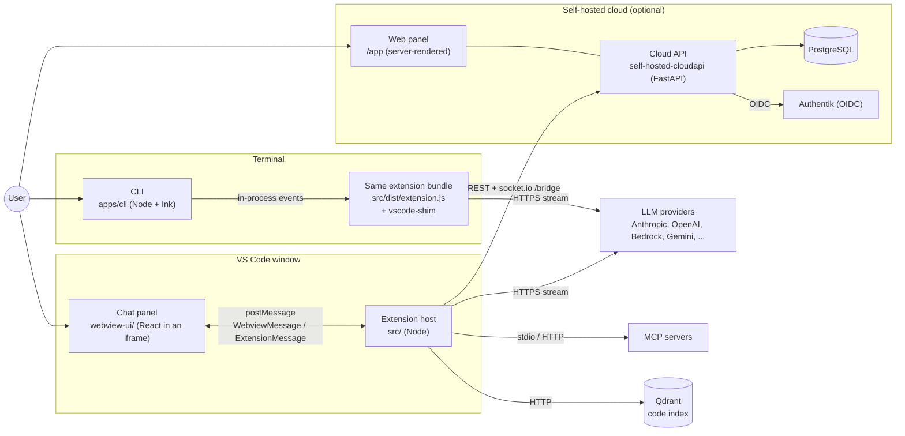
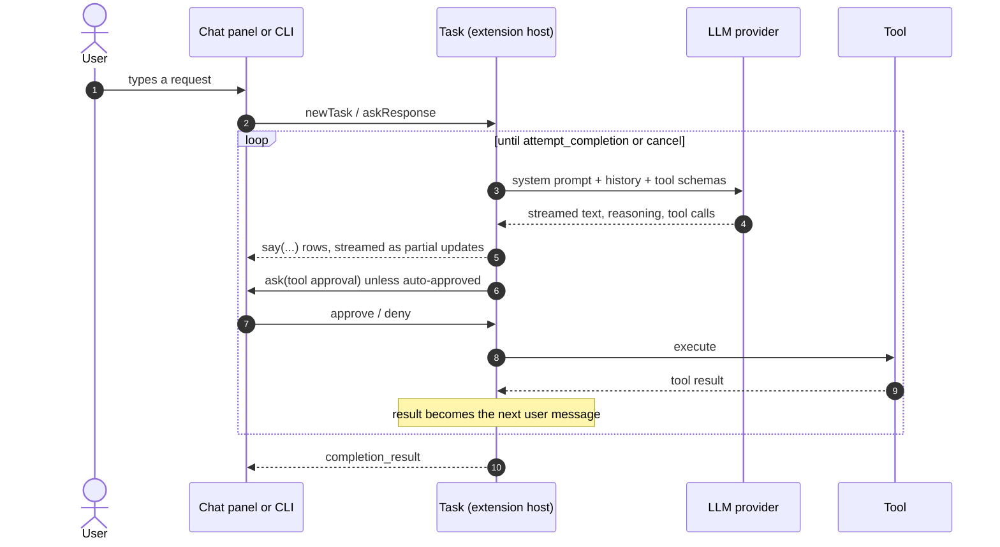

# Level 0: system overview

Tumble Code is an AI coding agent. A user types a request, a language model answers with text and tool calls
(read a file, edit a file, run a command...), the agent executes the tools after approval, and the loop continues
until the model calls `attempt_completion`.

The same agent code runs in two front ends (the VS Code panel and a terminal CLI) and can optionally report to a
self-hosted cloud service that stores task history, shows metrics and lets a browser follow or steer a running task.

## The running pieces

| Piece           | Where                   | Language    | Runs as                                                                |
| --------------- | ----------------------- | ----------- | ---------------------------------------------------------------------- |
| Extension host  | `src/`                  | TypeScript  | Node, inside VS Code's extension host process                          |
| Chat panel      | `webview-ui/`           | React 19    | A sandboxed browser page inside VS Code; no Node, no file system       |
| CLI             | `apps/cli/`             | TypeScript  | Node; loads `src/dist/extension.js` in-process, `vscode` is a shim     |
| Shared packages | `packages/*`            | TypeScript  | Libraries bundled into the pieces above                                |
| Cloud API       | `self-hosted-cloudapi/` | Python 3.13 | FastAPI under uvicorn, with PostgreSQL (SQLite in tests) and Authentik |

## The one loop everything serves

Everything else in the repository supports one of the steps above: settings and profiles choose the provider and
mode, persistence keeps the history, checkpoints make edits reversible, the cloud mirrors the rows.

## Where to go next

- The folder map and import rules: [architecture.md](architecture.md).
- How the host starts and feeds the panel: [02-extension-host.md](02-extension-host.md).
- The loop above in detail: [03-task-agent-loop.md](03-task-agent-loop.md).
