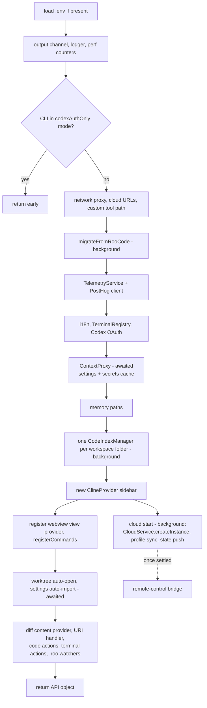
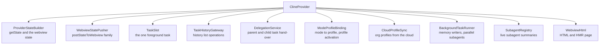
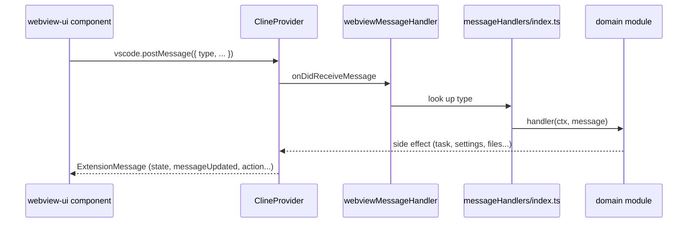

# Level 2: the extension host

The extension host is the `src/` workspace, bundled by esbuild into `src/dist/extension.js`. VS Code (or the CLI)
loads it and calls `activate()`.

## Activation

`activate()` in `src/extension.ts` builds the long-lived singletons in dependency order. Steps marked "background"
are not awaited.

The cloud start runs in the background (`src/extension/cloudStartup.ts`, P9): the webview and the commands never
wait for it, and a failed start only means local-only mode. It counts as "starting" until it settles or 10 s pass;
in that window `CloudService.hasInstance()` is false and a Clerk sign-in callback (`handleUri`) waits for it. When the start settles, activation pushes a fresh state to a
visible webview (which may have shown signed-out cloud facts) and sets up the remote-control bridge.

Diagnostics go through `logger` (`src/utils/logging`), configured as the first step of `activate()`. It writes one
line per call (time, level, optional `[scope]`) to the Tumble Code output channel; `debug` lines only while the
`tumble-code.debug` setting is on. A development host also copies every line to the console; the CLI gets a console
copy of errors only, which it moves to its debug log file. `console.*` is an ESLint error in `src/` outside
`src/shared` (bundled into the webview too), the token counting worker and `i18n/setup.ts` (runs before activation).

`deactivate()` flushes pending chat-message saves, removes cloud listeners, stops MCP servers, shuts telemetry
down, cleans terminals and disposes the tree-sitter parsers.

Helpers live in `src/activate/`: `registerCommands.ts`, `registerCodeActions.ts`, `registerTerminalActions.ts`,
`handleUri.ts`, `handleTask.ts`, `CodeActionProvider.ts`, `cloud-urls.ts`.

## ClineProvider: the panel's backend

`src/core/webview/ClineProvider.ts` implements `WebviewViewProvider`. One instance serves the sidebar; editor-tab
panels get their own instance. It owns the webview lifecycle, the current task and the state sent to the panel.
The rest of its old responsibilities moved into collaborators it creates in its constructor, each receiving a
small "host" object instead of the whole provider:

### The task slot

`ClineProvider` holds exactly one foreground task, in `TaskSlot` (`core/webview/TaskSlot.ts`): `createTask`
clears the current top-level task before setting a new one, and `DelegationService` clears the parent before
it opens a child. The parent is re-created from history when the child finishes. `TaskSlot.set` (provider
method `setCurrentTask`, formerly `addClineToStack`) emits `TaskFocused` and runs provider preparation (for
example the LM Studio model preload); `TaskSlot.clear` (provider method `clearCurrentTask`, formerly
`removeClineFromStack`) aborts the task, removes its listeners and repairs a delegated parent if needed.
`TaskSlot.replaceInPlace` is the flicker-free rehydrate path used by `createTaskWithHistoryItem` when the
reopened task is the current one.

### Getting state to the panel

The panel never reads host memory; it receives snapshots and deltas.

| Method                                      | Sends                                                                   |
| ------------------------------------------- | ----------------------------------------------------------------------- |
| `postStateToWebview`                        | Full `state`; the task history list only when it changed                |
| `postStateToWebviewWithoutTaskHistory`      | `state` without the history list                                        |
| `postStateToWebviewWithoutClineMessages`    | `state` without chat rows (and without `clineMessagesSeq`)              |
| `postClineMessageAdded`                     | One `messageAdded` row when that is enough (`canSendClineMessageAlone`) |
| `postEditedClineMessage` / `messageUpdated` | One changed row, for example a streaming partial                        |

Every snapshot that carries chat rows is stamped with a growing `clineMessagesSeq`. The panel ignores a snapshot
older than the one it already has, so a slow full-state push cannot overwrite newer streamed rows. This, the three
`postStateToWebview*` variants and the `sourceTaskId` check on `messageUpdated` are on the "do not touch" list in
[architecture.md](architecture.md). The method bodies live in `WebviewStatePusher`
(`core/webview/WebviewStatePusher.ts`), which also owns the per-webview bookkeeping (`webviewAcceptsMessageAdded`,
the remembered message list); `ClineProvider` keeps one-line delegating methods so the Task classes and the
message handlers keep calling the provider.

## From a panel message to a handler

`src/core/webview/messageHandlers/` has one module per domain (settings, codeIndex, messageEdits, mcp, history,
...), about 140 routed message types in total. `registry.spec.ts` pins the set of routed types and
`webviewMessageHandler.routing.spec.ts` snapshots each handler's side effects. A new message type gets its handler
in the module of its domain and an entry in both specs.

## Services

Long-lived helpers the task and the provider use. Each folder is self-contained.

| Folder                               | Purpose                                                                               |
| ------------------------------------ | ------------------------------------------------------------------------------------- |
| `services/mcp`                       | MCP servers: `McpHub` with connection manager, config store and watcher, tool catalog |
| `services/code-index`                | Semantic code search: embedders, Qdrant client, scanner, file watcher                 |
| `services/checkpoints`               | Shadow git repository per task for reversible edits                                   |
| `services/tree-sitter`               | Code definition extraction for `list_code_definition_names` and the index             |
| `services/web`                       | `web_search` and `web_fetch`, with an SSRF guard on the target address                |
| `services/marketplace`               | Remote catalog of modes and MCP servers, and the installer                            |
| `services/skills`                    | Skills discovery and invocation                                                       |
| `services/command`                   | Slash commands                                                                        |
| `services/roo-config`                | Resolution and watching of `.roo/` folders                                            |
| `services/glob`, `ripgrep`, `search` | File listing, content search, fuzzy file search for `@` mentions                      |
| `core/memory`                        | Auto-memory: extraction after tasks, consolidation, recall (do not touch)             |
