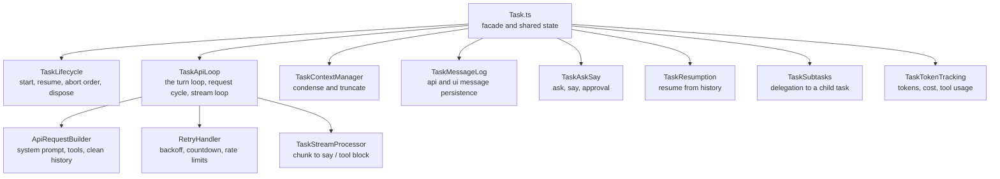
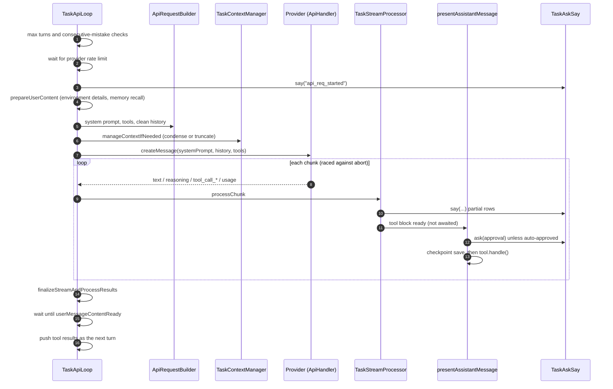
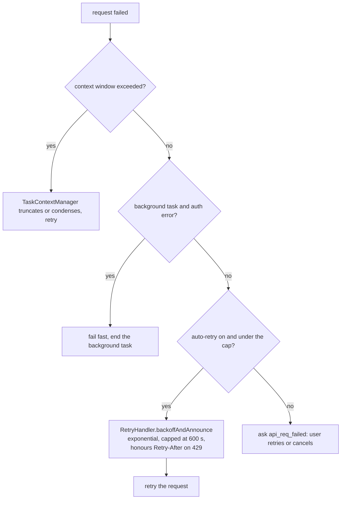
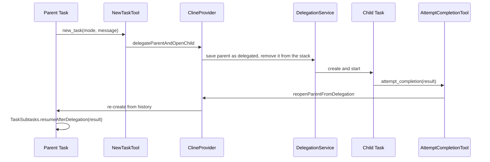

# Level 3: Task and the agent loop

A `Task` (`src/core/task/Task.ts`) is one agent conversation: its messages, its mode and provider profile, its
tool state and its abort signal. `Task` itself is a facade. The work is done by modules it builds in its
constructor, each receiving the task through a narrow `*Access` interface that lists only what the module needs.

## The modules

| File                                                         | Responsibility                                                                                                                                                     |
| ------------------------------------------------------------ | ------------------------------------------------------------------------------------------------------------------------------------------------------------------ |
| `TaskApiLoop.ts`                                             | The turn loop, one request cycle, the stream loop, the ask/backoff presentation of a failed stream                                                                 |
| `TaskStreamProcessor.ts`                                     | Turns stream chunks into `say` rows; the chunk dispatcher and coordinator                                                                                          |
| `StreamToolCallHandler.ts`                                   | Tool-call stream events → partial/final tool_use blocks (parser, dedup guard, eager checkpoint, orphaned-end repair)                                               |
| `AssistantMessageAssembler.ts`                               | Builds and saves the assistant message for API history (tool_use dedup, new_task isolation)                                                                        |
| `TaskContextManager.ts`                                      | Automatic and manual condensing, context-window-exceeded recovery                                                                                                  |
| `TaskLifecycle.ts`                                           | Mode and profile init, start, abort ordering, dispose, memory writers                                                                                              |
| `TaskMessageLog.ts`                                          | Reads and writes `api_conversation_history.json` and `ui_messages.json`                                                                                            |
| `TaskAskSay.ts`                                              | `ask` (with auto-approval), `say`, handling of the user's answer                                                                                                   |
| `TaskResumption.ts`                                          | Resuming a task from disk, cleaning stale partial rows                                                                                                             |
| `ApiRequestBuilder.ts`                                       | System prompt, tool array, history cleaned for the provider                                                                                                        |
| `RetryHandler.ts`                                            | Error→retry dispatch (fail-fast, capped retry, api_req_failed ask, backoff decision) plus exponential backoff with countdown rows, provider and global rate limits |
| `TaskSubtasks.ts`                                            | `startSubtask`, `resumeAfterDelegation`                                                                                                                            |
| `TaskTokenTracking.ts`                                       | Token, cost and tool-usage counters, queued user messages                                                                                                          |
| `build-tools.ts`, `deferred-tools*.ts`                       | Which tools the model sees; tools loaded on demand                                                                                                                 |
| `validateToolResultIds.ts`, `mergeConsecutiveApiMessages.ts` | History fixes the providers require                                                                                                                                |

## One turn

`initiateTaskLoop` starts the checkpoint service and runs `recursivelyMakeClineRequests`. Despite its name it is
an explicit loop over a stack of pending user contents, not recursion: each finished turn pushes the tool results
as the next item.

### Errors and retry

`handleApiRequestError` in `RetryHandler` decides what a failed request becomes (moved there in S3; the loop's `handleStreamError` keeps the ask/backoff presentation and stack requeue):

A failure after the first chunk goes through `handleStreamError` instead, with the same outcomes: fail fast for a
background task, back off and retry when auto-retry is on, otherwise ask the user.

Two separate rate limits exist: the provider profile's `rateLimitSeconds`, and the process-wide
`lastGlobalApiRequestTime` in `RetryHandler.ts` that spaces requests across all tasks (do not touch).

### Timeouts

| What                                               | Limit                                          | Where                                              |
| -------------------------------------------------- | ---------------------------------------------- | -------------------------------------------------- |
| Silence on an open stream (first or later chunk)   | `apiRequestTimeout` setting, 10 min by default | `raceNextChunkWithAbort(iterator, signal, idleMs)` |
| Waiting for the response headers                   | the same setting, passed to the provider SDK   | `BaseProvider.timeoutMs`                           |
| Short control requests (token refresh, model list) | 30 s, `CONTROL_REQUEST_TIMEOUT_MS`             | `src/api/providers/utils/timeout-config.ts`        |
| Image generation, embeddings                       | `apiRequestTimeout`                            | `AbortSignal.timeout(getApiRequestTimeout())`      |

When a stream stays silent past the limit, the loop raises `StreamIdleTimeoutError`, aborts the request's
`AbortController` (which closes the HTTP connection) and lets the error take the normal retry path above. The
Gemini, Vertex and Mistral SDKs get no request timeout on purpose: `@google/genai` keeps its timer armed while the
body streams and would cut long answers; the idle limit covers them instead.

### Abort

`cancelTask` on the provider calls `task.abortTask()`. `TaskLifecycle.abortTask` runs three phases whose order
tests pin:

1. `prepareAbort`: set the `abort` flag (every running promise checks it), emit `TaskAborted` while the task state
   is intact, start the memory writers.
2. `cleanupAbort`: `dispose()` (flush pending saves, cancel the current request, release terminals, remove
   listeners) and persist the final messages.
3. `drainAbort`: wait for in-flight memory extraction.

The stream loop races every `iterator.next()` against the abort signal (`raceNextChunkWithAbort`), so a stalled
provider does not block a cancel. After the stream, the wait for the tool results
(`userMessageContentReady`) also ends on `abort`, so a task cancelled while a tool is still asking for approval
does not keep polling. `presentAssistantMessage` returns quietly on an aborted task; every caller fires it
without awaiting, so it must never throw.

## Context management

`TaskContextManager.manageContextIfNeeded` runs before each request. It counts tokens and, above the configured
threshold (`autoCondenseContextPercent`), calls `summarizeConversation` (`src/core/condense/`) to replace older
messages with a summary. If condensing is off or fails, `src/core/context-management/` truncates the oldest turns
instead. A provider error that says the context is too long triggers the same path once, then a retry.

## Checkpoints

Before a tool that changes files (`requiresCheckpoint` in its descriptor), `presentAssistantMessage` calls
`checkpointSave`. `src/core/checkpoints/` keeps a shadow git repository per task, so the user can restore or diff
any earlier point from the chat.

## Subtasks

`run_parallel_tasks` is different: `BackgroundTaskRunner` starts headless child tasks that run beside the parent,
and `SubagentRegistry` shows their progress in the panel.
