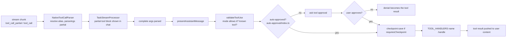
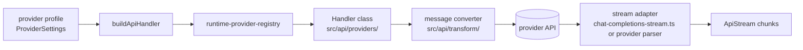

# Level 3: tools and providers

## Tools

A tool is a class plus one row in a descriptor table. The compiler enforces most of the wiring because the
tables are typed `Record<ToolName, ...>`: forget a row and the build fails.

| Piece                                                                  | File                                                           |
| ---------------------------------------------------------------------- | -------------------------------------------------------------- |
| Tool name list, param names, display names, groups                     | `packages/types/src/tool.ts`                                   |
| Typed arguments per tool (`NativeToolArgs`)                            | `src/shared/tools.ts`                                          |
| JSON schema the model sees                                             | `src/core/prompts/tools/native-tools/<name>.ts` and `index.ts` |
| Argument parsing (partial and complete)                                | `src/core/assistant-message/toolArgParsers.ts`                 |
| Behaviour flags: approval category, checkpoint, compaction, `describe` | `src/core/tools/toolDescriptors.ts` (`TOOL_DESCRIPTORS`)       |
| Tool instance lookup                                                   | `src/core/assistant-message/toolHandlers.ts` (`TOOL_HANDLERS`) |
| Implementation                                                         | `src/core/tools/<Name>Tool.ts`, a `BaseTool` subclass          |
| Chat row in the panel                                                  | `webview-ui/src/components/chat/rows/renderers/tool/`          |

### A tool call, end to end

Two compatibility rules are on the "do not touch" list: weak models still send the legacy `read_file` `files`
shape and old tool names, so the aliases and the legacy parser must stay.

MCP tools take the same path with block type `mcp_tool_use`; `McpHub` executes them.

## Providers

A provider turns a request into an `ApiStream`, an async iterator of chunks. `buildApiHandler` in
`src/api/index.ts` looks the profile's `apiProvider` up in `src/api/runtime-provider-registry.ts` and calls its
factory. Portable metadata (names, model lists, capabilities) lives in `packages/types/src/provider-registry.ts`
and `packages/types/src/providers/`.

The chunk types (`src/api/transform/stream.ts`): `text`, `reasoning`, `thinking_complete`, `usage`, `grounding`,
`tool_call`, `tool_call_start`, `tool_call_delta`, `tool_call_end`, `tool_call_partial`, `finish_reason`, `error`.

Providers that speak the Chat Completions wire format share `chat-completions-stream.ts`; Anthropic, Bedrock,
Gemini, the Responses API and a few others keep their own parsers because their wire formats differ.

### Adding a provider today

About 15 code files, plus one translation key per label in each locale: the portable tables in `packages/types`
(model list, registry entry, model definition, API key field, validation, config schema, settings arm, secret key,
model selection, and one row in `PROVIDER_DESCRIPTORS`), the handler, barrel export and runtime registry entry in
`src/api`, and the CLI's environment map. The webview settings form comes from the provider's
`PROVIDER_DESCRIPTORS` row (`packages/types/src/provider-descriptors.ts`, S4) when the provider only needs an API
key, an endpoint choice and an optional base URL; `ProviderDescriptorForm` renders it, and the model picker's
service link, the docs link and the default model on a provider switch are read from the same tables. Only a
provider with its own controls (OAuth, fetched model lists, cloud credentials, model-dependent options) still needs a
hand-written component. The step-by-step checklist, and the equivalents for a setting and a tool, are on
[10-adding-things.md](10-adding-things.md).

## Auto-approval

`src/core/auto-approval/` decides whether an `ask` needs the user. Each tool's descriptor names its
`approvalCategory` (`readOnly`, `write`, `execute`, `mcp`, `modeSwitch`, `subtask`, `subtaskFinish`, `followup`,
`alwaysAllowed`, `manual` or `none`); the user's toggles in the panel map to those categories. Commands are
additionally checked against the allowed and denied command lists. A per-task request and cost limit
(`checkAutoApprovalLimits`) stops runaway loops.
