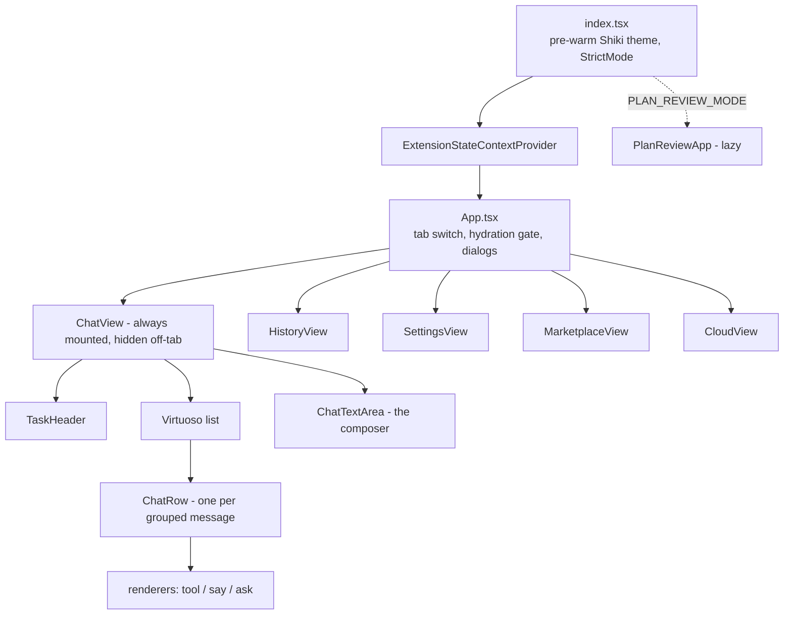
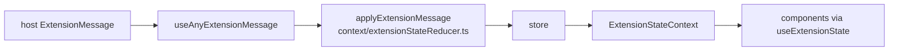
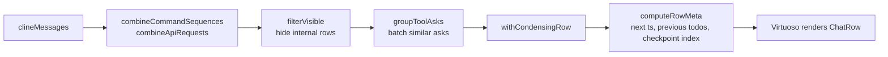
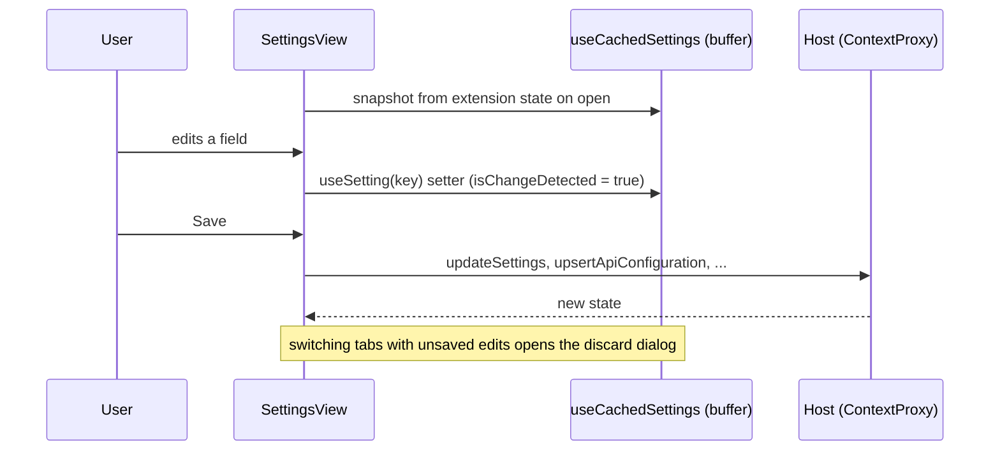

# Level 2: the webview UI

`webview-ui/` is a React 19 app built by Vite into `webview-ui/build`, which the host serves inside a VS Code
webview (a sandboxed browser page with no Node and no file system). All data comes from the host through
`postMessage`.

## Component tree

`App.tsx` renders nothing until the first `state` message arrives (`didHydrateState`). `ChatView` stays mounted
while other tabs are shown, so the draft input and pending asks survive a tab switch. The other views mount only
while their tab is active.

## State: one reducer, fed by the host

`extensionStateReducer.ts` is a pure function and is where the delivery rules live:

- `state`: merged by `mergeExtensionState`; `clineMessages` are replaced only when the incoming `clineMessagesSeq`
  is not older than the current one.
- `messageAdded`: appended; a gap in sequence numbers sets `clineMessagesResyncRequested` and the provider asks
  the host for a full state.
- `messageUpdated`: replaces one row by `ts`, and is dropped when its `sourceTaskId` is not the current task.

Side effects (the resync request, the auto-approve echo) stay in the provider component, not in the reducer.

## From messages to chat rows

`ChatView` shapes the raw `clineMessages` with pure functions in `components/chat/rows/`:

`ChatRow` is a thin dispatcher: it picks a renderer from `TOOL_RENDERERS`, `SAY_RENDERERS` or `ASK_RENDERERS`
(`rows/renderers/`) and reports its height. Row heights feed `hooks/useScrollLifecycle.ts`, a small state machine
(hydrating and pinned to the bottom, anchored and following, or the user browsing history) that decides whether
new rows scroll into view. The hook and the height contract are on the "do not touch" list.

Chat logic that used to live in `ChatView` is in hooks under `components/chat/hooks/`: `useAskButtons`,
`useChatComposer`, `useChatHostMessages`, `useChatSounds`, `useCheckpointNavigation`, `useModeSwitchShortcuts`.

## Settings: edit a buffer, save explicitly

Inputs bind to the buffer, never to `useExtensionState()` directly (see `AGENTS.md`). The buffer is a small external
store (`settings/settingsDraftStore.ts`) that `SettingsView` hands to its sections through `SettingsDraftProvider`; a
control reads and writes one key with `useSetting(key)` and re-renders only when that key changes. `components/settings/schema.ts`
declares each setting once, including whether it applies on save or immediately (`apply: "onSave" | "immediate"`).
Provider-specific forms are looked up in `settings/provider-ui-registry.tsx`.

## Styling

- Tailwind v4 with a custom preflight (`src/index.css`). VS Code theme colors are exposed as `--color-vscode-*`,
  and the shadcn semantic tokens (`--background`, `--primary`, ...) map to VS Code variables, so every theme works
  without extra CSS.
- Square corners everywhere: `--radius: 0` and the Tailwind radius scale are flattened in `index.css`.
- One monospace font, the editor font (`--font-mono`), for tool blocks and code.
- In-repo `Themed*` components in `components/ui/` replace the removed `@vscode/webview-ui-toolkit`.
- No CSS-in-JS: `CodeBlock`, `MarkdownBlock`, `MermaidBlock` and the settings model description are styled by the
  unlayered "content blocks" section at the end of `index.css` (unlayered so VS Code's default webview styles and
  `katex.min.css` do not override them).

## Heavy renderers, loaded on demand

| What     | Where                                          | Loading                                                |
| -------- | ---------------------------------------------- | ------------------------------------------------------ |
| Markdown | `common/MarkdownBlock.tsx`                     | react-markdown with GFM, math and GitHub alerts        |
| Code     | `common/CodeBlock.tsx`, `utils/highlighter.ts` | Shiki; only the needed theme is loaded                 |
| Math     | KaTeX via rehype-katex                         | Plugin loaded lazily                                   |
| Diagrams | `common/MermaidBlock.tsx`                      | `import("mermaid")` on first diagram                   |
| Locales  | `i18n/setup.ts`                                | English bundled; the other 17 languages one chunk each |

The React Compiler is enabled (`vite.config.ts`); `scripts/check-react-compiler-bailouts.mjs` reports components
it could not optimize.
