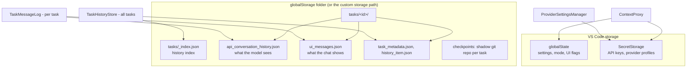
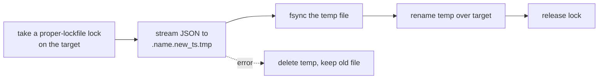

# Level 3: persistence

## What is stored where

| Owner                                                | Stores                                                                                              |
| ---------------------------------------------------- | --------------------------------------------------------------------------------------------------- |
| `src/core/config/ContextProxy.ts`                    | Settings (`globalState`) and secrets (`SecretStorage`) behind one cache; runs legacy key migrations |
| `src/core/config/ProviderSettingsManager.ts`         | Named provider profiles, in SecretStorage                                                           |
| `src/core/task/TaskMessageLog.ts`                    | One task's API and UI messages                                                                      |
| `src/core/task-persistence/TaskHistoryStore.ts`      | The history list across tasks: in-memory cache, `_index.json`, per-task records                     |
| `src/core/checkpoints/`, `src/services/checkpoints/` | Shadow git repositories                                                                             |

The keys and schemas of every setting are in `packages/types/src/global-settings.ts` and
`provider-settings.ts`; defaults for unset values are in `packages/types/src/settings-defaults.ts`
(`SETTINGS_DEFAULTS`).

## Atomic writes

Every JSON file above is written with `safeWriteJson` (`packages/core/src/fs/safeWriteJson.ts`):

Rename is atomic on the same file system, so a reader sees the old file or the new one, never half of each. The
`fsync` before the rename makes sure the new bytes are on disk before the name points at them; without it a power
loss could leave an empty file. A lock left by a crashed process goes stale after about 31 seconds.

## Reading a damaged file

`readApiMessages` and `readTaskMessages` (`src/core/task-persistence/`) return `[]` when a task file does not
parse or is not an array, because every caller expects an array. Before that they call `quarantineCorruptFile`,
which renames the file to `<name>.corrupt-<timestamp>`. The task's next save therefore writes a fresh file
instead of overwriting the damaged one, and the original bytes stay on disk for manual recovery. A read error
such as a missing permission is not treated as damage: the file stays where it is.

## Save timing

- UI messages are saved with a debounce (1 s after the last change, at most 3 s late). `deactivate()` and task
  dispose flush a pending save.
- API history is saved after each turn.
- `TaskHistoryStore` updates records inside a per-record lock (`atomicReadAndUpdate`), writes `_index.json` with a
  debounce, watches task folders for changes made by other windows, and reconciles the index with the disk every
  five minutes.
