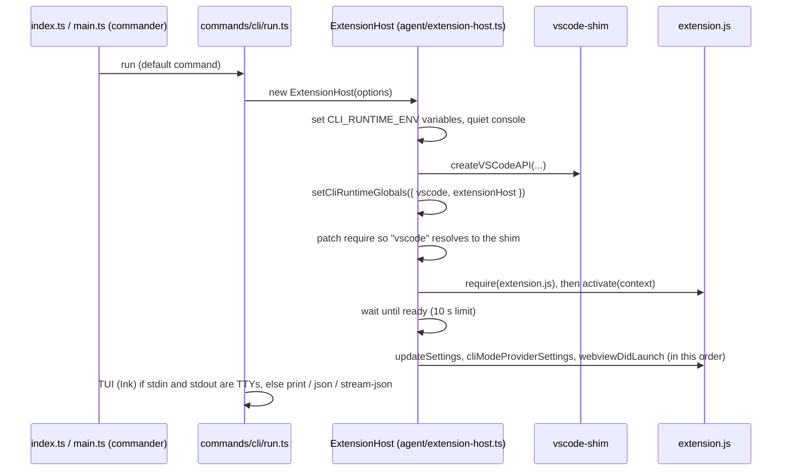
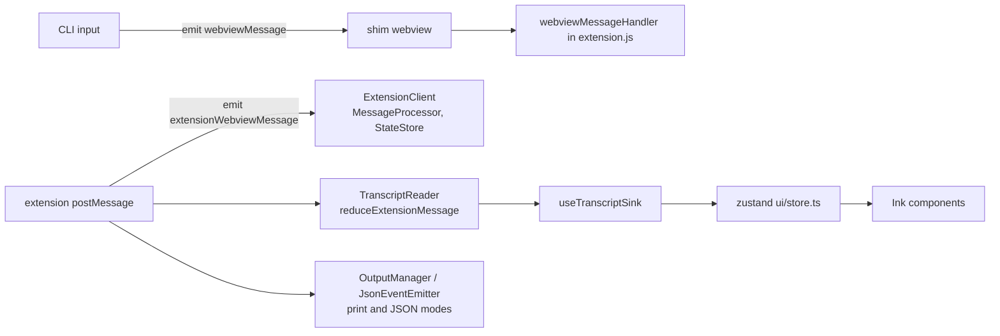

# Level 2: the CLI

`apps/cli` (`@tumble-code/cli`) is a terminal client. It does not reimplement the agent: it loads the same
`src/dist/extension.js` the VS Code extension uses, inside its own Node process, with `packages/vscode-shim`
standing in for the `vscode` module.

## Boot

The runtime contract (six environment variables and two `globalThis` slots) is defined once in
`packages/types/src/cli-runtime.ts`. See [architecture.md](architecture.md).

## Message flow

The shim's webview object is an event emitter. The CLI plays the part of the chat panel:

## Rendering in the terminal

Ink redraws its dynamic area on every change, which flickers and gets slow with long output. The CLI therefore
splits the screen:

- Finished rows go to Ink's `<Static>` (`TranscriptStatic`), printed once and never redrawn.
- A streaming answer is committed line by line (`ui/streamCommit.ts`): complete lines move into `<Static>`, an
  unclosed code fence is held back until it closes.
- The live tail (`TailViewport.tsx`) is capped to the terminal height, anchored to the bottom.

This pipeline, including the `useInsertionEffect` ordering in `TailViewport`, is on the "do not touch" list.

## Build

`apps/cli/tsup.config.ts` bundles the CLI to ESM for Node 22, with the workspace packages inlined.
`apps/cli/scripts/build.sh` builds the extension bundle, then the CLI, then packs both into one tarball.
