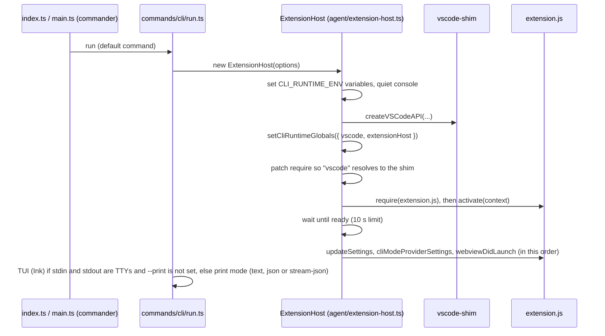
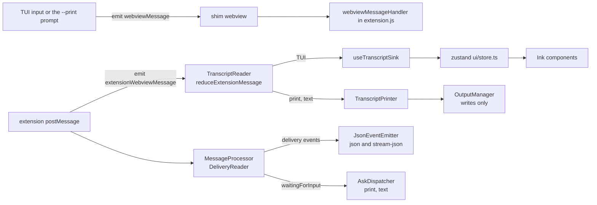

# Level 2: the CLI

`apps/cli` (`@tumble-code/cli`) is a terminal client. It does not reimplement the agent: it loads the same
`src/dist/extension.js` the VS Code extension uses, inside its own Node process, with `packages/vscode-shim`
standing in for the `vscode` module.

## Boot

The runtime contract (six environment variables and two `globalThis` slots) is defined once in
`packages/types/src/cli-runtime.ts`. See [architecture.md](architecture.md).

## Message flow

The shim's webview object is an event emitter. The CLI plays the part of the chat panel: what the user types (or
the prompt given on the command line) goes in as a `webviewMessage`, and every message the extension posts comes
out as an `extensionWebviewMessage` that two readers inside `ExtensionClient` (`agent/extension-client.ts`) take in:

- **Rows.** `TranscriptReader` (`agent/transcript-reader.ts`) runs the transcript reducer on every message and sends
  the resulting row changes to the one sink attached to it: the TUI's `useTranscriptSink`, which applies them to
  the zustand store, or in print mode `TranscriptPrinter` (`agent/transcript-printer.ts`), which writes the rows'
  text through `OutputManager`. `OutputManager` decides nothing; it only writes lines. With no sink attached (JSON
  output) the reader does nothing.
- **Deliveries.** `MessageProcessor` passes every state push and `messageUpdated` to the `DeliveryReader`
  (`agent/transcript-deliveries.ts`), which keeps the client's copy of the task's messages and hands out only the
  news: a message the first time it arrives, again only when it changed, with a resumed task's history marked. The
  client publishes them as `delivery` events, and derives the agent loop state (`agent/agent-state.ts`) from the
  same copy for its `stateChange`, `waitingForInput` and `taskCompleted` events. `JsonEventEmitter` builds the JSON
  output from the `delivery` events (the message `ts` is the event id); `AskDispatcher` answers or prompts for the
  asks of a text print run (in the TUI the components answer them, a JSON run relies on auto-approval).

## Rendering in the terminal

Ink redraws its dynamic area on every change, which flickers and gets slow with long output. The CLI therefore
splits the screen:

- Finished rows go to Ink's `<Static>` (`TranscriptStatic`), printed once and never redrawn.
- A streaming answer is committed line by line (`ui/streamCommit.ts`): complete lines move into `<Static>`, an
  unclosed code fence is held back until it closes.
- The live tail (`TailViewport.tsx`) is capped to the terminal height, anchored to the bottom.

This pipeline, including the `useInsertionEffect` ordering in `TailViewport`, is on the "do not touch" list.

## Build

`apps/cli/tsup.config.ts` bundles the CLI to ESM for Node 22, with the workspace packages inlined.
`apps/cli/scripts/build.sh` builds the extension bundle, then the CLI, then packs both into one tarball.
