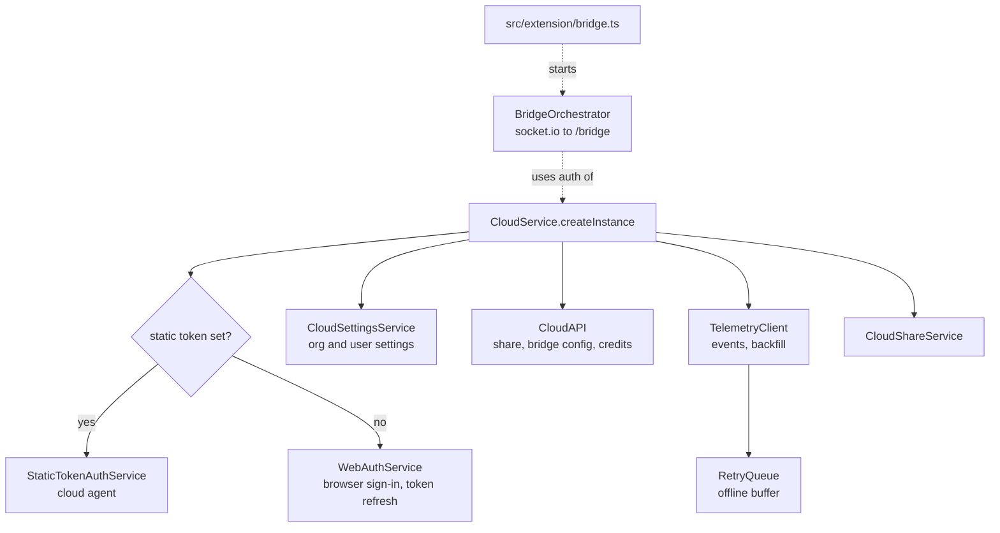
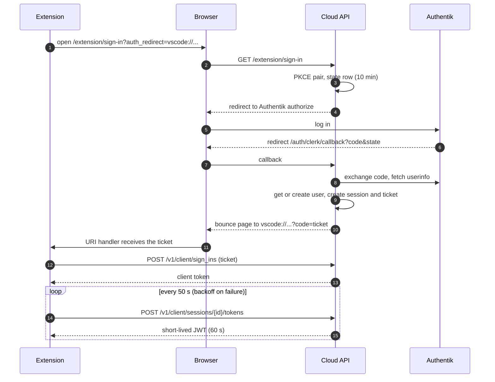
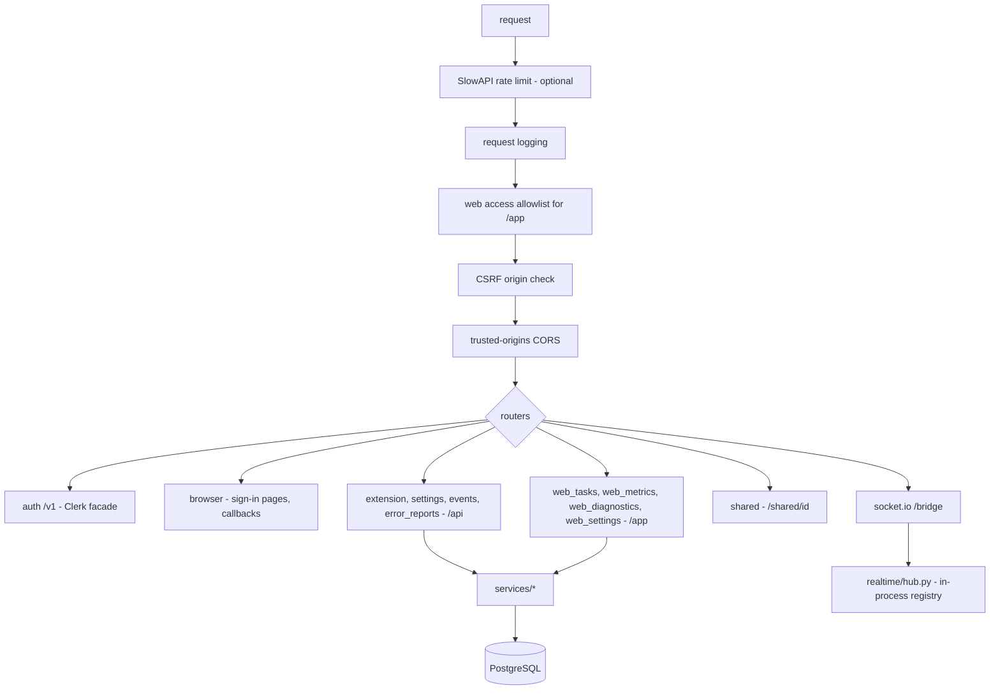
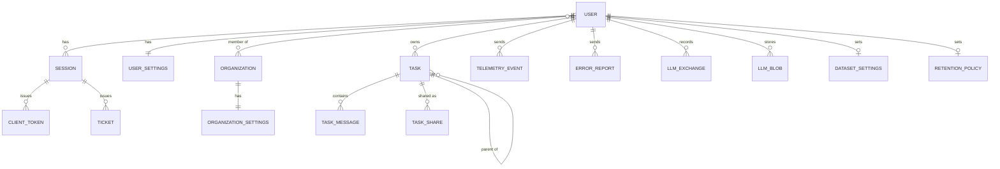

# Level 2: the cloud

The cloud is optional. Without it the extension works fully locally. With it, a user gets task history across
machines, a web panel with metrics, sharing, and a live view of a running task that can also send it commands.

Two halves:

- `packages/cloud` (`CloudService`): the client inside the extension.
- `self-hosted-cloudapi/`: a FastAPI service with PostgreSQL and Authentik (OIDC), deployed with Docker Compose.

## Client side: CloudService

Extension activation starts `CloudService` in the background and does not wait for it (see
[the extension host](02-extension-host.md#activation)). Code that runs outside activation must therefore not assume
a started cloud: check `CloudService.hasInstance()` (true only after `initialize()` finished) before reading
`CloudService.instance`, or catch its "not initialized" error. `CloudService.isEnabled()` is false while starting.

| Client code            | Endpoint                                                                                                                                                        |
| ---------------------- | --------------------------------------------------------------------------------------------------------------------------------------------------------------- |
| `WebAuthService`       | `POST /v1/client/sign_ins`, `POST /v1/client/sessions/{id}/tokens`, `GET /v1/me`, `GET /v1/me/organization_memberships`, `POST /v1/client/sessions/{id}/remove` |
| `CloudSettingsService` | `GET /api/extension-settings`, `PATCH /api/user-settings`                                                                                                       |
| `CloudAPI`             | `POST /api/extension/share`, `GET /api/extension/bridge/config`                                                                                                 |
| `TelemetryClient`      | `POST /api/events`, `POST /api/events/backfill`                                                                                                                 |
| `BridgeOrchestrator`   | socket.io at `/bridge/socket.io`                                                                                                                                |

The API speaks the shapes of the original Roo Code Cloud (a Clerk-like auth API), so the extension's client code
did not have to change; the server's `auth/clerk_facade.py` produces those shapes.

## Sign-in

The web panel uses the same Authentik flow but ends with a signed `tumble_session` cookie instead of a ticket.

## Server side

`src/main.py` assembles the app. Routers are thin; logic is in `src/services/`. Because the bridge registry is an
in-process singleton, the service runs as one uvicorn worker.

### Data model

`TASK` carries denormalized summary columns (tokens, cost, quality) so the list page needs no aggregation;
`refresh_task_summary` keeps them current.

### How task rows arrive

- Live: the extension sends each chat row over the bridge (`task:event`). The server upserts it into
  `TASK_MESSAGE` with a monotonic `ON CONFLICT` rule (an older version never overwrites a newer one) and relays it
  to browsers watching the task.
- Backfill: on share, or when the bridge was down, the extension posts the whole conversation to
  `/api/events/backfill`; the server replaces the task's rows.
- Telemetry: `POST /api/events` stores events and links child tasks to parents (`TaskRelation`).
- Error reports: `POST /api/error-reports` (same Bearer token) stores one problem the extension ran into, with its
  model, provider, context size and the tail of the request and response (`ERROR_REPORT`, schema in
  `schemas/error_report.py`). The extension sends them only while signed in. The insert ignores an id it already
  has, so a retried upload is stored once; bodies above 1 MB get 413. Reports are swept with telemetry by the
  retention policy, deleted with their task, and cascade with their user.
- LLM exchanges: `POST /api/llm-exchanges` stores one request the agent sent to the model and its answer, and
  `POST /api/llm-exchanges/outcome` how its tool calls went (`LLM_EXCHANGE`, schema in `schemas/llm_exchange.py`).
  The extension records only while signed in AND the user switched recording on at `/app/dataset`
  (`GET /api/llm-exchanges/config`, `DATASET_SETTINGS`). Storage is incremental: an exchange is a delta of an
  earlier one of its task (`baseId`, keep the first N messages, append the rest), and the system prompt, the tool
  definitions and large fields of the exact HTTP body are blobs (`LLM_BLOB`, per user, task and SHA-256).
  Bodies are gzip (32 MB compressed, 128 MB inflated at most); a duplicate id is ignored. Exchanges are deleted
  with their task and cascade with their user; the retention sweep of telemetry does not touch them.

### Background work

`retention_scheduler.py` runs `sweep_all_enabled` every few hours (default 6) and deletes tasks older than each
user's retention policy. Each user runs inside a savepoint within the cycle's single transaction, so one user's
failed sweep is rolled back whole without affecting the others. The loop starts and stops with the app's lifespan.

### Database and deploy

- `db-migrate.sh` runs `python -m src.db_bootstrap`, which classifies the database as fresh (create and stamp),
  legacy (stamp the baseline, then upgrade) or managed (upgrade), then Alembic applies the migrations.
- `Dockerfile`: Python 3.13 slim, `uv sync --frozen`, non-root user. `docker-entrypoint.sh` migrates, then starts
  uvicorn with `--timeout-graceful-shutdown 25`: on SIGTERM in-flight requests finish for up to 25 s before the
  process exits (raise Docker's stop timeout above the 10 s default to give it room).
- `docker-compose.yml`: API, PostgreSQL, Authentik server and worker with their database, and a blueprint that
  provisions the OIDC application. The API container has a healthcheck on `/health/ready`, which runs `SELECT 1`
  on the database and answers 503 when it is down; `/health` stays liveness-only (no DB, cheap). The DB engine is
  created with `pool_pre_ping`, so a connection dropped behind the pool's back is replaced instead of failing the
  first query after it.

## The web panel

Server-rendered Jinja templates in `src/web/templates/` with one stylesheet (`static/app.css`, design tokens on
`:root`) and small plain-JavaScript files, no build step:

| Page        | Template                                      | Script                                                                   |
| ----------- | --------------------------------------------- | ------------------------------------------------------------------------ |
| Every page  | `base.html`                                   | `theme.js` (theme, in `<head>`), `app.js` (`data-confirm`, copy buttons) |
| Task list   | `tasks_list.html`                             | `tasklist.js` (selection, bulk delete, tree fold, live filters, density) |
| Task detail | `task_detail.html`                            | `render.js` (conversation), `timeline.js`, `live.js` (bridge client)     |
| Metrics     | `metrics.html`                                | none (charts are server-rendered SVG)                                    |
| Problems    | `diagnostics.html`, `diagnostics_report.html` | none                                                                     |
| Dataset     | `dataset.html`, `dataset_audit.html`          | none                                                                     |
| Settings    | `settings.html`                               | none                                                                     |
| Shared task | `task_detail.html`, read-only                 | `render.js`, `timeline.js`                                               |

### The problem report

`/app/diagnostics` (the "Problems" tab) answers what goes wrong, whose fault it is and what to try
(`services/diagnostics_service.py`). It reads three sources into one occurrence shape: error reports, and for the
time before the user's first report the error messages of synced conversations (`task_messages.q_kind` error or
retry, model attributed from the request before the message) and the error telemetry events. Occurrences are
grouped by a signature (category, tool and the message's first line with paths, ids and digits blanked), ranked by
the tasks they hit, and looked up in `services/problem_catalogue.py`, an ordered list of rules that gives each
group a class (software defect, model mismatch, provider or network, configuration) and a mitigation. Groups no
rule matches are shown as Unclassified. A model fit table puts problems next to the period's LLM Completion
requests per model. `/app/diagnostics/reports/{id}` shows one report in full to its owner (404 for anyone else).

The page filters by period, class, category, model, provider, tool, source and free text (title, signature,
message), all in the query string, so a filtered view is a shareable link and works without scripting; the class
tiles are filter links too, and `sort=impact|count|recent` orders the list. Each problem is one closed row (class,
title, tool, top model, count, tasks, last seen) that opens to the detail. The agent brief
(`services/problem_brief.py`) is Markdown a coding agent can act on with no other context: per problem a task
statement, the rule that classified it and what it matched, the impact, the repository paths to start from (the
rule's `code_hints`), up to three distinct samples with the request tail, the response, the raw tool call and the
tool result, and acceptance criteria. `/app/diagnostics/report.md` is the brief of the filtered list and
`/app/diagnostics/problems/{key}/brief.md` the brief of one problem (key: 12 hex digits of the signature's
SHA-256), both reading the same filters as the page; "Copy for agent" puts either on the clipboard.

### The dataset

`/app/dataset` (the "Dataset" tab) holds the recording switch and the user's own anonymization terms, counts the
recorded exchanges per model and per issue, and exports them (ai_plans/2026-10-02_llm-exchange-dataset.md).

- `services/exchange_reconstruction.py` rebuilds every request of a task from its deltas and blobs; the exact HTTP
  body is re-serialized like `JSON.stringify` and checked against the SHA-256 the extension recorded. A missing
  base or blob marks the exchange, and everything built on it, `incomplete`.
- `services/exchange_quality.py` names what keeps an exchange out of a clean dataset: failed or cancelled requests,
  empty or truncated answers, tool arguments that are not a JSON object, a tool that was not offered, a missing
  non-nullable required parameter, tool call markup written as text, and the extension's own verdicts (invalid
  call, mistake limit). Strict also drops calls that ran and failed and calls the user rejected.
- `services/dataset_export.py` writes OpenAI chat JSONL (`messages`, `tools`, `weight` on assistant messages):
  `turns` (one sample per clean answer) or `trajectories` (one per run of requests that extend each other), with
  filters for period, teacher models and excluded workspaces. `services/openai_messages.py` mirrors the
  extension's `convertToOpenAiMessages`.
- `services/anonymizer.py` runs on export (on by default) with one consistent pseudonym table per export: secrets,
  workspace paths and names, home folders and user names, the account's name and e-mail, the user's terms,
  e-mail and IP addresses, checksummed PESEL/IBAN/card numbers and phone numbers. `/app/dataset/audit` lists every
  replacement the same export would make.
- `/app/dataset/tasks/{task_id}.jsonl` is the full reconstruction of one task, not anonymized, owner only.
- `tests/fixtures/llm_exchanges_recorder.json` is the cross-language contract: the extension's recorder produces
  it (`src/core/dataset/__tests__/ExchangeRecorder.fixture.spec.ts`) and `tests/test_llm_exchanges.py` reconstructs
  it.
