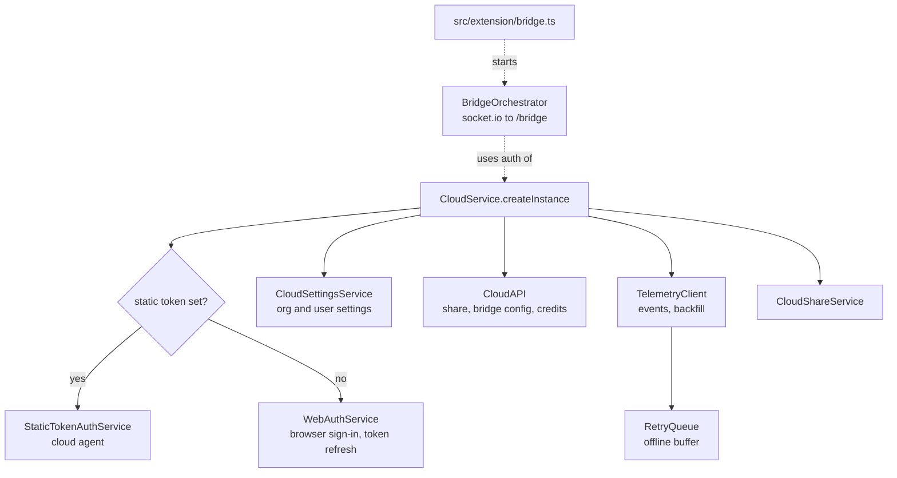
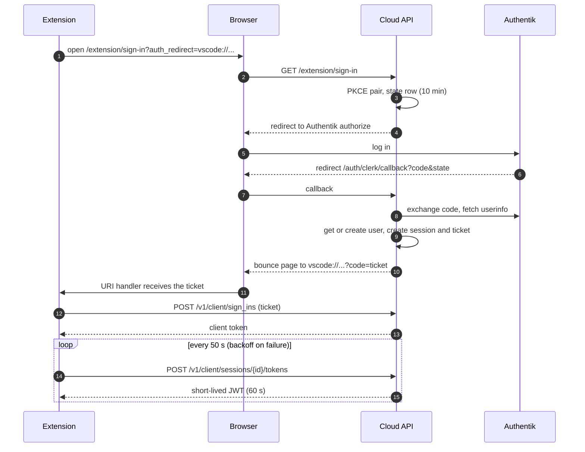
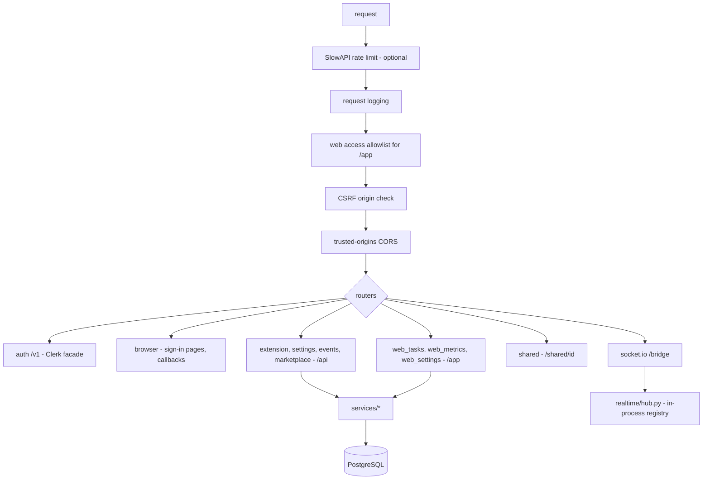
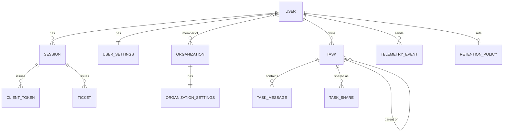

# Level 2: the cloud

The cloud is optional. Without it the extension works fully locally. With it, a user gets task history across
machines, a web panel with metrics, sharing, and a live view of a running task that can also send it commands.

Two halves:

- `packages/cloud` (`CloudService`): the client inside the extension.
- `self-hosted-cloudapi/`: a FastAPI service with PostgreSQL and Authentik (OIDC), deployed with Docker Compose.

## Client side: CloudService

Extension activation starts `CloudService` in the background and does not wait for it (see
[the extension host](02-extension-host.md#activation)). Code that runs outside activation must therefore not assume
a started cloud: check `CloudService.hasInstance()` (true only after `initialize()` finished) before reading
`CloudService.instance`, or catch its "not initialized" error. `CloudService.isEnabled()` is false while starting.

| Client code            | Endpoint                                                                                                                                                        |
| ---------------------- | --------------------------------------------------------------------------------------------------------------------------------------------------------------- |
| `WebAuthService`       | `POST /v1/client/sign_ins`, `POST /v1/client/sessions/{id}/tokens`, `GET /v1/me`, `GET /v1/me/organization_memberships`, `POST /v1/client/sessions/{id}/remove` |
| `CloudSettingsService` | `GET /api/extension-settings`, `PATCH /api/user-settings`                                                                                                       |
| `CloudAPI`             | `POST /api/extension/share`, `GET /api/extension/bridge/config`, `GET /api/extension/credit-balance`                                                            |
| `TelemetryClient`      | `POST /api/events`, `POST /api/events/backfill`                                                                                                                 |
| `BridgeOrchestrator`   | socket.io at `/bridge/socket.io`                                                                                                                                |

The API speaks the shapes of the original Roo Code Cloud (a Clerk-like auth API), so the extension's client code
did not have to change; the server's `auth/clerk_facade.py` produces those shapes.

## Sign-in

The web panel uses the same Authentik flow but ends with a signed `tumble_session` cookie instead of a ticket.

## Server side

`src/main.py` assembles the app. Routers are thin; logic is in `src/services/`. Because the bridge registry is an
in-process singleton, the service runs as one uvicorn worker.

### Data model

`TASK` carries denormalized summary columns (tokens, cost, quality) so the list page needs no aggregation;
`refresh_task_summary` keeps them current.

### How task rows arrive

- Live: the extension sends each chat row over the bridge (`task:event`). The server upserts it into
  `TASK_MESSAGE` with a monotonic `ON CONFLICT` rule (an older version never overwrites a newer one) and relays it
  to browsers watching the task.
- Backfill: on share, or when the bridge was down, the extension posts the whole conversation to
  `/api/events/backfill`; the server replaces the task's rows.
- Telemetry: `POST /api/events` stores events and links child tasks to parents (`TaskRelation`).

### Background work

`retention_scheduler.py` runs `sweep_all_enabled` every few hours (default 6) and deletes tasks older than each
user's retention policy. Each user runs inside a savepoint within the cycle's single transaction, so one user's
failed sweep is rolled back whole without affecting the others. The loop starts and stops with the app's lifespan.

### Database and deploy

- `db-migrate.sh` runs `python -m src.db_bootstrap`, which classifies the database as fresh (create and stamp),
  legacy (stamp the baseline, then upgrade) or managed (upgrade), then Alembic applies the migrations.
- `Dockerfile`: Python 3.13 slim, `uv sync --frozen`, non-root user. `docker-entrypoint.sh` migrates, then starts
  uvicorn with `--timeout-graceful-shutdown 25`: on SIGTERM in-flight requests finish for up to 25 s before the
  process exits (raise Docker's stop timeout above the 10 s default to give it room).
- `docker-compose.yml`: API, PostgreSQL, Authentik server and worker with their database, and a blueprint that
  provisions the OIDC application. The API container has a healthcheck on `/health/ready`, which runs `SELECT 1`
  on the database and answers 503 when it is down; `/health` stays liveness-only (no DB, cheap). The DB engine is
  created with `pool_pre_ping`, so a connection dropped behind the pool's back is replaced instead of failing the
  first query after it.

## The web panel

Server-rendered Jinja templates in `src/web/templates/` with one stylesheet (`static/app.css`, design tokens on
`:root`) and small plain-JavaScript files, no build step:

| Page        | Template                      | Script                                                |
| ----------- | ----------------------------- | ----------------------------------------------------- |
| Task list   | `tasks_list.html`             | `tasklist.js` (selection, bulk delete, tree fold)     |
| Task detail | `task_detail.html`            | `render.js` (conversation), `live.js` (bridge client) |
| Metrics     | `metrics.html`                | `metrics.js` (Chart.js)                               |
| Settings    | `settings.html`               | none                                                  |
| Shared task | `task_detail.html`, read-only | `render.js`                                           |
