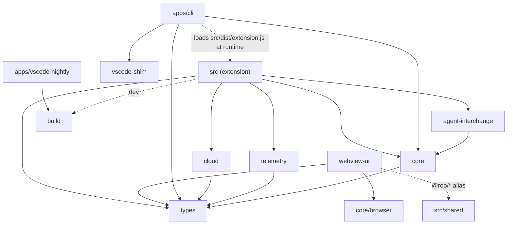

# Architecture map

Read this page before you change code that crosses a folder boundary. It names the parts of the repository, which
direction they may depend on each other, and the two paths almost every change touches: a message from the chat
panel to the extension, and a model answer from the provider back to the chat. Every refactor item that moves a
boundary updates this page in the same pull request. Item names such as `CORE-R1` refer to the refactor plan
(`ai_plans/2026-09-24_refactor/`).

## The workspaces

This is a pnpm monorepo: one repository holding several packages ("workspaces", listed in `pnpm-workspace.yaml`)
that depend on each other by name (`"@roo-code/types": "workspace:^"`).

| Folder                        | Package name                                             | What it owns                                                                                                                                                                      |
| ----------------------------- | -------------------------------------------------------- | --------------------------------------------------------------------------------------------------------------------------------------------------------------------------------- |
| `src/`                        | `tumble-code`                                            | The VS Code extension ("the host"): activation, `ClineProvider` (the chat panel's backend), `Task` (one agent conversation), tools, API providers, services. Built to `src/dist`. |
| `src/shared/`                 | none (a folder, not a package)                           | Code used by both the host and the webview. The webview imports it through the `@roo/*` path alias. It must stay browser-safe (see below).                                        |
| `webview-ui/`                 | `@roo-code/vscode-webview`                               | The React chat and settings UI that runs inside the VS Code webview (an embedded browser page).                                                                                   |
| `apps/cli/`                   | `@tumble-code/cli`                                       | The terminal client. It runs the built extension inside its own Node process and renders with Ink (React for terminals).                                                          |
| `apps/vscode-e2e/`            | `@roo-code/vscode-e2e`                                   | End-to-end tests in a real VS Code.                                                                                                                                               |
| `apps/vscode-nightly/`        | `@roo-code/vscode-nightly`                               | The nightly VSIX build.                                                                                                                                                           |
| `packages/types/`             | `@roo-code/types`                                        | Zod schemas and TypeScript types shared by everyone: settings, providers, `ExtensionMessage` and `WebviewMessage`, the CLI runtime contract. Its only runtime dependency is zod.  |
| `packages/core/`              | `@roo-code/core`                                         | Platform-agnostic logic (no `vscode`). Entry points: `.` (host), `./browser` (webview-safe), `./cli`, `./fs` (`safeWriteJson`).                                                   |
| `packages/cloud/`             | `@roo-code/cloud`                                        | `CloudService`: login, settings sync, sharing, the bridge to the self-hosted cloud API.                                                                                           |
| `packages/telemetry/`         | `@roo-code/telemetry`                                    | `TelemetryService` and its clients.                                                                                                                                               |
| `packages/agent-interchange/` | `@roo-code/agent-interchange`                            | Reading and handing off sessions between Claude Code and Tumble Code (an MCP server plus readers).                                                                                |
| `packages/vscode-shim/`       | `@roo-code/vscode-shim`                                  | A fake `vscode` module so the extension can run outside VS Code (used by the CLI).                                                                                                |
| `packages/build/`             | `@roo-code/build`                                        | esbuild helpers and the extension's external modules list (`extensionExternals` in its `src/extension.ts`).                                                                       |
| `packages/config-*/`          | `@roo-code/config-eslint`, `@roo-code/config-typescript` | Shared lint and compiler settings.                                                                                                                                                |
| `self-hosted-cloudapi/`       | none (Python)                                            | The FastAPI cloud service the extension talks to. Not part of the pnpm graph.                                                                                                     |

## Allowed dependency directions

An arrow means "may import". Nothing may point back up; `packages/types` is a leaf.

Three checks enforce this (PKG-2, CORE-R10):

- The lint rule `boundaries/no-relative-import-outside-package` (`packages/config-eslint/boundaries.js`) rejects a
  relative import that leaves its own workspace, such as `../../../src/utils/x`. Import the other workspace by its
  package name and declare it in `package.json`, otherwise pnpm, turbo (the build cache) and knip (the unused-code
  checker) do not see the dependency.
- `src/eslint.config.mjs` forbids importing `vscode` in `src/shared`, because the webview bundles that folder and
  has no `vscode` module. The only exceptions are `shared/cloud-urls.ts` and `shared/vsCodeSelectorUtils.ts`.
- `src/__tests__/layering.spec.ts` pins three edges inside `src`: `ClineProvider` does not import `src/activate`
  (the panel references live in `core/webview/panelRegistry.ts`); `shared/modes.ts` imports neither `vscode` nor
  extension code (the host-side helpers are in `core/prompts/modeDetails.ts`); and `McpHub`, `McpServerManager`,
  `WorkspaceTracker`, `DiffViewProvider` and `DiagnosticsCollector` depend on narrow interfaces listing only the
  members they use, not on the `ClineProvider` and `Task` classes.

## The CLI runtime contract

The CLI does not talk to the extension over a network. `apps/cli/src/agent/extension-host.ts` loads
`src/dist/extension.js` into its own process, redirects `require("vscode")` to the shim and calls `activate()`.
The two sides agree on six environment variables and two `globalThis` slots, all spelled in one place:
`packages/types/src/cli-runtime.ts` (`CLI_RUNTIME_ENV`, `readCliRuntimeEnv`, `CLI_RUNTIME_GLOBAL_SLOTS`,
`setCliRuntimeGlobals`). Use those names instead of string literals. `packages/vscode-shim` still reads the two
slots by literal name, so renaming a slot means changing both.

## Where settings defaults live today

Settings are stored by `ContextProxy` (`src/core/config/ContextProxy.ts`) under the keys and schemas in
`packages/types/src/global-settings.ts` and `provider-settings.ts`. The default for an unset value is applied in
several places: `ClineProvider.getState()` (what host code reads), `ClineProvider.getStateToPostToWebview()` (what
the webview receives), and the webview's initial state in `webview-ui/src/context/ExtensionStateContext.tsx`. A
few values already have one shared constant in `packages/types` (for example
`DEFAULT_TERMINAL_SHELL_INTEGRATION_TIMEOUT_MS`); when you add a setting, add such a constant and use it in all
three places. CORE-R1 will replace the copies with one defaults table.

## From the webview to a handler

1. A component calls `vscode.postMessage({ type: ..., ... })` (`webview-ui/src/utils/vscode.ts`) with a
   `WebviewMessage` (`packages/types/src/vscode-extension-host.ts`).
2. `ClineProvider.setWebviewMessageListener` receives it and calls `webviewMessageHandler`
   (`src/core/webview/webviewMessageHandler.ts`), one large `switch (message.type)`. Find your case there by the
   message type string. CORE-R3 will split it into domain modules behind a lookup table.
3. The answer goes back as an `ExtensionMessage` through `ClineProvider.postMessageToWebview` or one of the
   `postStateToWebview*` methods, and `ExtensionStateContext.tsx` merges it into React state (`case "state"`,
   `case "messageUpdated"`).

## From a provider stream to a chat row

1. `buildApiHandler` (`src/api/index.ts`) picks a provider class in `src/api/providers/`; its `createMessage`
   returns an `ApiStream` of chunks (`text`, `reasoning`, `tool_call_partial`, `tool_call`, `usage`; see
   `src/api/transform/stream.ts`). Each provider parses its own wire format today; API-7 will add one shared
   Chat Completions stream adapter.
2. `TaskApiLoop.attemptApiRequest` (`src/core/task/TaskApiLoop.ts`) iterates the stream and hands each chunk to
   `TaskStreamProcessor.processChunk`, which turns text and reasoning into `say(...)` calls and tool calls into
   `presentAssistantMessage` (tool execution).
3. `TaskAskSay` records the result as a `ClineMessage`; `TaskHistory.addToClineMessages` pushes a state update and
   `TaskHistory.updateClineMessage` sends a `messageUpdated` message for a streaming partial.
4. In the webview, `ChatView.tsx` shapes the message list (`modifiedMessages`, `visibleMessages`,
   `groupedMessages`) and renders one `ChatRow` per entry. WEB-1 will move that shaping into pure functions.

## Do not touch without a dedicated item

These look odd but encode tested race fixes or deliberate contracts. Change them only in a planned item with the
named tests in place (full list: "Do not touch" in `ai_plans/2026-09-24_refactor/00-master-plan.md`).

- State delivery to the webview: `clineMessagesSeq`, the three `postStateToWebview*` variants, the `sourceTaskId`
  routing in the webview state merge.
- Task control: `cancelTask` and the abort ordering, the global `lastGlobalApiRequestTime` rate limit,
  `TaskHistoryStore` (`src/core/task-persistence/`).
- Model compatibility: the legacy `read_file` `files` shape and the tool-name aliases (weak models still send
  them); the per-protocol message converters in `src/api/transform/`; the provider registries
  (`packages/types/src/provider-registry.ts`, `src/api/runtime-provider-registry.ts`); the flat
  `providerSettingsSchema`; the runtime values of `TelemetryEventName`.
- Public shapes: `ExtensionMessage` and `WebviewMessage` (change them only additively).
- UI behavior: `webview-ui/src/hooks/useScrollLifecycle.ts` and the ChatRow height contract; the CLI's Ink render
  pipeline (`streamCommit.ts`, `TailViewport.tsx`, the `useInsertionEffect` ordering, `theme.dimmed`).
- Packaging: `extensionExternals` in `packages/build/src/extension.ts` and the `--no-dependencies` VSIX packaging;
  the security pins in the root `pnpm.overrides`.
- Whole areas: `packages/vscode-shim`, `src/core/memory`, `apps/vscode-nightly`, `scripts/agent-bench`.
- Cloud API (`self-hosted-cloudapi/`): the monotonic `ON CONFLICT` upsert, `response_model_exclude_none=True`,
  share returning 404 for unknown tasks, the `/bridge` socket path, the database bootstrap classification, SQLite
  as the test database, the denormalized summary columns.
